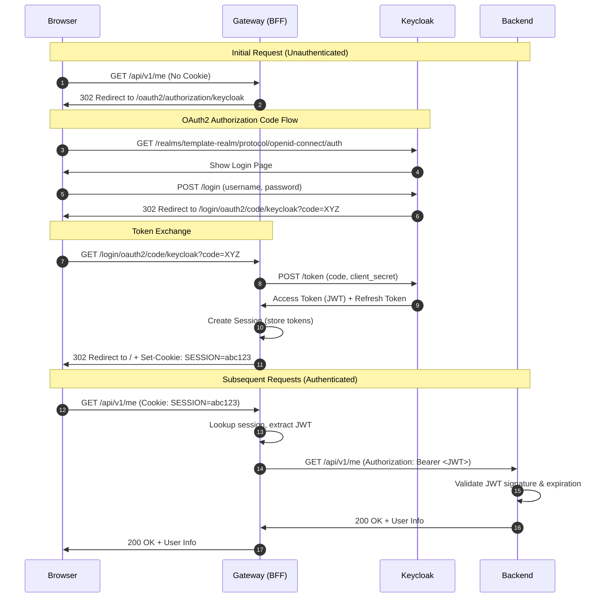

# Implementation Plan: Secure Authentication with Gateway BFF & Keycloak

## Table of Contents
1. [Understanding the BFF Pattern](#1-understanding-the-bff-pattern)
2. [Why Spring Addons](#2-why-spring-addons)
3. [Prerequisites & Configuration](#3-prerequisites--configuration)
4. [Phase 1: Infrastructure Setup](#4-phase-1-infrastructure-setup)
5. [Phase 2: Gateway (BFF) Implementation](#5-phase-2-gateway-bff-implementation)
6. [Phase 3: Backend (Resource Server)](#6-phase-3-backend-resource-server)
7. [Phase 4: Frontend Integration](#7-phase-4-frontend-integration)
8. [Phase 5: Advanced Features](#8-phase-5-advanced-features)
9. [Testing & Verification](#9-testing--verification)
10. [Architecture Diagrams](#10-architecture-diagrams)

---

## 1. Understanding the BFF Pattern

### What Problem Are We Solving?

**Traditional SPA Authentication (❌ Security Risk):**
```
Browser (React)
  ↓ stores Access Token in localStorage/sessionStorage
  ↓ sends: Authorization: Bearer <token>
Backend API
```

**Problems with this approach:**
- 🚨 **XSS Vulnerability:** If attacker injects JavaScript, they can steal tokens
- 🚨 **Token Exposure:** Tokens visible in browser DevTools
- 🚨 **No Token Management:** Frontend handles token refresh logic

**BFF Pattern (✅ Secure):**
```
Browser (React)
  ↓ stores: HttpOnly Cookie (SESSION)
  ↓ sends: Cookie: SESSION=abc123
Gateway (BFF)
  ↓ translates: Cookie → JWT
  ↓ sends: Authorization: Bearer <jwt>
Backend API (Resource Server)
```

**Benefits:**
- ✅ **XSS Protection:** Tokens never exposed to JavaScript
- ✅ **Simplified Frontend:** No token management code
- ✅ **Centralized Security:** Gateway handles OAuth2 complexity
- ✅ **Token Refresh:** Gateway handles automatic refresh with refresh tokens

### Key Concepts

**Backend for Frontend (BFF):**
> A BFF is an intermediary layer that sits between the frontend and backend APIs. It handles authentication, token management, and request transformation.

**Token Relay Pattern:**
> The BFF receives requests with session cookies, retrieves the access token from the session, and forwards it to backend services as a JWT bearer token.

**Resource Server:**
> A backend service that validates JWT tokens and serves protected resources. It doesn't maintain sessions.

---

## 2. Why Spring Addons?

### Decision: Use Spring Addons Library

We're using **`com.c4-soft.springaddons:spring-addons-starter-oidc`** instead of vanilla Spring Security OAuth2.

### Comparison: Before vs After

**WITHOUT Spring Addons (Vanilla Spring Security):**

You'd need to write ~80 lines of complex Java configuration:

```java
@Configuration
public class SecurityConfig {
    @Bean
    @Order(1)
    public SecurityFilterChain clientFilterChain(HttpSecurity http) throws Exception {
        http
            .securityMatcher("/api/**", "/login/**", "/oauth2/**")
            .authorizeHttpRequests(auth -> auth
                .requestMatchers("/login/**", "/oauth2/**").permitAll()
                .anyRequest().authenticated()
            )
            .oauth2Login(oauth2 -> oauth2
                .defaultSuccessUrl("/")
            )
            .csrf(csrf -> csrf
                .csrfTokenRepository(CookieServerCsrfTokenRepository.withHttpOnlyFalse())
                .csrfTokenRequestHandler(new SpaCsrfTokenRequestHandler()) // Custom class!
            )
            .logout(logout -> logout
                .logoutSuccessHandler(oidcLogoutSuccessHandler()) // Custom method!
            );
        return http.build();
    }

    @Bean
    @Order(2)
    public SecurityFilterChain resourceServerChain(HttpSecurity http) throws Exception {
        http
            .securityMatcher("/login-options", "/error", "/actuator/**")
            .authorizeHttpRequests(auth -> auth.anyRequest().permitAll())
            .sessionManagement(session -> session
                .sessionCreationPolicy(SessionCreationPolicy.STATELESS)
            );
        return http.build();
    }

    // Plus custom handler implementations...
}
```

**WITH Spring Addons:**

Just ~15 lines of YAML configuration:

```yaml
com:
  c4-soft:
    springaddons:
      oidc:
        ops:
          - iss: ${issuer}
            authorities:
              - path: $.realm_access.roles
        client:
          client-uri: http://localhost:8080
          security-matchers: [/api/**, /login/**, /oauth2/**]
          permit-all: [/login/**, /oauth2/**]
          csrf: cookie-accessible-from-js
          oauth2-redirections:
            rp-initiated-logout: ACCEPTED
          back-channel-logout:
            enabled: true
```

**Result:** 83% code reduction + production-ready features!

### What Spring Addons Provides

✅ **Automatic Dual Security Filter Chains** - Separates authenticated routes from public endpoints
✅ **Advanced Logout** - RP-initiated logout + back-channel logout
✅ **SPA-Friendly CSRF** - Cookies accessible to JavaScript for CSRF tokens
✅ **Authorities Mapping** - Extracts roles from JWT claims automatically
✅ **Multi-Provider Support** - Easy to add Google/GitHub/Auth0 later
✅ **Testing Utilities** - Mock OAuth2 users in tests
✅ **Production-Ready Defaults** - PKCE, token caching, error handling

### Key Features We'll Use

| Feature              | Configuration                            | Benefit                                   |
| -------------------- | ---------------------------------------- | ----------------------------------------- |
| Dual Security Chains | `client:` and `resourceserver:` sections | Clean separation: authenticated vs public |
| CSRF Config          | `csrf: cookie-accessible-from-js`        | React can read CSRF token from cookie     |
| Logout Support       | `rp-initiated-logout: ACCEPTED`          | Proper Keycloak logout flow               |
| Back-channel Logout  | `enabled: true`                          | Multi-device logout support               |
| Authorities Mapping  | `path: $.realm_access.roles`             | Auto-extract Keycloak roles               |

**Reference:** Spring Addons simplifies OAuth2 BFF implementation as explained in the [Baeldung OAuth2 BFF tutorial](https://www.baeldung.com/spring-cloud-gateway-bff-oauth2).

---

## 3. Prerequisites & Configuration

### Step 0: Update `.env` File

Add these variables to your root `.env` file:

```env
# --- Keycloak Configuration ---
KC_PORT=9000
KC_ADMIN=admin
KC_ADMIN_PASSWORD=admin
KC_REALM=template-realm
KC_CLIENT_ID=template-gateway
KC_CLIENT_SECRET=CHANGE_ME_GENERATE_IN_KEYCLOAK_UI

# --- Gateway Configuration ---
GW_PORT=8080

# --- Backend (Resource Server) Configuration ---
# Backend moves to 8081 to free up 8080 for Gateway
BCK_APP_PORT=8081
```

**Why these variables?**
- **KC_PORT:** Keycloak runs on a different port (9000) to avoid conflicts
- **GW_PORT:** Gateway is now the main entry point (8080) - all traffic flows through it
- **BCK_APP_PORT:** Backend moves to 8081 since Gateway takes 8080

> **Design Decision:** All `/api/*` requests go through the Gateway (single entry point). This mirrors production deployment and simplifies routing - no `/bff` prefix needed.

---

## 4. Phase 1: Infrastructure Setup

### Step 1.1: Update `docker-compose.yml`

**Why?** We need to add Keycloak (Identity Provider) and Gateway (BFF) services.

**Location:** `/docker-compose.yml` (root of project)

Add these services:

```yaml
services:
  # ... existing db, backend, frontend services ...

  keycloak:
    container_name: template-keycloak
    image: quay.io/keycloak/keycloak:26.0
    command:
      - start-dev
      - --import-realm  # 👈 Automatically imports realm configuration
    ports:
      - "${KC_PORT}:8080"
    volumes:
      - ./keycloak/import:/opt/keycloak/data/import:ro  # 👈 Mount realm config
    environment:
      KEYCLOAK_ADMIN: ${KC_ADMIN}
      KEYCLOAK_ADMIN_PASSWORD: ${KC_ADMIN_PASSWORD}
      KC_HTTP_PORT: 8080
      KC_HOSTNAME_URL: http://localhost:${KC_PORT}
      KC_HOSTNAME_ADMIN_URL: http://localhost:${KC_PORT}
      KC_HTTP_ENABLED: true
      KC_HEALTH_ENABLED: true
    networks:
      - backend-network
    healthcheck:
      test: ['CMD-SHELL', 'exec 3<>/dev/tcp/127.0.0.1/8080 && echo -e "GET /health/ready HTTP/1.1\r\nhost: 127.0.0.1:8080\r\nConnection: close\r\n\r\n" >&3 && cat <&3 | grep -q "200 OK"']
      interval: 5s
      timeout: 5s
      retries: 20

  gateway:
    container_name: template-gateway
    build:
      context: ./gateway
      dockerfile: Dockerfile
    ports:
      - "${GW_PORT}:8080"  # 👈 Gateway is now the main entry point
    environment:
      SPRING_PROFILES_ACTIVE: docker
      KC_CLIENT_SECRET: ${KC_CLIENT_SECRET}
      SERVER_ADDRESS: 0.0.0.0
    depends_on:
      keycloak:
        condition: service_healthy  # 👈 Wait for Keycloak to be ready
      backend:
        condition: service_started
    networks:
      - backend-network
```

**Key Configuration Explained:**

- **`--import-realm`:** Automatically imports Keycloak configuration from `/keycloak/import/` directory
- **healthcheck:** Ensures Keycloak is fully started before Gateway tries to connect
- **`condition: service_healthy`:** Gateway waits for Keycloak healthcheck to pass
- **ports:** Gateway takes over port 8080 (the main entry point for your app)

---

### Step 1.2: Create Keycloak Realm Configuration

**Why?** Instead of manual clicking in Keycloak UI, we'll automate the setup with a realm export file.

**Action:** Create the directory structure and realm configuration:

```bash
mkdir -p keycloak/import
```

**Location:** `/keycloak/import/template-realm.json`

Create this file with the following content:

```json
{
  "realm": "template-realm",
  "enabled": true,
  "sslRequired": "none",
  "registrationAllowed": false,
  "loginWithEmailAllowed": true,
  "duplicateEmailsAllowed": false,
  "resetPasswordAllowed": false,
  "editUsernameAllowed": false,
  "bruteForceProtected": true,

  "clients": [
    {
      "clientId": "template-gateway",
      "name": "Template Gateway BFF",
      "enabled": true,
      "clientAuthenticatorType": "client-secret",
      "secret": "CHANGE_ME_GENERATE_IN_KEYCLOAK_UI",
      "redirectUris": [
        "http://localhost:8080/*",
        "http://localhost:8080/login/oauth2/code/keycloak"
      ],
      "webOrigins": ["+"],
      "standardFlowEnabled": true,
      "implicitFlowEnabled": false,
      "directAccessGrantsEnabled": false,
      "serviceAccountsEnabled": false,
      "publicClient": false,
      "protocol": "openid-connect",
      "attributes": {
        "post.logout.redirect.uris": "http://localhost:8080/*",
        "backchannel.logout.session.required": "true",
        "backchannel.logout.revoke.offline.tokens": "false"
      },
      "defaultClientScopes": ["openid", "profile", "email", "roles"],
      "optionalClientScopes": ["offline_access"]
    }
  ],

  "roles": {
    "realm": [
      {
        "name": "USER",
        "description": "Standard user role"
      },
      {
        "name": "ADMIN",
        "description": "Administrator role"
      }
    ]
  },

  "users": [
    {
      "username": "user",
      "enabled": true,
      "emailVerified": true,
      "email": "user@example.com",
      "firstName": "Test",
      "lastName": "User",
      "credentials": [
        {
          "type": "password",
          "value": "password",
          "temporary": false
        }
      ],
      "realmRoles": ["USER"]
    },
    {
      "username": "admin",
      "enabled": true,
      "emailVerified": true,
      "email": "admin@example.com",
      "firstName": "Admin",
      "lastName": "User",
      "credentials": [
        {
          "type": "password",
          "value": "admin",
          "temporary": false
        }
      ],
      "realmRoles": ["USER", "ADMIN"]
    }
  ],

  "clientScopes": [
    {
      "name": "roles",
      "protocol": "openid-connect",
      "attributes": {
        "include.in.token.scope": "true",
        "display.on.consent.screen": "false"
      },
      "protocolMappers": [
        {
          "name": "realm roles",
          "protocol": "openid-connect",
          "protocolMapper": "oidc-usermodel-realm-role-mapper",
          "consentRequired": false,
          "config": {
            "multivalued": "true",
            "userinfo.token.claim": "true",
            "id.token.claim": "true",
            "access.token.claim": "true",
            "claim.name": "realm_access.roles",
            "jsonType.label": "String"
          }
        }
      ]
    }
  ]
}
```

**Important Configuration Notes:**

1. **`secret: "CHANGE_ME_GENERATE_IN_KEYCLOAK_UI"`** - After first startup:
   - Access Keycloak admin console: http://localhost:9000
   - Go to Clients → template-gateway → Credentials tab
   - Copy the Client Secret
   - Update `.env` file with `KC_CLIENT_SECRET=<copied-secret>`
   - Restart gateway service

2. **Test Users:**
   - **Regular User:** username=`user`, password=`password`, role=`USER`
   - **Admin User:** username=`admin`, password=`admin`, roles=`USER,ADMIN`

3. **Back-channel Logout Configuration:**
   - `backchannel.logout.session.required: true` - Enables multi-device logout
   - When user logs out on one device, all sessions are terminated

---

## 5. Phase 2: Gateway (BFF) Implementation

### Step 2.1: Generate Gateway Project

**Why?** We need a new Spring Boot application to act as the BFF.

**Action:** Run this command from your project root:

```bash
curl https://start.spring.io/starter.zip \
    -d type=maven-project \
    -d language=java \
    -d bootVersion=3.4.1 \
    -d dependencies=cloud-gateway,oauth2-client,security,actuator \
    -d groupId=com.example \
    -d artifactId=gateway \
    -d name=gateway \
    -d packageName=com.example.gateway \
    -d javaVersion=21 \
    -o gateway.zip

unzip gateway.zip -d gateway
rm gateway.zip
```

**What this creates:**
- New `gateway/` directory with Spring Cloud Gateway
- OAuth2 Client dependencies (for OAuth2 login)
- Spring Security (for authentication)
- Actuator (for health checks)

---

### Step 2.2: Add Spring Addons Dependency

**Location:** `gateway/pom.xml`

Add this dependency inside `<dependencies>`:

```xml
<dependency>
    <groupId>com.c4-soft.springaddons</groupId>
    <artifactId>spring-addons-starter-oidc</artifactId>
    <version>7.4.6</version>
</dependency>
```

**Also add for testing:**

```xml
<dependency>
    <groupId>com.c4-soft.springaddons</groupId>
    <artifactId>spring-addons-starter-oidc-test</artifactId>
    <version>7.4.6</version>
    <scope>test</scope>
</dependency>
```

**Note:** Spring Addons automatically pulls in `spring-boot-starter-oauth2-client` and `spring-boot-starter-oauth2-resource-server` as transitive dependencies.

---

### Step 2.3: Configure Gateway Application

**Location:** `gateway/src/main/resources/application.yml`

Replace the entire content with:

```yaml
# Custom properties for easy configuration
scheme: http
hostname: localhost
gateway-port: 8080
backend-port: 8081
keycloak-port: 9000
issuer: ${scheme}://${hostname}:${keycloak-port}/realms/template-realm
client-id: template-gateway
client-secret: ${KC_CLIENT_SECRET}

server:
  port: ${gateway-port}

spring:
  application:
    name: gateway

  # Standard Spring Security OAuth2 Client configuration
  security:
    oauth2:
      client:
        provider:
          keycloak:
            issuer-uri: ${issuer}
        registration:
          keycloak:
            provider: keycloak
            client-id: ${client-id}
            client-secret: ${client-secret}
            authorization-grant-type: authorization_code
            scope: openid,profile,email,offline_access
            redirect-uri: "{baseUrl}/login/oauth2/code/{registrationId}"

  # Spring Cloud Gateway routing configuration
  cloud:
    gateway:
      routes:
        # Route 1: Forward /api/** to backend API (with TokenRelay)
        - id: backend-api-route
          uri: ${scheme}://${hostname}:${backend-port}
          predicates:
            - Path=/api/**
          filters:
            - DedupeResponseHeader=Access-Control-Allow-Credentials Access-Control-Allow-Origin
            - TokenRelay=      # 👈 Automatically adds JWT to forwarded requests
            - SaveSession      # 👈 Saves session after token relay
            # No StripPrefix needed - /api/v1/greetings → /api/v1/greetings

        # Route 2: Login options endpoint (handled by Gateway controller)
        - id: login-options-route
          uri: no://op  # Internal route - handled by Gateway controller
          predicates:
            - Path=/login-options

# Spring Addons configuration - This is where the magic happens!
com:
  c4-soft:
    springaddons:
      oidc:
        # OpenID Provider configuration
        ops:
          - iss: ${issuer}
            username-claim: $.preferred_username  # 👈 Extract username from JWT
            authorities:
              - path: $.realm_access.roles        # 👈 Extract roles from JWT

        # Client configuration (oauth2Login filter chain)
        client:
          client-uri: ${scheme}://${hostname}:${gateway-port}
          security-matchers:
            - /api/**
            - /oauth2/**
            - /login/**
            - /logout/**
          permit-all:
            - /api/v1/greetings          # 👈 Public: list greetings
            - /api/v1/greetings/*        # 👈 Public: get single greeting
            - /oauth2/**
            - /login/**
            - /logout/connect/back-channel/keycloak
          post-logout-redirect-host: ${hostname}
          csrf: cookie-accessible-from-js        # 👈 SPA can read CSRF token
          oauth2-redirections:
            rp-initiated-logout: ACCEPTED         # 👈 Enable proper logout flow
          back-channel-logout:
            enabled: true                         # 👈 Multi-device logout support

        # Resource Server configuration (oauth2ResourceServer filter chain)
        resourceserver:
          permit-all:
            - /login-options                      # 👈 Public endpoint (Gateway)
            - /error
            - /actuator/health/**

# Actuator configuration
management:
  endpoint:
    health:
      probes:
        enabled: true
  endpoints:
    web:
      exposure:
        include: health,info
  health:
    livenessstate:
      enabled: true
    readinessstate:
      enabled: true

logging:
  level:
    root: INFO
    org.springframework.security: DEBUG          # 👈 Enable security debugging
    org.springframework.web: INFO
    com.c4_soft.springaddons: DEBUG              # 👈 Debug Spring Addons
```

**Configuration Explained:**

#### Key Design Decisions

| Original Plan        | Simplified Approach | Why                                    |
| -------------------- | ------------------- | -------------------------------------- |
| `/bff/api/*` prefix  | `/api/*` directly   | Single entry point, mirrors production |
| `StripPrefix=2`      | No StripPrefix      | URLs pass through unchanged            |
| `/bff/login-options` | `/login-options`    | Simpler, cleaner URL                   |

#### OAuth2 Client Registration
```yaml
spring.security.oauth2.client:
  provider.keycloak:
    issuer-uri: http://localhost:9000/realms/template-realm
  registration.keycloak:
    scope: openid,profile,email,offline_access  # offline_access = refresh token
```
- **issuer-uri:** Spring automatically discovers Keycloak endpoints from `/.well-known/openid-configuration`
- **offline_access:** Requests a refresh token for automatic token renewal

#### Gateway Routes
```yaml
filters:
  - DedupeResponseHeader=...  # Prevents duplicate CORS headers (common issue)
  - TokenRelay=               # Extracts JWT from session and adds to Authorization header
  - SaveSession              # Ensures session is saved after token operations
  # No StripPrefix - /api/v1/greetings passes through unchanged
```

#### Spring Addons - Dual Security Chains

**Client Chain (Session-based):**
```yaml
client:
  security-matchers: [/api/**, /oauth2/**, /login/**, /logout/**]
  permit-all: [/api/v1/greetings, /api/v1/greetings/*, /oauth2/**, /login/**]
```
- Routes matching `security-matchers` use **oauth2Login** (session-based authentication)
- Public endpoints (GET greetings) don't require authentication

**Resource Server Chain (Stateless):**
```yaml
resourceserver:
  permit-all: [/login-options, /error, /actuator/health/**]
```
- Routes matching `permit-all` here don't require authentication
- Uses **oauth2ResourceServer** (stateless, no sessions created)

---

### Step 2.4: Create Login Options Controller

**Why?** The frontend needs to discover available login providers dynamically.

**Location:** `gateway/src/main/java/com/example/gateway/controller/LoginOptionsController.java`

Create this new file:

```java
package com.example.gateway.controller;

import java.util.List;
import org.springframework.boot.autoconfigure.security.oauth2.client.OAuth2ClientProperties;
import org.springframework.http.MediaType;
import org.springframework.web.bind.annotation.GetMapping;
import org.springframework.web.bind.annotation.RestController;
import com.c4_soft.springaddons.security.oidc.starter.properties.SpringAddonsOidcProperties;
import reactor.core.publisher.Mono;

/**
 * REST endpoint that returns available OAuth2 login providers.
 *
 * The frontend calls this to discover login URLs dynamically,
 * making it easy to add more providers (Google, GitHub, etc.) later.
 */
@RestController
public class LoginOptionsController {

    private final List<LoginOptionDto> loginOptions;

    public LoginOptionsController(
            OAuth2ClientProperties clientProps,
            SpringAddonsOidcProperties addonsProperties) {

        // Build the login options from configured OAuth2 providers
        final var clientAuthority = addonsProperties.getClient()
            .getClientUri()
            .getAuthority();

        this.loginOptions = clientProps.getRegistration()
            .entrySet()
            .stream()
            .filter(e -> "authorization_code".equals(e.getValue()
                .getAuthorizationGrantType()))
            .map(e -> {
                final var label = e.getValue().getProvider();
                final var loginUri = "%s/oauth2/authorization/%s".formatted(
                    addonsProperties.getClient().getClientUri(),
                    e.getKey()
                );
                return new LoginOptionDto(label, loginUri);
            })
            .toList();
    }

    /**
     * GET /login-options
     *
     * Returns: [{"label": "keycloak", "loginUri": "http://localhost:8080/oauth2/authorization/keycloak"}]
     */
    @GetMapping(path = "/login-options", produces = MediaType.APPLICATION_JSON_VALUE)
    public Mono<List<LoginOptionDto>> getLoginOptions() {
        return Mono.just(this.loginOptions);
    }

    /**
     * DTO representing a login option.
     *
     * @param label      Display name (e.g., "keycloak", "google")
     * @param loginUri   URL to redirect browser for login
     */
    public record LoginOptionDto(String label, String loginUri) {}
}
```

**How it works:**

1. **Constructor:** Scans all configured OAuth2 providers (currently just Keycloak)
2. **Endpoint:** Returns JSON array of login options
3. **Future-proof:** When you add Google/GitHub, they'll automatically appear here

**Frontend usage example:**
```javascript
// Frontend fetches login options
const response = await fetch('/login-options');
const options = await response.json();
// [{ label: "keycloak", loginUri: "http://localhost:8080/oauth2/authorization/keycloak" }]

// Redirect to login
window.location.href = options[0].loginUri;
```

---

### Step 2.5: Create Gateway Dockerfile

**Why?** To run the gateway in Docker alongside other services.

**Location:** `gateway/Dockerfile`

Create this file:

```dockerfile
# Build stage
FROM maven:3.9-eclipse-temurin-21-alpine AS build
WORKDIR /app

# Copy pom.xml and download dependencies (cached layer)
COPY pom.xml .
RUN mvn dependency:go-offline -B

# Copy source and build
COPY src ./src
RUN mvn clean package -DskipTests

# Runtime stage
FROM eclipse-temurin:21-jre-alpine
WORKDIR /app

# Copy jar from build stage
COPY --from=build /app/target/*.jar app.jar

# Run as non-root user
RUN addgroup -S spring && adduser -S spring -G spring
USER spring:spring

# Expose port
EXPOSE 8080

# Health check
HEALTHCHECK --interval=30s --timeout=3s --start-period=60s --retries=3 \
  CMD wget --quiet --tries=1 --spider http://localhost:8080/actuator/health || exit 1

ENTRYPOINT ["java", "-jar", "app.jar"]
```

---

## 6. Phase 3: Backend (Resource Server)

The backend validates JWTs sent by the Gateway and serves protected resources.

### Step 3.1: Add Dependencies

**Location:** `backend/pom.xml`

Add Spring Addons dependency:

```xml
<dependency>
    <groupId>com.c4-soft.springaddons</groupId>
    <artifactId>spring-addons-starter-oidc</artifactId>
    <version>7.4.6</version>
</dependency>
```

**Note:** You can remove `spring-boot-starter-oauth2-resource-server` if you had it before, as Spring Addons includes it.

---

### Step 3.2: Configure Backend Application

**Location:** `backend/src/main/resources/application-*.properties`

> **Format Choice:** Since your backend already uses `.properties` files, stick with that format. No need to migrate to YAML - Spring supports both equally. The Gateway (new project) uses YAML because nested OAuth2 config is cleaner there.

**Recommended: Add to your existing `.properties` files** (e.g., `application-local.properties`, `application-docker.properties`):

```properties
# Server Configuration
server.port=8081

# Spring Addons OIDC Configuration
com.c4-soft.springaddons.oidc.ops[0].iss=http://keycloak:8080/realms/template-realm
com.c4-soft.springaddons.oidc.ops[0].username-claim=$.preferred_username
com.c4-soft.springaddons.oidc.ops[0].authorities[0].path=$.realm_access.roles
com.c4-soft.springaddons.oidc.ops[0].aud=

# Resource Server Configuration - matches your OpenAPI spec security definitions
com.c4-soft.springaddons.oidc.resourceserver.permit-all=/error,/api/v1/greetings,/api/v1/greetings/**,/actuator/health/**
```

**Alternative: YAML equivalent** (for reference only - not recommended if you're already using .properties):

```yaml
server:
  port: 8081

spring:
  application:
    name: backend

com:
  c4-soft:
    springaddons:
      oidc:
        # OpenID Provider configuration
        ops:
          - iss: http://keycloak:8080/realms/template-realm
            username-claim: $.preferred_username
            authorities:
              - path: $.realm_access.roles
            aud:  # Leave empty or specify your audience

        # Resource Server configuration - aligns with OpenAPI spec
        resourceserver:
          permit-all:
            - /error
            - /api/v1/greetings            # GET list - public (security: [] in spec)
            - /api/v1/greetings/*          # GET single - public (security: [] in spec)
            - /actuator/health/**

logging:
  level:
    root: INFO
    org.springframework.security: DEBUG
```

**Configuration Explained:**

- **iss:** Issuer URL of Keycloak (used to validate JWT signature)
- **username-claim:** Where to find username in JWT (Keycloak uses `preferred_username`)
- **authorities.path:** Where to find roles in JWT (Keycloak stores in `realm_access.roles`)
- **aud:** Audience claim validation (optional, leave empty if not using)
- **permit-all:** Matches your OpenAPI spec - endpoints with `security: []` are public

---

### Step 3.3: Update Backend Security Configuration

**Location:** `backend/src/main/java/com/example/demo/common/config/WebSecurityConfig.java`

**Replace the entire file** with:

```java
package com.example.demo.common.config;

import org.springframework.context.annotation.Configuration;
import org.springframework.context.annotation.Profile;
import org.springframework.security.config.annotation.web.configuration.EnableWebSecurity;

/**
 * Security configuration for OAuth2 Resource Server.
 *
 * Spring Addons automatically configures:
 * - JWT validation against Keycloak
 * - Authorities extraction from realm_access.roles
 * - Stateless session management
 * - Public endpoint access (configured in application.yml)
 *
 * No @Bean SecurityFilterChain needed - Spring Addons handles it!
 */
@Configuration
@EnableWebSecurity
@Profile("!test")  // Don't apply in tests (TestSecurityConfig is used instead)
public class WebSecurityConfig {
    // Spring Addons auto-configuration handles everything!
    // See: com.c4-soft.springaddons.oidc.resourceserver config in application.properties
}
```

**What changed?**

- **Before:** Manual `SecurityFilterChain` with `oauth2ResourceServer()` configuration
- **After:** Spring Addons auto-configures based on YAML properties

**If you need custom authorization rules:**

```java
@Configuration
@EnableWebSecurity
@Profile("!test")
public class WebSecurityConfig {

    @Bean
    @ConditionalOnMissingBean(SecurityFilterChain.class)
    public SecurityFilterChain filterChain(HttpSecurity http) throws Exception {
        http
            .authorizeHttpRequests(auth -> auth
                .requestMatchers("/api/admin/**").hasRole("ADMIN")
                .requestMatchers("/api/user/**").hasAnyRole("USER", "ADMIN")
                .anyRequest().authenticated()
            );
        return http.build();
    }
}
```

---

### Step 3.4: Create User Info Endpoint

**Why?** The frontend needs to know who's logged in and when the session expires.

> **API-First Note:** This endpoint will be added to your OpenAPI spec in Phase 4.5. The backend implements what the spec defines.

**Location:** `backend/src/main/java/com/example/demo/user/UserController.java`

Create this new file:

```java
package com.example.demo.user;

import java.time.Instant;
import java.util.Date;
import java.util.List;
import java.util.Optional;
import org.springframework.security.core.Authentication;
import org.springframework.security.core.GrantedAuthority;
import org.springframework.security.oauth2.core.oidc.StandardClaimNames;
import org.springframework.security.oauth2.jwt.JwtClaimNames;
import org.springframework.security.oauth2.server.resource.authentication.JwtAuthenticationToken;
import org.springframework.web.bind.annotation.GetMapping;
import org.springframework.web.bind.annotation.RequestMapping;
import org.springframework.web.bind.annotation.RestController;

/**
 * REST endpoint that returns current user information.
 *
 * This is called by the frontend to:
 * 1. Display user info (name, email, roles)
 * 2. Schedule token refresh (using exp timestamp)
 * 3. Check authentication status
 *
 * @see api/specification/openapi.yaml - User tag endpoints
 */
@RestController
@RequestMapping("/api/v1/me")
public class UserController {

    /**
     * GET /api/v1/me
     *
     * Returns current user info extracted from JWT token.
     * Gateway forwards the JWT in the Authorization header.
     */
    @GetMapping
    public UserInfoDto getMe(Authentication auth) {
        if (auth instanceof JwtAuthenticationToken jwtAuth) {
            final var email = (String) jwtAuth.getTokenAttributes()
                .getOrDefault(StandardClaimNames.EMAIL, "");

            final var roles = auth.getAuthorities()
                .stream()
                .map(GrantedAuthority::getAuthority)
                .toList();

            // Extract token expiration time
            final var exp = Optional.ofNullable(jwtAuth.getTokenAttributes()
                .get(JwtClaimNames.EXP))
                .map(expClaim -> {
                    if (expClaim instanceof Long lexp) {
                        return lexp;
                    }
                    if (expClaim instanceof Instant iexp) {
                        return iexp.getEpochSecond();
                    }
                    if (expClaim instanceof Date dexp) {
                        return dexp.toInstant().getEpochSecond();
                    }
                    return Long.MAX_VALUE;
                })
                .orElse(Long.MAX_VALUE);

            return new UserInfoDto(auth.getName(), email, roles, exp);
        }

        // Not authenticated (shouldn't happen on this endpoint)
        return UserInfoDto.ANONYMOUS;
    }

    /**
     * DTO representing user information.
     *
     * @param username  Username from JWT (preferred_username claim)
     * @param email     Email from JWT (email claim)
     * @param roles     List of roles (extracted from realm_access.roles)
     * @param exp       Token expiration timestamp (seconds since epoch)
     */
    public record UserInfoDto(
        String username,
        String email,
        List<String> roles,
        Long exp
    ) {
        public static final UserInfoDto ANONYMOUS = new UserInfoDto("", "", List.of(), null);
    }
}
```

**How it works:**

1. **Gateway sends JWT:** Gateway extracts JWT from session and forwards in `Authorization: Bearer <token>` header
2. **Spring Security validates:** Spring Addons validates JWT signature and expiration
3. **Controller extracts claims:** Pulls username, email, roles, and expiration from JWT
4. **Frontend uses it:** React app can display user info and schedule token refresh

**Frontend usage example:**
```javascript
const response = await fetch('/api/v1/me', {
  credentials: 'include'  // Send session cookie
});
const user = await response.json();
// {
//   username: "user",
//   email: "user@example.com",
//   roles: ["USER"],
//   exp: 1734567890  // Unix timestamp
// }

// Schedule refresh 80% of the way to expiration
const now = Date.now() / 1000;
const refreshIn = (user.exp - now) * 0.8 * 1000;
setTimeout(() => refreshUserInfo(), refreshIn);
```

---

### Step 3.5: Update Backend Port in docker-compose.yml

**Location:** `/docker-compose.yml`

Update the backend service to use port 8081:

```yaml
services:
  backend:
    build:
      context: .
      dockerfile: backend/Dockerfile
    container_name: demo-backend
    restart: on-failure
    networks:
      - backend-network
    ports:
      - "${BCK_APP_PORT}:8081"       # 👈 Changed from 8080 to 8081
      - "${BCK_MGMT_PORT}:8082"      # Management port stays same
    environment:
      SPRING_PROFILES_ACTIVE: docker
      SPRING_DATASOURCE_URL: jdbc:postgresql://${DB_HOST}:${DB_PORT}/${DB_NAME}
      SPRING_DATASOURCE_USERNAME: ${DB_ADMIN_USER}
      SPRING_DATASOURCE_PASSWORD: ${DB_ADMIN_PW}
      SPRING_JPA_HIBERNATE_DDL_AUTO: update
      SPRING_SERVER_PORT: 8081       # 👈 Backend runs on 8081 internally
    depends_on:
      db:
        condition: service_healthy
```

---

## 7. Phase 4: Frontend Integration

> **Alignment with Your Setup:** This section adapts to your existing patterns:
> - **API Client:** `@hey-api/client-fetch` (not axios)
> - **Feature Structure:** `src/features/auth/` following your greetings pattern
> - **Hooks Pattern:** Custom hooks like `useAuth`, `useUser`
> - **OpenAPI Types:** Generated from spec via `@hey-api/openapi-ts`

### Step 4.1: Update Vite Proxy Configuration

**Why?** All requests now go through the Gateway (single entry point). Your existing `/api` proxy just needs to point to the Gateway.

**Location:** `frontend/vite.config.ts`

Update the proxy configuration:

```typescript
import { defineConfig } from "vite";
import react from "@vitejs/plugin-react-swc";

export default defineConfig(({ mode }) => ({
    plugins: [react()],
    server: {
        proxy:
            mode === "development"
                ? {
                      // All /api/* requests go through Gateway
                      "/api": {
                          target: process.env.VITE_PROXY_TARGET || "http://localhost:8080",
                          changeOrigin: true,
                          // Remove Prism rewrite - Gateway handles routing
                      },
                      // OAuth2 endpoints go through Gateway
                      "/oauth2": {
                          target: "http://localhost:8080",
                          changeOrigin: true,
                      },
                      // Login/logout endpoints go through Gateway
                      "/login": {
                          target: "http://localhost:8080",
                          changeOrigin: true,
                      },
                      "/logout": {
                          target: "http://localhost:8080",
                          changeOrigin: true,
                      },
                      // Login options endpoint (Gateway controller)
                      "/login-options": {
                          target: "http://localhost:8080",
                          changeOrigin: true,
                      },
                  }
                : undefined,
    },
    build: { outDir: "dist" },
    base: "/",
    define: {
        __API_URL__: JSON.stringify(process.env.VITE_API_URL || "/api"),
    },
}));
```

**What changed?**
- **Before:** `/api` → `http://localhost:8080` (backend direct, or Prism mock)
- **After:** `/api` → `http://localhost:8080` (Gateway) + OAuth2/login routes
- **Removed:** Prism rewrite - you can still use Prism for API mocking, but auth flows need Gateway

---

### Step 4.2: Update API Config for Session Cookies

**Why?** The hey-api client needs to send session cookies with every request for BFF authentication.

**Location:** `frontend/src/api/config.ts`

Update the configuration:

```typescript
/**
 * API Configuration Module
 *
 * This module provides centralized configuration for all API clients.
 * It handles:
 * - Base path configuration (environment-aware)
 * - Authentication via session cookies (BFF pattern)
 * - CSRF token handling for state-changing requests
 */

import { client } from "./generated/client.gen";

/**
 * Get the API base path from environment variables.
 */
export function getApiBasePath(): string {
    const baseUrl = import.meta.env.VITE_API_URL ?? "";
    return `${baseUrl}/api`;
}

export const API_BASE_PATH = "/api/v1";

/**
 * Get CSRF token from cookie (set by Gateway).
 * Required for POST, PUT, PATCH, DELETE requests.
 */
export function getCsrfToken(): string | null {
    const match = document.cookie.match(/XSRF-TOKEN=([^;]+)/);
    return match ? decodeURIComponent(match[1]) : null;
}

/**
 * Initialize the hey-api client with BFF authentication.
 *
 * Key changes from token-based auth:
 * - Uses credentials: 'include' for session cookies
 * - Adds CSRF token header for state-changing requests
 * - No more Bearer token in Authorization header
 */
export function initializeApiClient(): void {
    client.setConfig({
        baseUrl: getApiBasePath(),
        credentials: "include", // 👈 Send session cookies with every request
    });

    // Add CSRF token to state-changing requests
    client.interceptors.request.use((request) => {
        const method = request.method?.toUpperCase();
        if (method && !["GET", "HEAD", "OPTIONS"].includes(method)) {
            const csrfToken = getCsrfToken();
            if (csrfToken) {
                request.headers.set("X-XSRF-TOKEN", csrfToken);
            }
        }
        return request;
    });

    // Handle 401 responses (session expired)
    client.interceptors.response.use((response) => {
        if (response.status === 401) {
            // Session expired - trigger re-authentication
            // The AuthContext will handle redirecting to login
            window.dispatchEvent(new CustomEvent("auth:session-expired"));
        }
        return response;
    });
}

// Re-export generated SDK functions
export * from "./generated";
```

**Key Changes from Original Token-Based Setup:**

| Before (Token-based)          | After (BFF Session-based)  |
| ----------------------------- | -------------------------- |
| `Authorization: Bearer <jwt>` | `Cookie: SESSION=abc123`   |
| Token in localStorage         | HttpOnly cookie (XSS-safe) |
| Manual token refresh          | Gateway handles refresh    |
| Demo token hardcoded          | No tokens in frontend code |

---

### Step 4.3: Create Auth Feature Module

**Why?** Following your existing feature structure (`src/features/greetings/`), we create a dedicated auth module.

**Location:** Create `frontend/src/features/auth/` folder structure:

```
frontend/src/features/auth/
├── index.ts                    # Public exports
├── types.ts                    # Auth types (LoginOption, etc.)
├── context/
│   └── AuthContext.tsx         # React context provider
├── hooks/
│   ├── index.ts                # Hook exports
│   ├── useAuth.ts              # Main auth hook
│   ├── useUser.ts              # Current user hook
│   └── useLoginOptions.ts      # Login providers hook
└── components/
    ├── index.ts                # Component exports
    ├── LoginButton.tsx         # Login trigger
    ├── LogoutButton.tsx        # Logout trigger
    └── UserMenu.tsx            # User info dropdown
```

---

### Step 4.4: Create Auth Types

**Location:** `frontend/src/features/auth/types.ts`

```typescript
/**
 * Auth types - manually defined for gateway-specific endpoints.
 * 
 * Note: UserInfoResponse is generated from OpenAPI spec.
 * LoginOption is gateway-only, so we define it manually.
 */

// Re-export generated type from OpenAPI spec
export type { UserInfoResponse } from "../../api/generated";

/**
 * Login option from /login-options endpoint.
 * Manually typed (not in OpenAPI spec - gateway internal endpoint).
 */
export interface LoginOption {
    label: string;
    loginUri: string;
}

/**
 * Auth state for context.
 */
export interface AuthState {
    user: UserInfoResponse | null;
    isLoading: boolean;
    isAuthenticated: boolean;
}
```

---

### Step 4.5: Create Auth Hooks

**Location:** `frontend/src/features/auth/hooks/useLoginOptions.ts`

```typescript
import { useState, useEffect } from "react";
import type { LoginOption } from "../types";

/**
 * Hook to fetch available login options from Gateway.
 * 
 * Note: This endpoint is gateway-specific, not generated from OpenAPI.
 */
export function useLoginOptions() {
    const [loginOptions, setLoginOptions] = useState<LoginOption[]>([]);
    const [isLoading, setIsLoading] = useState(true);
    const [error, setError] = useState<Error | null>(null);

    useEffect(() => {
        async function fetchLoginOptions() {
            try {
                const response = await fetch("/login-options", {
                    credentials: "include",
                });
                if (!response.ok) {
                    throw new Error("Failed to fetch login options");
                }
                const data = await response.json();
                setLoginOptions(data);
            } catch (err) {
                setError(err instanceof Error ? err : new Error("Unknown error"));
            } finally {
                setIsLoading(false);
            }
        }
        fetchLoginOptions();
    }, []);

    return { loginOptions, isLoading, error };
}
```

**Location:** `frontend/src/features/auth/hooks/useUser.ts`

```typescript
import { useState, useEffect, useCallback } from "react";
import { getMe } from "../../../api/generated";  // Generated from OpenAPI
import type { UserInfoResponse } from "../types";

/**
 * Hook to fetch and manage current user info.
 * 
 * Uses the generated API client from OpenAPI spec.
 */
export function useUser() {
    const [user, setUser] = useState<UserInfoResponse | null>(null);
    const [isLoading, setIsLoading] = useState(true);
    const [error, setError] = useState<Error | null>(null);

    const fetchUser = useCallback(async () => {
        setIsLoading(true);
        setError(null);
        try {
            const { data, error: apiError } = await getMe();
            if (apiError) {
                // Not authenticated or session expired
                setUser(null);
            } else {
                setUser(data ?? null);
                
                // Schedule token refresh at 80% of lifetime
                if (data?.exp) {
                    scheduleRefresh(data.exp);
                }
            }
        } catch (err) {
            setError(err instanceof Error ? err : new Error("Unknown error"));
            setUser(null);
        } finally {
            setIsLoading(false);
        }
    }, []);

    // Refresh timer reference
    const [refreshTimer, setRefreshTimer] = useState<NodeJS.Timeout | null>(null);

    const scheduleRefresh = useCallback((exp: number) => {
        // Clear existing timer
        if (refreshTimer) {
            clearTimeout(refreshTimer);
        }

        const now = Date.now() / 1000;
        const expiresIn = exp - now;
        
        if (expiresIn <= 0) {
            console.warn("Token already expired");
            return;
        }

        // Refresh at 80% of lifetime
        const refreshIn = expiresIn * 0.8 * 1000;
        
        if (refreshIn > 2000) {
            console.log(`Scheduling user refresh in ${Math.round(refreshIn / 1000)}s`);
            const timer = setTimeout(() => {
                fetchUser();
            }, refreshIn);
            setRefreshTimer(timer);
        }
    }, [refreshTimer, fetchUser]);

    // Fetch on mount
    useEffect(() => {
        fetchUser();
        return () => {
            if (refreshTimer) {
                clearTimeout(refreshTimer);
            }
        };
    }, []);

    // Listen for session expiry events
    useEffect(() => {
        const handleSessionExpired = () => {
            setUser(null);
        };
        window.addEventListener("auth:session-expired", handleSessionExpired);
        return () => {
            window.removeEventListener("auth:session-expired", handleSessionExpired);
        };
    }, []);

    return {
        user,
        isLoading,
        error,
        isAuthenticated: !!user?.username,
        refetch: fetchUser,
    };
}
```

**Location:** `frontend/src/features/auth/hooks/useAuth.ts`

```typescript
import { useCallback } from "react";
import { useUser } from "./useUser";
import { useLoginOptions } from "./useLoginOptions";

/**
 * Main authentication hook combining user state and auth actions.
 */
export function useAuth() {
    const { user, isLoading: userLoading, isAuthenticated, refetch } = useUser();
    const { loginOptions, isLoading: optionsLoading } = useLoginOptions();

    /**
     * Redirect to OAuth2 login.
     */
    const login = useCallback((returnUrl?: string) => {
        if (loginOptions.length === 0) {
            console.error("No login options available");
            return;
        }

        const loginUrl = new URL(loginOptions[0].loginUri);
        
        // Add return URL as query param if provided
        if (returnUrl) {
            loginUrl.searchParams.append("post_login_success_uri", returnUrl);
        }

        window.location.href = loginUrl.toString();
    }, [loginOptions]);

    /**
     * Logout and redirect to home.
     */
    const logout = useCallback(async () => {
        try {
            // POST to /logout triggers RP-initiated logout
            await fetch("/logout", {
                method: "POST",
                credentials: "include",
                headers: {
                    "X-XSRF-TOKEN": getCsrfTokenFromCookie() ?? "",
                },
            });
        } catch (error) {
            console.error("Logout failed:", error);
        }
        // Redirect to home (will trigger Keycloak logout flow)
        window.location.href = "/";
    }, []);

    return {
        user,
        isLoading: userLoading || optionsLoading,
        isAuthenticated,
        login,
        logout,
        refetch,
    };
}

// Helper to get CSRF token
function getCsrfTokenFromCookie(): string | null {
    const match = document.cookie.match(/XSRF-TOKEN=([^;]+)/);
    return match ? decodeURIComponent(match[1]) : null;
}
```

**Location:** `frontend/src/features/auth/hooks/index.ts`

```typescript
export { useAuth } from "./useAuth";
export { useUser } from "./useUser";
export { useLoginOptions } from "./useLoginOptions";
```

---

### Step 4.6: Create Auth Context (Optional)

**Why?** If you need to share auth state across many components without prop drilling.

**Location:** `frontend/src/features/auth/context/AuthContext.tsx`

```typescript
import React, { createContext, useContext, type ReactNode } from "react";
import { useAuth } from "../hooks";
import type { UserInfoResponse } from "../types";

interface AuthContextType {
    user: UserInfoResponse | null;
    isLoading: boolean;
    isAuthenticated: boolean;
    login: (returnUrl?: string) => void;
    logout: () => Promise<void>;
    refetch: () => Promise<void>;
}

const AuthContext = createContext<AuthContextType | undefined>(undefined);

export function AuthProvider({ children }: { children: ReactNode }) {
    const auth = useAuth();

    return (
        <AuthContext.Provider value={auth}>
            {children}
        </AuthContext.Provider>
    );
}

/**
 * Hook to access auth context.
 * Throws if used outside AuthProvider.
 */
export function useAuthContext() {
    const context = useContext(AuthContext);
    if (context === undefined) {
        throw new Error("useAuthContext must be used within an AuthProvider");
    }
    return context;
}
```

---

### Step 4.7: Create Auth Components

**Location:** `frontend/src/features/auth/components/LoginButton.tsx`

```typescript
import { useAuth } from "../hooks";

interface LoginButtonProps {
    returnUrl?: string;
    className?: string;
    children?: React.ReactNode;
}

export function LoginButton({ returnUrl, className, children }: LoginButtonProps) {
    const { login, isLoading } = useAuth();

    return (
        <button
            onClick={() => login(returnUrl ?? window.location.href)}
            disabled={isLoading}
            className={className}
        >
            {children ?? "Login"}
        </button>
    );
}
```

**Location:** `frontend/src/features/auth/components/LogoutButton.tsx`

```typescript
import { useAuth } from "../hooks";

interface LogoutButtonProps {
    className?: string;
    children?: React.ReactNode;
}

export function LogoutButton({ className, children }: LogoutButtonProps) {
    const { logout, isLoading } = useAuth();

    return (
        <button
            onClick={logout}
            disabled={isLoading}
            className={className}
        >
            {children ?? "Logout"}
        </button>
    );
}
```

**Location:** `frontend/src/features/auth/components/UserMenu.tsx`

```typescript
import { useAuth } from "../hooks";
import { LoginButton } from "./LoginButton";
import { LogoutButton } from "./LogoutButton";

export function UserMenu() {
    const { user, isLoading, isAuthenticated } = useAuth();

    if (isLoading) {
        return <div className="user-menu loading">Loading...</div>;
    }

    if (!isAuthenticated) {
        return <LoginButton />;
    }

    return (
        <div className="user-menu">
            <span className="user-info">
                {user?.username}
                {user?.roles && user.roles.length > 0 && (
                    <span className="user-roles">
                        ({user.roles.join(", ")})
                    </span>
                )}
            </span>
            <LogoutButton />
        </div>
    );
}
```

**Location:** `frontend/src/features/auth/components/index.ts`

```typescript
export { LoginButton } from "./LoginButton";
export { LogoutButton } from "./LogoutButton";
export { UserMenu } from "./UserMenu";
```

---

### Step 4.8: Create Feature Index

**Location:** `frontend/src/features/auth/index.ts`

```typescript
// Types
export type { LoginOption, UserInfoResponse, AuthState } from "./types";

// Hooks
export { useAuth, useUser, useLoginOptions } from "./hooks";

// Context
export { AuthProvider, useAuthContext } from "./context/AuthContext";

// Components
export { LoginButton, LogoutButton, UserMenu } from "./components";
```

---

### Step 4.9: Update App.tsx

**Location:** `frontend/src/App.tsx`

Add the AuthProvider wrapper:

```typescript
import { AuthProvider, UserMenu } from "./features/auth";
import { initializeApiClient } from "./api/config";
// ... your existing imports

// Initialize API client on app load
initializeApiClient();

function App() {
    return (
        <AuthProvider>
            <div className="App">
                <header>
                    <UserMenu />
                </header>
                {/* Your existing app content */}
            </div>
        </AuthProvider>
    );
}

export default App;
```

---

### Step 4.10: Initialize API Client in main.tsx

**Location:** `frontend/src/main.tsx`

```typescript
import { StrictMode } from "react";
import { createRoot } from "react-dom/client";
import { initializeApiClient } from "./api/config";
import App from "./App";
import "./index.css";

// Initialize API client with session cookie support
initializeApiClient();

createRoot(document.getElementById("root")!).render(
    <StrictMode>
        <App />
    </StrictMode>
);
```

---

## 7.5. Phase 4.5: API-First - OpenAPI Spec Updates

> **Important:** This section adds the `/api/v1/me` endpoint to your OpenAPI spec, maintaining your API-first approach where the spec is the source of truth.

### Step 4.5.1: Add User Tag to OpenAPI Spec

**Location:** `api/specification/openapi.yaml`

Add a new `User` tag alongside the existing `Greetings` tag:

```yaml
tags:
  - name: Greetings
    description: Operations for managing greeting resources
  - name: User
    description: Operations for current user information and authentication status
```

### Step 4.5.2: Add /api/v1/me Endpoint

**Location:** `api/specification/openapi.yaml` - Add to `paths:` section:

```yaml
paths:
  # ... existing /v1/greetings paths ...

  /v1/me:
    get:
      tags:
        - User
      summary: Get current user info
      description: |
        Returns information about the currently authenticated user.
        This endpoint requires authentication - the Gateway adds the JWT 
        from the session cookie to the Authorization header.
        
        Use this endpoint to:
        - Display user info in the UI
        - Check authentication status
        - Get token expiration for refresh scheduling
      operationId: getMe
      security:
        - BearerAuth: []
      responses:
        '200':
          description: Current user information
          content:
            application/json:
              schema:
                $ref: '#/components/schemas/UserInfoResponse'
              examples:
                authenticated:
                  summary: Authenticated user
                  value:
                    username: "user"
                    email: "user@example.com"
                    roles: ["USER"]
                    exp: 1735689600
                admin:
                  summary: Admin user with multiple roles
                  value:
                    username: "admin"
                    email: "admin@example.com"
                    roles: ["USER", "ADMIN"]
                    exp: 1735689600
        '401':
          $ref: '#/components/responses/Unauthorized'
```

### Step 4.5.3: Add UserInfoResponse Schema

**Location:** `api/specification/openapi.yaml` - Add to `components.schemas:` section:

```yaml
components:
  schemas:
    # ... existing schemas ...

    UserInfoResponse:
      type: object
      description: Current authenticated user information extracted from JWT
      additionalProperties: false
      properties:
        username:
          type: string
          description: Username from JWT preferred_username claim
          example: "john.doe"
        email:
          type: string
          format: email
          description: User's email address from JWT email claim
          example: "john.doe@example.com"
        roles:
          type: array
          description: User's roles extracted from JWT realm_access.roles claim
          items:
            type: string
          example: ["USER", "ADMIN"]
        exp:
          type: integer
          format: int64
          description: |
            Token expiration timestamp (Unix epoch seconds).
            Frontend can use this to schedule token refresh at ~80% of lifetime.
          example: 1735689600
      required:
        - username
        - roles
```

### Step 4.5.4: Regenerate Frontend API Client

**Action:** Run the API client generation:

```bash
cd frontend
npm run api:generate
```

This will:
1. Read the updated `openapi.yaml`
2. Generate `UserInfoResponse` type in `src/api/generated/types.gen.ts`
3. Generate `getMe()` function in `src/api/generated/sdk.gen.ts`

**Verify generated code:**

```typescript
// In src/api/generated/types.gen.ts
export type UserInfoResponse = {
    username: string;
    email?: string;
    roles: string[];
    exp?: number;
};

// In src/api/generated/sdk.gen.ts
export const getMe = (options?: Options) => {
    return (options?.client ?? client).get<GetMeResponse>({
        url: '/v1/me',
    });
};
```

### Step 4.5.5: Update MSW Mock Handlers (Optional)

**Location:** `frontend/src/test/mocks/handlers.ts`

Add mock handler for testing:

```typescript
import { http, HttpResponse } from "msw";

export const authHandlers = [
    // Mock /api/v1/me endpoint
    http.get("/api/v1/me", ({ request }) => {
        const authHeader = request.headers.get("Authorization");
        
        if (!authHeader?.startsWith("Bearer ")) {
            return HttpResponse.json(
                {
                    type: "about:blank",
                    title: "Unauthorized",
                    status: 401,
                    detail: "Missing or invalid authentication token",
                    timestamp: new Date().toISOString(),
                    traceId: "mock-trace-id",
                },
                { status: 401 }
            );
        }

        // Return mock authenticated user
        return HttpResponse.json({
            username: "test-user",
            email: "test@example.com",
            roles: ["USER"],
            exp: Math.floor(Date.now() / 1000) + 3600, // 1 hour from now
        });
    }),
];
```

### API-First Summary

| Component          | File                             | What's Added                                  |
| ------------------ | -------------------------------- | --------------------------------------------- |
| **OpenAPI Spec**   | `api/specification/openapi.yaml` | `/v1/me` endpoint + `UserInfoResponse` schema |
| **Backend**        | `UserController.java`            | Implements the spec                           |
| **Frontend Types** | Generated from spec              | `UserInfoResponse` type                       |
| **Frontend SDK**   | Generated from spec              | `getMe()` function                            |
| **MSW Mocks**      | `handlers.ts`                    | Mock for testing                              |

---

## 8. Phase 5: Advanced Features

### Feature 1: CSRF Token Handling

**Why?** SPAs need to include CSRF tokens in state-changing requests (POST, PUT, DELETE).

**How Spring Addons helps:**
- Configured with `csrf: cookie-accessible-from-js`
- CSRF token is stored in a cookie that JavaScript can read
- Default cookie name: `XSRF-TOKEN`

**Frontend implementation:**

```typescript
// Add to auth.service.ts or create csrf.service.ts

export function getCsrfToken(): string | null {
  // Read CSRF token from cookie
  const match = document.cookie.match(/XSRF-TOKEN=([^;]+)/);
  return match ? match[1] : null;
}

// Configure axios to include CSRF token
axios.interceptors.request.use(config => {
  const csrfToken = getCsrfToken();
  if (csrfToken && (config.method !== 'get' && config.method !== 'head')) {
    config.headers['X-XSRF-TOKEN'] = csrfToken;
  }
  return config;
});
```

---

### Feature 2: Role-Based Access Control

**Backend - Protect endpoints by role:**

```java
// In any controller
@PreAuthorize("hasRole('ADMIN')")
@DeleteMapping("/api/admin/users/{id}")
public void deleteUser(@PathVariable Long id) {
    // Only users with ADMIN role can call this
}
```

**Frontend - Conditional rendering:**

```typescript
import { useAuth } from '../contexts/AuthContext';

function AdminPanel() {
  const { user } = useAuth();

  if (!authService.hasAnyRole(user!, 'ADMIN')) {
    return <div>Access denied</div>;
  }

  return <div>Admin content...</div>;
}
```

---

### Feature 3: Token Expiration Handling

The `AuthService` automatically handles token refresh, but you can also manually check expiration:

```typescript
function isTokenExpired(user: UserInfo): boolean {
  if (!user.exp) return false;
  const now = Date.now() / 1000;
  return now >= user.exp;
}

// Use in components
const { user } = useAuth();
if (user && isTokenExpired(user)) {
  // Show "session expiring soon" warning
  toast.warning('Your session is expiring soon. Please save your work.');
}
```

---

## 9. Testing & Verification

### Step 9.1: Start All Services

```bash
# From project root
docker-compose up -d

# Check logs
docker-compose logs -f gateway
docker-compose logs -f backend
docker-compose logs -f keycloak
```

**Wait for services to be ready:**
- Keycloak: http://localhost:9000 (wait ~30 seconds for startup)
- Gateway: http://localhost:8080/actuator/health
- Backend: http://localhost:8081/actuator/health

---

### Step 9.2: Get Keycloak Client Secret

1. Open Keycloak admin console: http://localhost:9000
2. Login with `admin` / `admin`
3. Navigate to: **Clients** → **template-gateway** → **Credentials** tab
4. Copy the **Client Secret**
5. Update `.env` file:
   ```env
   KC_CLIENT_SECRET=<paste-secret-here>
   ```
6. Restart gateway: `docker-compose restart gateway`

---

### Step 9.3: Test Authentication Flow

#### Test 1: Access Protected Endpoint (Unauthenticated)

```bash
curl -v http://localhost:8080/api/v1/me
```

**Expected:** HTTP 302 redirect to `/oauth2/authorization/keycloak`

#### Test 2: Login Options Endpoint

```bash
curl http://localhost:8080/login-options
```

**Expected:**
```json
[{
  "label": "keycloak",
  "loginUri": "http://localhost:8080/oauth2/authorization/keycloak"
}]
```

#### Test 3: Public Endpoints (No Auth Required)

```bash
# List greetings - should work without auth
curl http://localhost:8080/api/v1/greetings

# Get single greeting - should work without auth  
curl http://localhost:8080/api/v1/greetings/1
```

**Expected:** HTTP 200 with greeting data (matches your OpenAPI spec `security: []`)

#### Test 4: Frontend Login Flow

1. Open React app: http://localhost:5173
2. Click "Login" button
3. Browser redirects to Keycloak: http://localhost:9000/realms/template-realm/protocol/openid-connect/auth?...
4. Enter credentials: `user` / `password`
5. Browser redirects back: http://localhost:5173
6. UserMenu shows: "user (USER)"

#### Test 5: Check User Info

After logging in, open browser DevTools Console:

```javascript
fetch('/api/v1/me', { credentials: 'include' })
  .then(r => r.json())
  .then(console.log)
```

**Expected:**
```json
{
  "username": "user",
  "email": "user@example.com",
  "roles": ["USER"],
  "exp": 1734567890
}
```

#### Test 6: Backend Direct Access (Should Fail)

```bash
curl http://localhost:8081/api/v1/me
```

**Expected:** HTTP 401 Unauthorized (no JWT provided)

#### Test 7: Protected Endpoint via Gateway (Should Succeed)

```bash
# First, login via browser to get session cookie
# Then, copy the SESSION cookie from browser DevTools

curl -v http://localhost:8080/api/v1/me \
  -H "Cookie: SESSION=<paste-your-session-cookie>"
```

**Expected:** HTTP 200 with user info

---

### Step 9.4: Test Logout Flow

1. In React app, click "Logout" button
2. Browser redirects to Keycloak logout
3. Keycloak redirects back to app
4. UserMenu shows "Login" button again

**Verify session is destroyed:**

```javascript
fetch('/api/v1/me', { credentials: 'include' })
  .then(r => console.log('Status:', r.status))
```

**Expected:** Status 401 (or redirect to login)

---

### Step 9.5: Test Role-Based Access

**Create an admin-only endpoint:**

```java
// In backend
@RestController
@RequestMapping("/api/v1/admin")
public class AdminController {

    @GetMapping("/stats")
    @PreAuthorize("hasRole('ADMIN')")
    public Map<String, Object> getStats() {
        return Map.of("users", 100, "orders", 500);
    }
}
```

**Test with regular user:**
1. Login as `user` / `password`
2. Try to access: http://localhost:8080/api/v1/admin/stats
3. **Expected:** HTTP 403 Forbidden

**Test with admin user:**
1. Logout
2. Login as `admin` / `admin`
3. Access: http://localhost:8080/api/v1/admin/stats
4. **Expected:** HTTP 200 with stats data

---

## 10. Architecture Diagrams

### System Architecture

```
┌─────────────────┐
│   React App     │  http://localhost:5173
│  (Frontend)     │
└────────┬────────┘
         │ /api/*, /oauth2/*, /login/*
         │ Cookie: SESSION=abc123
         ↓
┌─────────────────┐
│   Gateway (BFF) │  http://localhost:8080
│  Spring Cloud   │  • OAuth2 Login (session-based)
│    Gateway      │  • Token Relay
└────────┬────────┘  • CSRF Protection
         │
         ├─────────────────────────┬──────────────────────┐
         │                         │                      │
         ↓                         ↓                      ↓
┌────────────────┐        ┌───────────────┐      ┌──────────────┐
│   Keycloak     │        │   Backend     │      │   Database   │
│  (Identity     │        │  (Resource    │      │  PostgreSQL  │
│   Provider)    │        │   Server)     │      └──────────────┘
└────────────────┘        └───────────────┘
http://localhost:9000     http://localhost:8081
```

### Request Flow Summary

| Request                              | Route                | Auth Required          |
| ------------------------------------ | -------------------- | ---------------------- |
| `GET /api/v1/greetings`              | Gateway → Backend    | No (public)            |
| `POST /api/v1/greetings`             | Gateway → Backend    | Yes (JWT relayed)      |
| `GET /api/v1/me`                     | Gateway → Backend    | Yes (JWT relayed)      |
| `GET /login-options`                 | Gateway (controller) | No                     |
| `GET /oauth2/authorization/keycloak` | Gateway → Keycloak   | No (initiates flow)    |
| `POST /logout`                       | Gateway → Keycloak   | Yes (session required) |

### Authentication Sequence Diagram



### Token Relay Pattern

```
                          ┌──────────────────────────────────────┐
                          │         Gateway Session              │
                          │  ┌────────────────────────────────┐  │
                          │  │ SESSION=abc123                 │  │
Browser ─────────────────>│  │ ├─ access_token: eyJhbGci... │  │
 Cookie: SESSION=abc123   │  │ ├─ refresh_token: def456...  │  │
                          │  │ └─ expires_at: 1734567890     │  │
                          │  └────────────────────────────────┘  │
                          │                                      │
                          │  TokenRelay Filter extracts JWT     │
                          └───────────────┬──────────────────────┘
                                          │
                                          ↓ Authorization: Bearer eyJhbGci...
                          ┌───────────────────────────────┐
                          │          Backend              │
                          │  JwtAuthenticationConverter   │
                          │  validates & decodes JWT      │
                          └───────────────────────────────┘
```

---

## 11. Troubleshooting

### Issue 1: Gateway fails to start with "Invalid redirect URI"

**Cause:** Keycloak client not configured with correct redirect URIs.

**Solution:**
1. Check Keycloak: Clients → template-gateway → Valid Redirect URIs
2. Ensure it includes:
   - `http://localhost:8080/*`
   - `http://localhost:8080/login/oauth2/code/keycloak`

---

### Issue 2: "CSRF token missing" error on POST requests

**Cause:** Frontend not sending CSRF token in header.

**Solution:**
1. Verify Spring Addons config has `csrf: cookie-accessible-from-js`
2. Implement CSRF token interceptor (see Phase 5)
3. Check browser DevTools → Application → Cookies for `XSRF-TOKEN` cookie

---

### Issue 3: Token refresh not working

**Cause:** Missing `offline_access` scope.

**Solution:**
1. Check `application.yml` OAuth2 client registration:
   ```yaml
   scope: openid,profile,email,offline_access  # ← Must include offline_access
   ```
2. Restart gateway

---

### Issue 4: "Audience validation failed"

**Cause:** JWT has `aud` claim that doesn't match configuration.

**Solution:**
1. Check backend `application.yml`:
   ```yaml
   com.c4-soft.springaddons.oidc.ops[0].aud=
   ```
2. Leave empty or set to your client ID: `template-gateway`

---

### Issue 5: Roles not extracted from JWT

**Cause:** Incorrect JSONPath for roles claim.

**Solution:**
1. Check JWT structure in https://jwt.io
2. Keycloak stores roles in `realm_access.roles` (array)
3. Verify configuration:
   ```yaml
   com.c4-soft.springaddons.oidc.ops[0].authorities[0].path=$.realm_access.roles
   ```

---

## 12. Next Steps & Enhancements

### Short-term (Current Sprint)
- ✅ Implement core BFF authentication
- ✅ Add login/logout flows
- ✅ Create user info endpoint
- ✅ Frontend token refresh logic
- ⬜ Add integration tests
- ⬜ Document API security schemes in OpenAPI

### Medium-term (Next 2-3 Sprints)
- ⬜ Add password reset flow
- ⬜ Implement remember-me functionality
- ⬜ Add user profile management endpoint
- ⬜ Set up security monitoring (failed login attempts)
- ⬜ Add rate limiting for auth endpoints

### Long-term (Future Enhancements)
- ⬜ Add additional OAuth2 providers (Google, GitHub, Microsoft)
- ⬜ Implement Redis session store for multi-instance deployment
- ⬜ Add 2FA/MFA support
- ⬜ Implement advanced RBAC with custom permissions
- ⬜ Add audit logging for security events

---

## 13. Key Differences from Original Plan

| Aspect                   | Original Plan             | Adapted Plan                               |
| ------------------------ | ------------------------- | ------------------------------------------ |
| **URL Prefix**           | `/bff/api/*`              | ✅ `/api/*` (no prefix change)              |
| **Gateway Routing**      | `StripPrefix=2`           | ✅ No StripPrefix (pass-through)            |
| **Login Options URL**    | `/bff/login-options`      | ✅ `/login-options`                         |
| **User Info URL**        | `/api/me`                 | ✅ `/api/v1/me` (versioned)                 |
| **Frontend HTTP Client** | axios                     | ✅ `@hey-api/client-fetch`                  |
| **Frontend Structure**   | `services/` + `contexts/` | ✅ `features/auth/` module                  |
| **Type Generation**      | Manual interfaces         | ✅ Generated from OpenAPI spec              |
| **API-First**            | Not emphasized            | ✅ Spec updated, types generated            |
| **OAuth2 Library**       | Vanilla Spring Security   | ✅ Spring Addons (83% code reduction)       |
| **Security Chains**      | Single oauth2Login        | ✅ Dual chains (client + resourceserver)    |
| **Token Refresh**        | Not mentioned             | ✅ Automatic frontend refresh before expiry |
| **Logout**               | Basic mention             | ✅ RP-initiated + back-channel logout       |
| **CSRF**                 | Enabled                   | ✅ SPA-friendly (cookie-accessible-from-js) |
| **Keycloak Setup**       | Manual UI clicking        | ✅ Automated realm import                   |
| **Testing Guide**        | Not included              | ✅ Comprehensive test scenarios             |

---

## 14. References & Resources

### Official Documentation
- **Spring Security OAuth2:** https://docs.spring.io/spring-security/reference/servlet/oauth2/index.html
- **Spring Cloud Gateway:** https://docs.spring.io/spring-cloud-gateway/reference/
- **Spring Addons:** https://github.com/ch4mpy/spring-addons
- **Keycloak:** https://www.keycloak.org/documentation
- **hey-api/openapi-ts:** https://heyapi.dev/

### Tutorials & Articles
- **Baeldung BFF Pattern:** https://www.baeldung.com/spring-cloud-gateway-bff-oauth2
- **OAuth2 BFF Architecture:** https://datatracker.ietf.org/doc/html/draft-ietf-oauth-browser-based-apps
- **PKCE Explained:** https://oauth.net/2/pkce/

### Security Best Practices
- **OWASP OAuth2 Security:** https://cheatsheetseries.owasp.org/cheatsheets/OAuth2_Cheat_Sheet.html
- **Token Best Practices:** https://datatracker.ietf.org/doc/html/rfc8725

---

## Appendix: Complete File Checklist

### Files to Create/Modify

```
api/
└── specification/
    └── openapi.yaml                                     [MODIFY] Add User tag + /v1/me endpoint

gateway/
├── pom.xml                                              [MODIFY] Add spring-addons
├── Dockerfile                                           [CREATE]
├── src/main/resources/
│   └── application.yml                                  [CREATE]
└── src/main/java/com/example/gateway/
    └── controller/
        └── LoginOptionsController.java                  [CREATE]

backend/
├── pom.xml                                              [MODIFY] Add spring-addons
├── src/main/resources/application.yml                   [MODIFY] Add OIDC config
└── src/main/java/com/example/demo/
    ├── common/config/
    │   └── WebSecurityConfig.java                       [MODIFY] Simplify with Spring Addons
    └── user/
        └── UserController.java                          [CREATE]

frontend/
├── vite.config.ts                                       [MODIFY] Add OAuth2 proxy routes
├── src/
│   ├── main.tsx                                         [MODIFY] Initialize API client
│   ├── App.tsx                                          [MODIFY] Add AuthProvider
│   ├── api/
│   │   ├── config.ts                                    [MODIFY] Session cookies + CSRF
│   │   └── generated/                                   [REGENERATE] npm run api:generate
│   └── features/
│       └── auth/                                        [CREATE] New feature module
│           ├── index.ts
│           ├── types.ts
│           ├── context/
│           │   └── AuthContext.tsx
│           ├── hooks/
│           │   ├── index.ts
│           │   ├── useAuth.ts
│           │   ├── useUser.ts
│           │   └── useLoginOptions.ts
│           └── components/
│               ├── index.ts
│               ├── LoginButton.tsx
│               ├── LogoutButton.tsx
│               └── UserMenu.tsx
└── src/test/mocks/
    └── handlers.ts                                      [MODIFY] Add auth handlers

keycloak/
└── import/
    └── template-realm.json                              [CREATE]

.env                                                      [MODIFY] Add KC_* and GW_* vars
docker-compose.yml                                       [MODIFY] Add keycloak + gateway services
```

### Implementation Order

1. **Phase 1:** Infrastructure (docker-compose, Keycloak realm)
2. **Phase 2:** Gateway (new Spring Boot project)
3. **Phase 3:** Backend (Spring Addons config, UserController)
4. **Phase 4:** Frontend (vite proxy, auth feature module)
5. **Phase 4.5:** API-First (OpenAPI spec update, regenerate types)
6. **Phase 5:** Advanced features (CSRF, role-based access)
7. **Testing:** Verification steps

---

**Implementation Ready!** 🚀

This adapted plan provides:
- ✅ **API-First approach:** OpenAPI spec is the source of truth
- ✅ **Simplified routing:** No `/bff` prefix, single entry point
- ✅ **Your patterns:** Feature modules, custom hooks, hey-api client
- ✅ **Production-ready:** BFF security, token refresh, CSRF protection
- ✅ **Type-safe:** Generated TypeScript from OpenAPI spec
