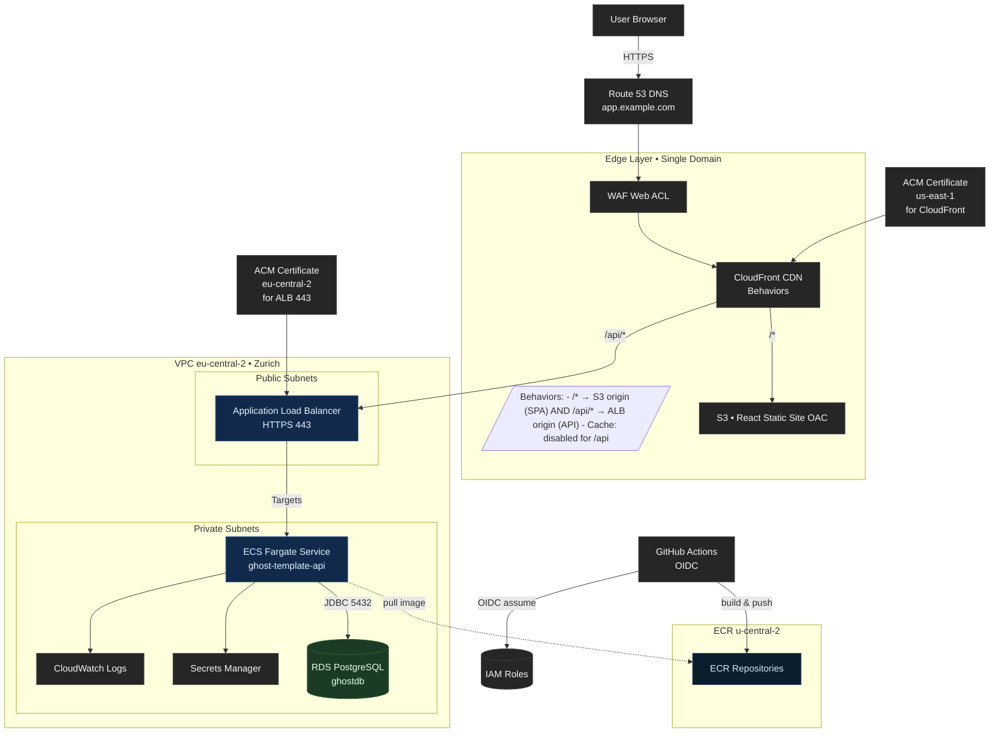
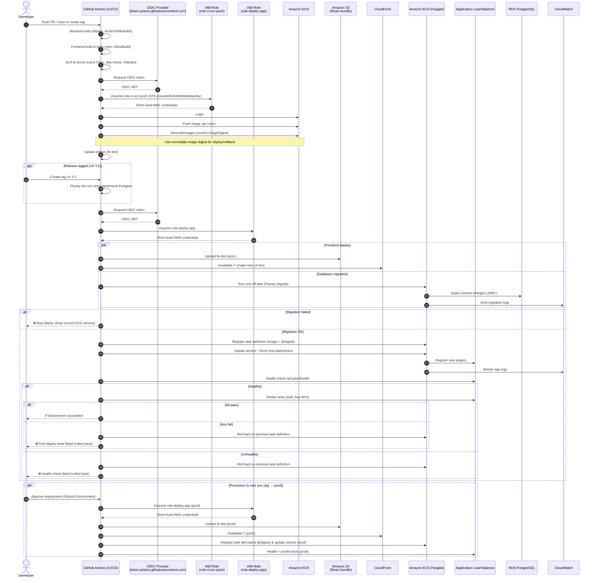

This guide documents how to deploy a full-stack application (Spring Boot backend + PostgreSQL + React frontend) 
on AWS using ECS Fargate, RDS, and CloudFront/S3.  
It's meant as a **reference architecture** and **learning resource**.

> ⚠️ This repository contains **no credentials**.  
> All AWS account IDs and names are placeholders.


- [High Level Architecture](#high-level-architecture)
- [Deployment sequence](#deployment-sequence)
  - [Phase 1 — Continuous Integration (CI)](#phase-1--continuous-integration-ci)
  - [Phase 2 — Build \& Package](#phase-2--build--package)
  - [Phase 3 — Deployment](#phase-3--deployment)
  - [Phase 4 — Promotion, Monitoring \& Rollback](#phase-4--promotion-monitoring--rollback)
- [AWS Components configuration](#aws-components-configuration)
  - [Phase 0 - Prereqs \& Naming](#phase-0---prereqs--naming)
  - [Phase 1 - Foundation (Networking \& Accounts)](#phase-1---foundation-networking--accounts)
  - [Phase 2 - Data (RDS PostgreSQL)](#phase-2---data-rds-postgresql)
  - [Phase 3 - Images (ECR) \& Build](#phase-3---images-ecr--build)
  - [Phase 4 - IAM for CI/CD \& Tasks](#phase-4---iam-for-cicd--tasks)
    - [GitHub → AWS (OIDC)](#github--aws-oidc)
    - [ECS Roles](#ecs-roles)
  - [Phase 5 - ECS (Cluster, Task Def, ALB, Service)](#phase-5---ecs-cluster-task-def-alb-service)
  - [Phase 6 - GitHub Actions (CI/CD)](#phase-6---github-actions-cicd)
    - [Build \& Push](#build--push)
    - [Deploy](#deploy)
  - [Phase 7 - Frontend (React on S3 + CloudFront)](#phase-7---frontend-react-on-s3--cloudfront)
  - [Phase 8 - Observability \& Ops](#phase-8---observability--ops)
  - [Phase 9 - Security Essentials](#phase-9---security-essentials)
  - [Phase 10 - Test \& Promote](#phase-10---test--promote)
  - [Creation Order Summary](#creation-order-summary)
- [AWS Cloud Resource Naming Conventions](#aws-cloud-resource-naming-conventions)
  - [1) Simple rules (use everywhere)](#1-simple-rules-use-everywhere)
  - [2) Canonical pattern](#2-canonical-pattern)
  - [3) Per-service naming templates](#3-per-service-naming-templates)
  - [4) Tagging strategy (mandatory-your best friend)](#4-tagging-strategy-mandatory-your-best-friend)
  - [5) Worked examples](#5-worked-examples)
    - [A) External client – ACME, Invoicer project, API service, prod in eu-west-1](#a-external-client--acme-invoicer-project-api-service-prod-in-eu-west-1)
    - [B) Your SaaS – “Ledger”, worker service, staging in eu-central-1](#b-your-saas--ledger-worker-service-staging-in-eu-central-1)
    - [C) Portfolio – “portfolio-site”, no client, dev in eu-west-1](#c-portfolio--portfolio-site-no-client-dev-in-eu-west-1)
    - [Image tags \& versions](#image-tags--versions)
    - [Guardrails \& pitfalls](#guardrails--pitfalls)
    - [Drop-in variables (IaC)](#drop-in-variables-iac)


# High Level Architecture 



| Component | Responsibility |
|------------|----------------|
| **GitHub Actions** | Runs CI/CD, builds and deploys code. |
| **OIDC + IAM Roles** | Securely authorize GitHub to assume AWS roles. |
| **Amazon ECR** | Stores versioned Docker images. |
| **Amazon ECS (Fargate)** | Runs backend containers with zero server management. |
| **RDS PostgreSQL** | Persistent managed database. |
| **S3 + CloudFront** | Host and distribute the React frontend globally. |
| **CloudWatch** | Logs, metrics, and alarms for monitoring and rollback visibility. |


---

# Deployment sequence


## Phase 1 — Continuous Integration (CI)

1. **Developer pushes code**  
   A developer pushes changes to the `main` branch or opens a Pull Request (PR).  
   GitHub Actions automatically triggers the CI workflow.

2. **Source checkout**  
   The pipeline checks out the latest source code from the GitHub repository.

3. **Backend build & tests (Spring Boot)**  
   Maven runs:
   - Unit tests  
   - Architecture checks (Modulith / ArchUnit)  
   If any test fails → the pipeline stops.

4. **Frontend build & tests (React)**  
   Node.js installs dependencies (`npm ci`), runs tests, and builds a static production bundle in the `build/` folder.

5. **Security & secret scans**  
   Tools like **Trivy**, **OWASP Dependency-Check**, and **Gitleaks** check:
   - For known vulnerabilities in dependencies  
   - For accidentally committed secrets  
   If any high-severity issue is found → the pipeline fails.


## Phase 2 — Build & Package

6. **Authenticate GitHub → AWS via OIDC**  
   GitHub Actions requests an OpenID Connect (OIDC) token from `token.actions.githubusercontent.com`.  
   AWS IAM verifies the token and issues short-lived credentials for the role:
   - `role-ci-ecr-push`

7. **Build backend container image**  
   Using **Jib** or **Paketo Buildpacks**, a Docker image of the Spring Boot app is created.  
   It includes all application code and dependencies.

8. **Push image to Amazon ECR**  
   The pipeline logs in to Amazon ECR and pushes the built image, tagged as:
   ```bash
   ghost-template-api:git-<sha>
   ```
   ECR returns an **immutable image digest** (e.g. `sha256:abcd...`).

9. **Store frontend artifact**  
   The compiled React bundle (`build/`) is uploaded as a GitHub Actions artifact, so it can be reused in deployment workflows.

10. **Optional: tag a release**  
    A human or automation creates a version tag (like `v1.2.3`) and generates release notes.  
    This locks the version that will be deployed.

11. **Optional: Flyway dry-run**  
    The pipeline runs a temporary PostgreSQL instance and executes `flyway:migrate` to verify that database migrations apply cleanly.  
    If any migration fails → deployment is blocked until fixed.


## Phase 3 — Deployment

12. **Authenticate again with AWS (deployment role)**  
    The pipeline assumes a second AWS IAM role:  
    - `role-deploy-app`  
    This one has permission to update ECS services, RDS secrets, and CloudFront.

13. **Upload frontend bundle to S3**  
    The React `build/` folder is synced to the S3 bucket (e.g. `ghost-template-web-prod-euc2-1`).  
    This makes the static website files (HTML, JS, CSS) publicly readable via CloudFront.

14. **Invalidate CloudFront cache**  
    The pipeline issues a cache invalidation (usually for `/*`) so that users immediately see the new version.

15. **Run Flyway migrations (real DB)**  
    The backend migrations are applied to the **production RDS PostgreSQL** instance by running a **one-off ECS task**:
    ```bash
    java -jar app.jar --spring.flyway.enabled=true
    ```
    If migrations fail → stop deployment and keep the current ECS version active.

16. **Register new ECS task definition**  
    A new ECS task definition is created, referencing:
    - The latest image digest in ECR  
    - Environment variables (DB URL, credentials, etc.)  
    - Roles for task execution and secret retrieval  

17. **Force ECS service update**  
    ECS deploys new containers running the updated image.  
    It uses **rolling deployments** with health checks via the **Application Load Balancer (ALB)**.

18. **Health checks**  
    The pipeline monitors the new ECS tasks until:
    - ALB marks them as healthy  
    - `/actuator/health` endpoint responds with `200 OK`  

19. **Smoke tests**  
    Once the new containers are live, the pipeline runs quick checks:
    - Login endpoint  
    - Core API routes  
    - Database connectivity  
    If all pass → continue.  
    If any fail → automatically roll back to the previous ECS task definition.


## Phase 4 — Promotion, Monitoring & Rollback

20. **Promotion**  
    After the first environment (e.g. `staging`) passes health & smoke tests, the same image digest is promoted to `prod` via manual GitHub approval.

21. **Monitoring**  
    CloudWatch collects:
    - ECS logs (application and system)  
    - ALB request counts, latency, and errors  
    - RDS metrics (connections, CPU, disk I/O)  
    Alarms alert on 5xx spikes or failed health checks.

22. **Rollback**  
    If an issue appears post-deploy:
    - The GitHub workflow can re-run the ECS update command using the **previous task definition revision**.
    - ECS instantly rolls traffic back to the stable containers.

23. **Cleanup / retention**  
    - ECR lifecycle policy deletes old images (e.g. keep last 30).  
    - CloudWatch logs older than 30 days are purged.  
    - RDS snapshots rotate automatically.  
    - Artifacts and cache files are cleaned to reduce costs.




---

# AWS Components configuration

## Phase 0 - Prereqs & Naming
- **Region:** `eu-central-2` (Zurich)
- **IAM Identity Center (SSO)** enabled with admin profile
- **CLI Profile:** `aws configure sso` → e.g. `VhAdmin`
- **Naming convention:**
  - Org: `ghost`
  - Project: `template`
  - Service: `api`
  - Env: `prod`


## Phase 1 - Foundation (Networking & Accounts)
- **VPC:** `ghost-main-vpc` (CIDR: `10.0.0.0/16`)
- **Subnets:**
  - Public: `10.0.1.0/24`, `10.0.2.0/24`
  - Private: `10.0.11.0/24`, `10.0.12.0/24`
- **Internet Gateway** and **NAT Gateways**
- **Security Groups:**
  - `alb-sg`: Inbound `80/443` from `0.0.0.0/0`
  - `ecs-sg`: Inbound `8080` from `alb-sg`
  - `rds-sg`: Inbound `5432` from `ecs-sg`
- **Check ECS service-linked role:** `AWSServiceRoleForECS`


## Phase 2 - Data (RDS PostgreSQL)
- **Engine:** PostgreSQL (latest)
- **Instance class:** `db.t3.small` or `db.t4g.small`
- **Storage:** gp3 20–50 GB (autoscaling on)
- **VPC:** Zurich VPC
- **Subnets:** Private subnets
- **Public access:** No
- **Security group:** `rds-sg`
- **Master username:** `ghost_admin`
- **DB name:** `ghostdb`
- **Store credentials:** Secrets Manager
- **Backup:** Enabled (7–14 days)
- **Outputs:** RDS endpoint + Secret ARN


## Phase 3 - Images (ECR) & Build
- **ECR repo:** `ghost/template/api`
- **Push images:** Tags `git-<sha>` or `vX.Y.Z`
- **Lifecycle policy:** Keep last 30 images
- **Image scanning:** Enabled

## Phase 4 - IAM for CI/CD & Tasks
### GitHub → AWS (OIDC)
- **OIDC Provider:** `token.actions.githubusercontent.com`
- **Role `role-ci-ecr-push`:**
  - Trust: GitHub OIDC
  - Policy: ECR push minimal
- **Role `role-deploy-app`:**
  - Trust: GitHub OIDC
  - Policy: ECS update, ECR describe, IAM pass

### ECS Roles
- **Execution role:** `ecsTaskExecutionRole` (policy: `AmazonECSTaskExecutionRolePolicy`)
- **Task role:** `ghost-template-api-taskrole`
  - Allow `secretsmanager:GetSecretValue`


## Phase 5 - ECS (Cluster, Task Def, ALB, Service)
- **Cluster:** `ghost-main-ecs` (Zurich)
- **Task Definition:**
  - Family: `ghost-template-api`
  - CPU/Mem: `0.5 vCPU / 1–2 GB`
  - Container:
    - Port: 8080
    - Health: `/actuator/health`
    - Env vars: `SPRING_DATASOURCE_URL`, `USERNAME`, `PASSWORD`
  - Execution Role: `ecsTaskExecutionRole`
  - Task Role: `ghost-template-api-taskrole`
- **ALB:**
  - Public subnets, `alb-sg`
  - Target group → port 8080
- **ECS Service:**
  - Launch type: Fargate
  - Subnets: Private
  - SG: `ecs-sg`
  - Target group: ALB TG


## Phase 6 - GitHub Actions (CI/CD)
### Build & Push
- **Assume:** `role-ci-ecr-push`
- **Steps:**
  - `docker build` and `docker push` to ECR

### Deploy
- **Assume:** `role-deploy-app`
- **Steps:**
  - Resolve image digest from ECR
  - Register new task definition
  - `aws ecs update-service` with `--force-new-deployment`


## Phase 7 - Frontend (React on S3 + CloudFront)
- **Build React:** `npm run build`
- **S3 bucket:** `ghost-template-web-prod-euc2-1`
- **CloudFront:**
  - Origin: S3
  - Cert: ACM (us-east-1)
  - Custom domain via Route 53
- **GitHub Actions:** `aws s3 sync build/ s3://bucket --delete`


## Phase 8 - Observability & Ops
- CloudWatch log retention 30d
- Alarms: ECS CPU/mem >80%, ALB 5xx, RDS connections
- ECR lifecycle + RDS snapshots
- Budgets and billing alerts


## Phase 9 - Security Essentials
- MFA on SSO & root
- Least privilege OIDC roles
- Secrets in Secrets Manager
- HTTPS via ACM + ALB listener 443


## Phase 10 - Test & Promote
- Test `/actuator/health` via ALB
- Run smoke tests
- Point domain to ALB or CloudFront
- Tag release (`v1.0.0`) and redeploy


## Creation Order Summary
1. VPC + Subnets + NAT + SGs  
2. RDS PostgreSQL  
3. ECR repo + image push  
4. IAM (OIDC + roles)  
5. ALB  
6. ECS Cluster + Task Def + Service  
7. GitHub CI/CD pipeline  
8. React S3 + CloudFront  
9. Monitoring + Security


# AWS Cloud Resource Naming Conventions
A consistent naming convention for cloud resources is crucial for managing infrastructure effectively. It aids in identification,

## 1) Simple rules (use everywhere)
- lowercase, hyphens only (a-z0-9-).
- Keep names short but specific; prefer segments over long words.
- Order segments from broad → specific.

Standard segments:
- `{org}` – your company/handle (e.g., zenbyte)
- `{client}` – external client id (optional for personal work)
- `{proj}` – product/project key (e.g., invoicer)
- `{svc}` – microservice or component (e.g., api, worker)
- `{env}` – dev|stg|prod (or sandbox, demo when needed)
- `{region}` – short code eu-west-1 → euw1, us-east-1 → use1, etc.
- `{tier}` – data|edge|net|ops (optional grouping)
- `{seq}` – numeric suffix if uniqueness is needed

Recommended short region map:
- eu-west-1 = `euw1`
- eu-central-1 = `euc1`
- us-east-1 = `use1`
- us-west-2 = `usw2`

## 2) Canonical pattern

General pattern (resource names):
`{org}`[-`{client}`]/`{proj}`/`{svc}`-`{env}`-`{region}` for ECR-style repos (with slashes)
`{org}`-`{opt_client}`-`{proj}`-`{svc}`-`{env}`-`{region}` for everything else

Omit `{client}` for your own SaaS/portfolio.

If a service is whole-app, you can drop `{svc}` and use `{proj}`.

## 3) Per-service naming templates

| Category | Resource | Naming Convention / Example |
|-----------|-----------|-----------------------------|
| **Compute** | **ECR repo** | `{org}`[-`{client}`]/`{proj}`/`{svc}`-`{env}` |
|  | **Tags (image)** | :v`{semver}`, :git-`{shortsha}`, :`{env}` |
|  | **App Runner service** | `{org}`-`{opt_client}`-`{proj}`-`{svc}`-`{env}`-`{region}` |
| **ECS** | **Cluster** | `{org}`-`{opt_client}`-`{proj}`-`{env}`-`{region}`-ecs |
|  | **Service** | `{org}`-`{opt_client}`-`{proj}`-`{svc}`-`{env}`-`{region}`-svc |
|  | **Task def (family)** | `{org}`-`{proj}`-`{svc}` |
|  | **Lambda function** | `{org}`-`{opt_client}`-`{proj}`-`{svc}`-`{env}` (keep ≤ 64 chars) |
| **Networking & Edge** | **VPC** | `{org}`-`{opt_client}`-`{proj}`-`{env}`-`{region}`-vpc |
|  | **Subnets** | `{org}`-`{proj}`-`{env}`-`{region}`-`{tier}`-`{az}` e.g., `zenbyte-invoicer-dev-euw1-app-a` |
|  | **Security Group** | `{org}`-`{proj}`-`{svc}`-`{env}`-sg |
|  | **ALB/NLB** | `{org}`-`{proj}`-`{env}`-`{region}`-alb |
|  | **Target group** | `{org}`-`{proj}`-`{svc}`-`{env}`-tg |
|  | **Route 53 records** | `{svc}`.`{env}`.`{proj}`.`{domain}` e.g., `api.dev.invoicer.example.com` |
|  | **CloudFront distro** | `{org}`-`{proj}`-`{env}`-cdn |
| **Data & Storage** | **S3 buckets** | `{org}`-`{opt_client}`-`{proj}`-`{tier}`-`{env}`-`{region}`-`{seq}` e.g., `zenbyte-invoicer-artifacts-dev-euw1-1` |
|  | **RDS instance/cluster** | `{org}`-`{proj}`-`{env}`-`{region}`-db |
|  | **DynamoDB table** | `{org}`-`{proj}`-`{svc}`-`{env}` |
|  | **ElastiCache** | `{org}`-`{proj}`-`{env}`-`{region}`-cache |
| **Messaging & Integration** | **SQS queue** | `{org}`-`{proj}`-`{svc}`-`{env}`-q |
|  | **SNS topic** | `{org}`-`{proj}`-`{svc}`-`{env}`-topic |
|  | **EventBridge bus/rule** | `{org}`-`{proj}`-`{env}`-bus, `{org}`-`{proj}`-`{svc}`-`{env}`-rule |
| **Config, Secrets, Keys** | **SSM Parameter prefix** | /`{org}`/`{opt_client}`/`{proj}`/`{env}`/`{svc}`/... e.g., `/zenbyte/invoicer/prod/api/SPRING_DATASOURCE_URL` |
|  | **Secrets Manager name** | `{org}`/`{opt_client}`/`{proj}`/`{env}`/`{svc}`/db |
|  | **KMS key alias** | `alias/{org}-{proj}-{env}` |
| **Observability** | **CloudWatch log group** | `/aws/{runtime}/{org}/{proj}/{svc}/{env}` e.g., `/aws/ecs/zenbyte/invoicer/api/prod` |
|  | **X-Ray group** | `{org}`-`{proj}`-`{env}`-xray |
| **CI/CD & Artifacts** | **CodeBuild/CodePipeline/Artifacts S3** |  |
|  | **Project** | `{org}`-`{proj}`-`{env}`-build |
|  | **Pipeline** | `{org}`-`{proj}`-`{env}`-pipe |
|  | **Artifacts bucket** | `{org}`-`{proj}`-artifacts-`{region}` |
|  | **GitHub Actions env names** | `{proj}`-`{env}` |
| **IAM (≤ 64 chars)** | **Roles** | `role-{org}-{proj}-{svc}-{env}-{purpose}` e.g., `role-zenbyte-invoicer-api-prod-task` |
|  | **Policies** | `pol-{org}-{proj}-{svc}-{purpose}` |
|  | **Instance profiles** | `ip-{org}-{proj}-{svc}-{env}` |


## 4) Tagging strategy (mandatory-your best friend)

Apply these AWS Tags to every resource (via IaC)
Also set AWS Budgets per tag (Project, Client, Environment) for cost visibility.

| Key	| Example |	Notes |
|- |-|-|
| Owner |	yourname |	Person/team accountable
| Org	| zenbyte	| Your org/brand
| Client |	acme or internal |	External client or internal
| Project |	invoicer |	Product/app key
| Service	 | api	| Microservice/component
| Environment | dev	| stg
| Region |	eu-west-1 |	Full AWS region
| CostCenter |	CONSULTING	| Optional but great for billing
| Compliance |	none |	gdpr
| DataClass	| public	| internal


## 5) Worked examples
### A) External client – ACME, Invoicer project, API service, prod in eu-west-1
- **ECR repo**: zenbyte-acme/invoicer/api-prod
- **ECS cluster**: zenbyte-acme-invoicer-prod-euw1-ecs
- **ECS service**: zenbyte-acme-invoicer-api-prod-euw1-svc
- **Task family**: zenbyte-invoicer-api
- **ALB**: zenbyte-acme-invoicer-prod-euw1-alb
- **RDS**: zenbyte-invoicer-prod-euw1-db
- **S3 (artifacts)**: zenbyte-invoicer-artifacts-euw1-1
- **Parameter path**: /zenbyte/acme/invoicer/prod/api/SPRING_DATASOURCE_URL
- **IAM task role**: role-zenbyte-invoicer-api-prod-task
- **Route 53**: api.prod.invoicer.acme.com

### B) Your SaaS – “Ledger”, worker service, staging in eu-central-1
- **ECR**: zenbyte/ledger/worker-stg
- **App Runner svc**: zenbyte-ledger-worker-stg-euc1
- **S3 (uploads)**: zenbyte-ledger-uploads-stg-euc1-1
- **DynamoDB table**: zenbyte-ledger-worker-stg
- **Log group**: /aws/apprunner/zenbyte/ledger/worker/stg
- **KMS alias**: alias/zenbyte-ledger-stg
- **Route 53**: worker.stg.ledger.example.com

### C) Portfolio – “portfolio-site”, no client, dev in eu-west-1
- **ECR**: zenbyte/portfolio-site/web-dev
- **CloudFront**: zenbyte-portfolio-site-dev-cdn
- **S3 (static site)**: zenbyte-portfolio-site-web-dev-euw1-1

### Image tags & versions
Use immutable tags in deploys:
- `:v1.4.3` (semver, from release)
- `:git-ab12cd3` (from commit)
Optional rolling: :prod points to current prod but never deploy by mutable tag alone.

### Guardrails & pitfalls
S3 names must be globally unique → include region or a short random suffix.
Lambda name ≤ 64 chars → keep `{org}`, `{proj}`, `{svc}` short.
Don’t put secrets in names (even DB names).
If you use multi-account, add `{acct}` segment (e.g., prd, nonprd) to names or tags.

### Drop-in variables (IaC)
```hcl
# Terraform locals
locals {
  org     = "zenbyte"
  client  = "acme"        # or "internal"
  proj    = "invoicer"
  svc     = "api"
  env     = "prod"        # dev|stg|prod
  region  = "eu-west-1"
  rshort  = "euw1"
}

# Compose names
locals {
  base_dash = "${local.org}-${local.client}-${local.proj}-${local.env}-${local.rshort}"
  svc_dash  = "${local.org}-${local.client}-${local.proj}-${local.svc}-${local.env}-${local.rshort}"
  ecr_repo  = "${local.org}-${local.client}/${local.proj}/${local.svc}-${local.env}"
}

# Standard tags
locals {
  tags = {
    Owner       = "yourname"
    Org         = local.org
    Client      = local.client
    Project     = local.proj
    Service     = local.svc
    Environment = local.env
    Region      = local.region
    CostCenter  = "CONSULTING"
  }
}
``` 