# API Contract

This directory contains the **OpenAPI 3.1 Specification**, which serves as the **Single Source of Truth** for our application's interface. We follow a strict **API-First** workflow.

## The API-First Workflow

Code is a derivative of the specification. We do not generate the spec from code; we generate the code from the spec.

```mermaid
flowchart TD
    %% Nodes
    Spec["📄 openapi.yaml<br/>(Source of Truth)"]
    Lint["🔍 Spectral<br/>(Linting & Style)"]
    Diff["⚖️ OpenAPI Diff<br/>(Breaking Changes?)"]
    
    subgraph Backend [Backend Build]
        direction TB
        JavaGen["☕ OpenAPI Generator<br/>(Maven Plugin)"]
        Interfaces["📝 Java Interfaces<br/>(Target/Generated)"]
        Impl["🛠️ Controller Implementation<br/>(src/main/java)"]
    end

    subgraph Frontend [Frontend Build]
        direction TB
        TSGen["TS OpenAPI Generator<br/>(NPM Script)"]
        Client["📦 TypeScript Client<br/>(src/api/generated)"]
        Hooks["fz React Hooks<br/>(src/hooks)"]
    end

    %% Flow
    Spec --> Lint
    Spec --> Diff
    
    Lint -->|Pass| JavaGen
    Lint -->|Pass| TSGen
    
    JavaGen --> Interfaces
    Interfaces -.->|Implements| Impl
    
    TSGen --> Client
    Client -.->|Imports| Hooks

    %% Styling
    style Spec fill:#f9f,stroke:#333,stroke-width:2px
    style Interfaces stroke-dasharray: 5 5
    style Client stroke-dasharray: 5 5
```

## Directory Structure

*   **`specification/openapi.yaml`**: The main contract file. Edit this to change the API.
*   **`rules/`**: Custom Spectral rulesets for governance (style, examples, etc.).
*   **`.spectral.yaml`**: Configuration for the linter.

## Key Commands

Run these commands from the `api/` directory:

| Command | Description |
| :--- | :--- |
| `npm run lint` | Validates the spec against our style guide and OpenAPI standards. |
| `npm run diff` | Checks for breaking changes against the `main` branch. |
| `npm run mock` | Starts a local mock server (Prism) on port 4010 to test the API before implementation. |

## Development Cycle

1.  **Modify** `specification/openapi.yaml`.
2.  **Lint** to ensure validity: `npm run lint`.
3.  **Push** to propagate changes.
    *   **Backend**: Run `./mvnw clean compile` to regenerate interfaces.
    *   **Frontend**: Run `npm run api:generate` to regenerate the client.
