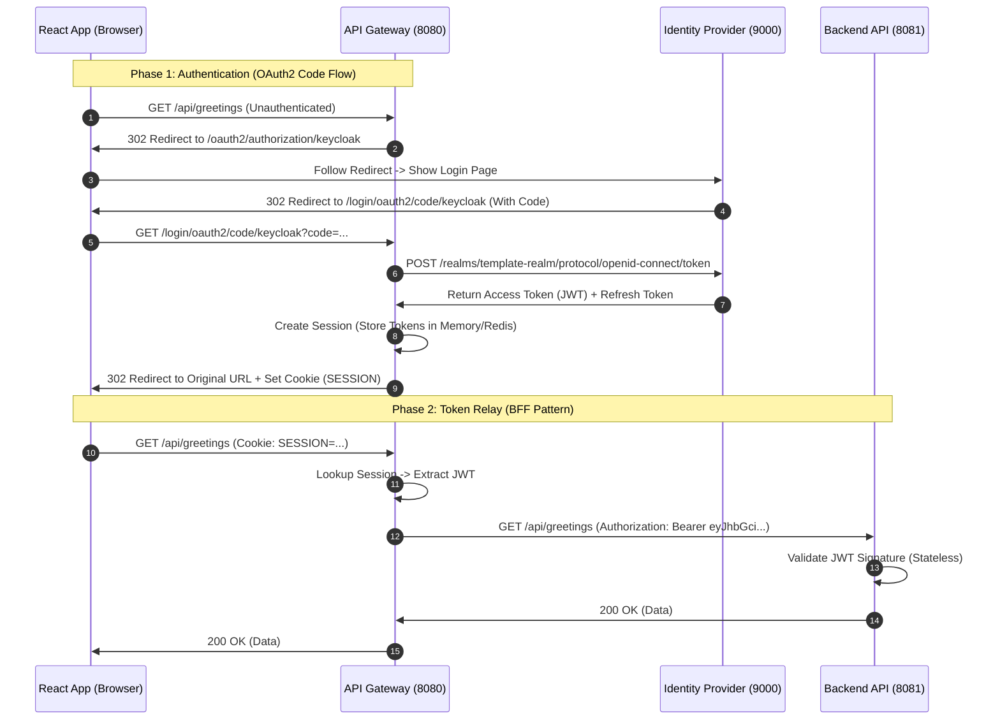

# Implementation Plan: Secure Authentication with Gateway BFF & Keycloak

## 1. Overview
This document outlines the step-by-step process to implement a **Backend for Frontend (BFF)** authentication architecture using **Spring Cloud Gateway** and **Keycloak**.

**Goal**: Secure our React Frontend and Spring Boot Backend using OpenID Connect (OIDC) without exposing sensitive tokens to the browser.

**Target Architecture**:
*   **Browser**: Authenticates via **HttpOnly Cookie** (Session).
*   **Gateway (BFF)**: Translates Cookie -> **Access Token (JWT)**.
*   **Backend (Resource Server)**: Authenticates via **Access Token (JWT)**.

---

## 2. Prerequisites: Configuration

Before writing code, we must set up the environment variables. This keeps our secrets safe and configuration flexible.

### Step 0: Configure `.env`
**Action**: Update your root `.env` file with these variables.

```env
# --- Keycloak Configuration ---
KC_PORT=9000
KC_ADMIN=admin
KC_ADMIN_PASSWORD=admin
KC_REALM=template-realm
KC_CLIENT_ID=template-gateway
KC_CLIENT_SECRET=CHANGE_ME_GENERATE_IN_KEYCLOAK_UI

# --- Gateway Configuration ---
GW_PORT=8080

# --- Backend (Resource Server) Configuration ---
# Note: Gateway will proxy traffic to this internal port
BCK_APP_PORT=8081 
```

---

## 3. Phase 1: Infrastructure (Keycloak & Gateway)

**Goal**: Spin up a local Identity Provider (IdP) and define the container infrastructure.

### Step 1.1: Update `docker-compose.yml`
**Why?**: We need Keycloak running to handle logins, and we need to define our new Gateway service.

**Action**: Add the `keycloak` and `gateway` services.

```yaml
services:
  # ... existing backend/db services ...

  keycloak:
    image: quay.io/keycloak/keycloak:26.0
    command: start-dev
    environment:
      KEYCLOAK_ADMIN: ${KC_ADMIN}
      KEYCLOAK_ADMIN_PASSWORD: ${KC_ADMIN_PASSWORD}
    ports:
      - "${KC_PORT}:8080"
    networks:
      - backend-network

  gateway:
    build:
      context: ./gateway
      dockerfile: Dockerfile
    ports:
      - "${GW_PORT}:8080" # This is the new Main Entry Point
    environment:
      SPRING_PROFILES_ACTIVE: docker
    depends_on:
      - keycloak
      - backend
    networks:
      - backend-network
```

### Step 1.2: Initialize Keycloak
**Why?**: Keycloak needs to know about our application (the "Client") and our users.

**Action**:
1.  **Start Keycloak**: `docker-compose up keycloak`.
2.  **Access Console**: Go to `http://localhost:9000` (Login with admin/admin).
3.  **Create Realm**: Name it `${KC_REALM}` (e.g., `template-realm`).
4.  **Create Client**:
    *   **Client ID**: `${KC_CLIENT_ID}` (e.g., `template-gateway`).
    *   **Client Authentication**: **ON** (Confidential Client).
    *   **Valid Redirect URIs**: `http://localhost:8080/login/oauth2/code/keycloak`.
    *   **Web Origins**: `+`.
5.  **Get Secret**: Go to the **Credentials** tab, copy the **Client Secret**, and paste it into your `.env` file (`KC_CLIENT_SECRET`).
6.  **Create User**: Create a test user (e.g., `user` / `password`).

---

## 4. Phase 2: The Gateway Service (BFF)

**Goal**: Create the Spring Boot application that acts as the secure bridge.

### Step 2.1: Generate Project
**Why?**: We need a fresh Spring Boot module for the gateway.

**Action**: Run this command in your terminal (inside the `root` folder):
```bash
curl https://start.spring.io/starter.zip \
    -d type=maven-project \
    -d language=java \
    -d bootVersion=3.4.1 \
    -d dependencies=cloud-gateway,oauth2-client,security,actuator \
    -d groupId=com.example \
    -d artifactId=gateway \
    -d name=gateway \
    -d packageName=com.example.gateway \
    -d javaVersion=21 \
    -o gateway.zip

unzip gateway.zip -d gateway
rm gateway.zip
```

### Step 2.2: Configure `gateway/src/main/resources/application.yml`
**Why?**: This tells the Gateway how to perform the OAuth2 login and where to route API requests.

**Action**: Replace content with:
```yaml
server:
  port: 8080

spring:
  application:
    name: gateway
  security:
    oauth2:
      client:
        registration:
          keycloak:
            provider: keycloak
            client-id: ${KC_CLIENT_ID}
            client-secret: ${KC_CLIENT_SECRET}
            scope: openid,profile,email
            authorization-grant-type: authorization_code
            redirect-uri: "{baseUrl}/login/oauth2/code/{registrationId}"
        provider:
          keycloak:
            # Internal Docker URL for container-to-container talk
            issuer-uri: http://keycloak:8080/realms/${KC_REALM}
            # External URL for browser redirection (if different)
            # authorization-uri: http://localhost:9000/realms/${KC_REALM}/protocol/openid-connect/auth 
  cloud:
    gateway:
      default-filters:
        - TokenRelay # <--- Critical: Passes JWT to Backend
      routes:
        - id: backend-route
          uri: http://backend:8080 # Internal Docker hostname
          predicates:
            - Path=/api/**
```

### Step 2.3: Security Config (`SecurityConfig.java`)
**Why?**: To enforce authentication on all requests and handle login/logout.

**Action**: Create `gateway/src/main/java/com/example/gateway/config/SecurityConfig.java`:
*   Enable `oauth2Login()`.
*   Enable `csrf()` (Use `CookieServerCsrfTokenRepository`).

### Step 2.4: Dockerize Gateway
**Why?**: To run it inside our Docker network.

**Action**: Create `gateway/Dockerfile` (Copy the pattern from `backend/Dockerfile`, but use the gateway jar).

### Step 2.5: Session Storage (Redis) - *Optional*
**Why?**: In production, if you have multiple Gateways, they need to share sessions.
*   **For now**: We skip this and use In-Memory sessions for simplicity.

---

## 5. Phase 3: The Backend (Resource Server)

**Goal**: Update the existing backend to accept JWTs instead of doing nothing.

### Step 3.1: Dependencies
**Action**: Add to `backend/pom.xml`:
```xml
<dependency>
    <groupId>org.springframework.boot</groupId>
    <artifactId>spring-boot-starter-oauth2-resource-server</artifactId>
</dependency>
```

### Step 3.2: Configuration
**Action**: Update `backend/src/main/resources/application.properties`:
```properties
# Backend moves to 8081 to free up 8080 for Gateway
server.port=8081
# Validates JWTs against Keycloak
spring.security.oauth2.resourceserver.jwt.issuer-uri=http://keycloak:8080/realms/${KC_REALM}
```

### Step 3.3: Security Config
**Action**: Update `backend/.../SecurityConfig.java`:
*   Change to `http.oauth2ResourceServer(oauth2 -> oauth2.jwt())`.
*   Set session policy to `SessionCreationPolicy.STATELESS`.

---

## 6. Phase 4: Frontend Integration

**Goal**: Point the React app to the Gateway.

### Step 4.1: Update Proxy
**Action**: Modify `frontend/vite.config.ts`.
*   Change the proxy target for `/api` from `http://backend:8080` to `http://localhost:8080` (The Gateway).

### Step 4.2: Handle Login
**Action**: In your React code, if you get a `401 Unauthorized`:
*   Redirect the window to `http://localhost:8080/oauth2/authorization/keycloak`.
*   The Gateway will handle the rest!

---

## 7. Visual Architecture



## 8. Final Project Structure

```
root/
├── .env                            # [New] Secrets & Config
├── docker-compose.yml              # [Modified] +Keycloak, +Gateway
├── backend/                        # Resource Server
│   ├── pom.xml                     # +oauth2-resource-server
│   └── src/main/java/.../config/
│       └── SecurityConfig.java     # Validates JWTs
├── gateway/                        # [New] BFF Application
│   ├── Dockerfile                  # Container definition
│   ├── pom.xml
│   └── src/main/resources/
│       └── application.yml         # Routes & TokenRelay
├── frontend/
│   ├── vite.config.ts              # Proxy -> Gateway (8080)
│   └── src/api/config.ts           # No client-side token logic
└── api/
    └── specification/
        └── openapi.yaml            # Auth security schemes
```