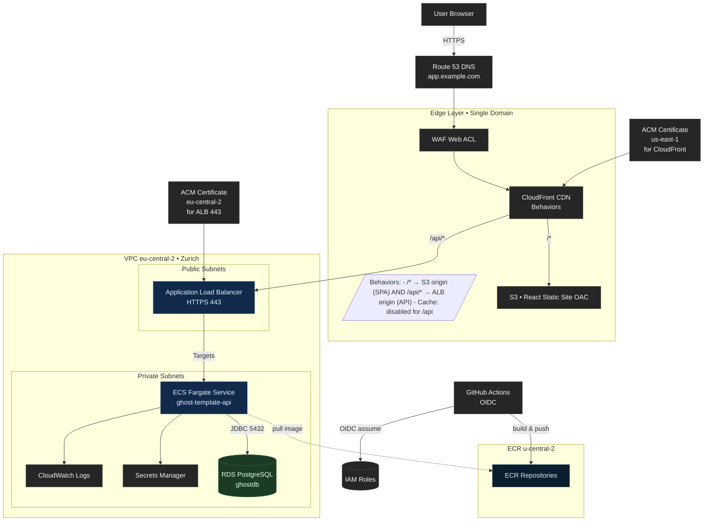
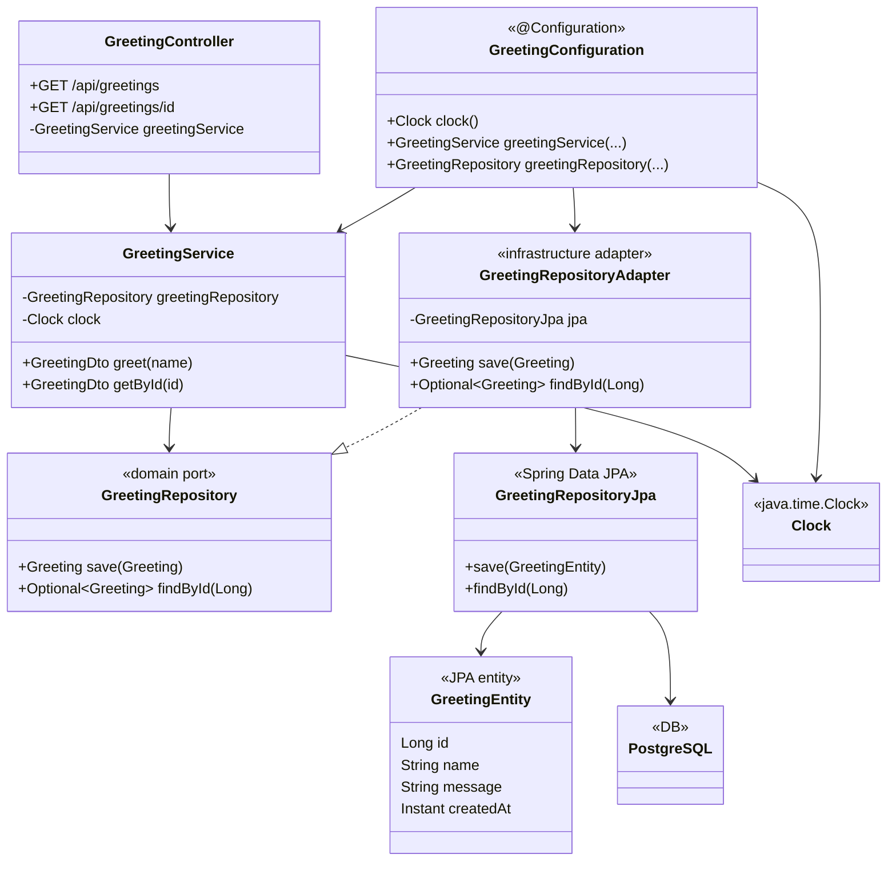
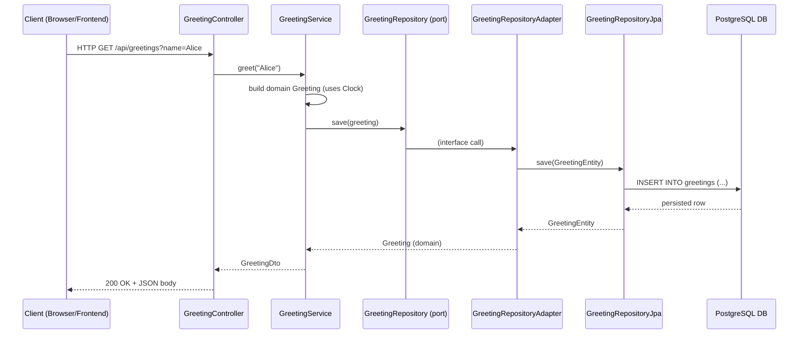

## High Level Architecture 

| Component                | Responsibility                                                    |
| ------------------------ | ----------------------------------------------------------------- |
| **GitHub Actions**       | Runs CI/CD, builds and deploys code.                              |
| **OIDC + IAM Roles**     | Securely authorize GitHub to assume AWS roles.                    |
| **Amazon ECR**           | Stores versioned Docker images.                                   |
| **Amazon ECS (Fargate)** | Runs backend containers with zero server management.              |
| **RDS PostgreSQL**       | Persistent managed database.                                      |
| **S3 + CloudFront**      | Host and distribute the React frontend globally.                  |
| **CloudWatch**           | Logs, metrics, and alarms for monitoring and rollback visibility. |

# Backend Clean Architecture

