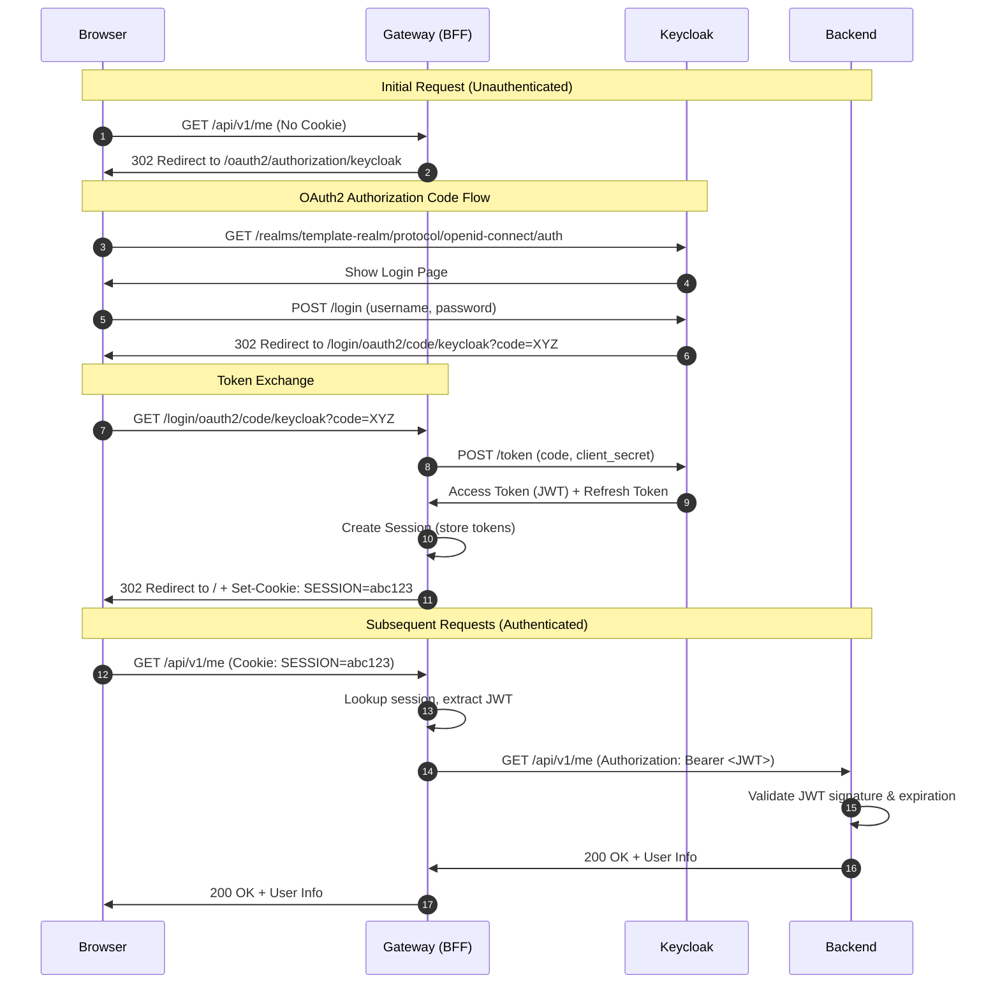

# Implementation Plan: Secure Authentication with Gateway BFF & Keycloak

## Table of Contents
1. [Understanding the BFF Pattern](#1-understanding-the-bff-pattern)
2. [Why Spring Addons](#2-why-spring-addons)
3. [Prerequisites & Configuration](#3-prerequisites--configuration)
4. [Phase 1: Keycloak Setup](#4-phase-1-keycloak-setup)
5. [Phase 2: Gateway (BFF) Implementation](#5-phase-2-gateway-bff-implementation)
6. [Phase 3: Backend (Resource Server)](#6-phase-3-backend-resource-server)
7. [Phase 4: Backend Testing](#7-phase-4-backend-testing)
8. [Phase 5: Frontend Integration](#8-phase-5-frontend-integration)
9. [Phase 6: Advanced Features](#9-phase-6-advanced-features)
10. [Phase 7: End-to-End Testing & Verification](#10-phase-7-end-to-end-testing--verification)
11. [Architecture Diagrams](#11-architecture-diagrams)

---

## 1. Understanding the BFF Pattern

### What Problem Are We Solving?

**Traditional SPA Authentication (❌ Security Risk):**
```
Browser (React)
  ↓ stores Access Token in localStorage/sessionStorage
  ↓ sends: Authorization: Bearer <token>
Backend API
```

**Problems with this approach:**
- 🚨 **XSS Vulnerability:** If attacker injects JavaScript, they can steal tokens
- 🚨 **Token Exposure:** Tokens visible in browser DevTools
- 🚨 **No Token Management:** Frontend handles token refresh logic

**BFF Pattern (✅ Secure):**
```
Browser (React)
  ↓ stores: HttpOnly Cookie (SESSION)
  ↓ sends: Cookie: SESSION=abc123
Gateway (BFF)
  ↓ translates: Cookie → JWT
  ↓ sends: Authorization: Bearer <jwt>
Backend API (Resource Server)
```

**Benefits:**
- ✅ **XSS Protection:** Tokens never exposed to JavaScript
- ✅ **Simplified Frontend:** No token management code
- ✅ **Centralized Security:** Gateway handles OAuth2 complexity
- ✅ **Token Refresh:** Gateway handles automatic refresh with refresh tokens

### Key Concepts

**Backend for Frontend (BFF):**
> A BFF is an intermediary layer that sits between the frontend and backend APIs. It handles authentication, token management, and request transformation.

**Token Relay Pattern:**
> The BFF receives requests with session cookies, retrieves the access token from the session, and forwards it to backend services as a JWT bearer token.

**Resource Server:**
> A backend service that validates JWT tokens and serves protected resources. It doesn't maintain sessions.

---

## 2. Why Spring Addons?

### Decision: Use Spring Addons Library

We're using **`com.c4-soft.springaddons:spring-addons-starter-oidc`** instead of vanilla Spring Security OAuth2.

### Comparison: Before vs After

**WITHOUT Spring Addons (Vanilla Spring Security):**

You'd need to write ~80 lines of complex Java configuration:

```java
@Configuration
public class SecurityConfig {
    @Bean
    @Order(1)
    public SecurityFilterChain clientFilterChain(HttpSecurity http) throws Exception {
        http
            .securityMatcher("/api/**", "/login/**", "/oauth2/**")
            .authorizeHttpRequests(auth -> auth
                .requestMatchers("/login/**", "/oauth2/**").permitAll()
                .anyRequest().authenticated()
            )
            .oauth2Login(oauth2 -> oauth2
                .defaultSuccessUrl("/")
            )
            .csrf(csrf -> csrf
                .csrfTokenRepository(CookieServerCsrfTokenRepository.withHttpOnlyFalse())
                .csrfTokenRequestHandler(new SpaCsrfTokenRequestHandler()) // Custom class!
            )
            .logout(logout -> logout
                .logoutSuccessHandler(oidcLogoutSuccessHandler()) // Custom method!
            );
        return http.build();
    }

    @Bean
    @Order(2)
    public SecurityFilterChain resourceServerChain(HttpSecurity http) throws Exception {
        http
            .securityMatcher("/login-options", "/error", "/actuator/**")
            .authorizeHttpRequests(auth -> auth.anyRequest().permitAll())
            .sessionManagement(session -> session
                .sessionCreationPolicy(SessionCreationPolicy.STATELESS)
            );
        return http.build();
    }

    // Plus custom handler implementations...
}
```

**WITH Spring Addons:**

Just ~15 lines of YAML configuration:

```yaml
com:
  c4-soft:
    springaddons:
      oidc:
        ops:
          - iss: ${issuer}
            authorities:
              - path: $.realm_access.roles
        client:
          client-uri: http://localhost:8080
          security-matchers: [/api/**, /login/**, /oauth2/**]
          permit-all: [/login/**, /oauth2/**]
          csrf: cookie-accessible-from-js
          oauth2-redirections:
            rp-initiated-logout: ACCEPTED
          back-channel-logout:
            enabled: true
```

**Result:** 83% code reduction + production-ready features!

### What Spring Addons Provides

✅ **Automatic Dual Security Filter Chains** - Separates authenticated routes from public endpoints
✅ **Advanced Logout** - RP-initiated logout + back-channel logout
✅ **SPA-Friendly CSRF** - Cookies accessible to JavaScript for CSRF tokens
✅ **Authorities Mapping** - Extracts roles from JWT claims automatically
✅ **Multi-Provider Support** - Easy to add Google/GitHub/Auth0 later
✅ **Testing Utilities** - Mock OAuth2 users in tests
✅ **Production-Ready Defaults** - PKCE, token caching, error handling

### Key Features We'll Use

| Feature              | Configuration                            | Benefit                                   |
| -------------------- | ---------------------------------------- | ----------------------------------------- |
| Dual Security Chains | `client:` and `resourceserver:` sections | Clean separation: authenticated vs public |
| CSRF Config          | `csrf: cookie-accessible-from-js`        | React can read CSRF token from cookie     |
| Logout Support       | `rp-initiated-logout: ACCEPTED`          | Proper Keycloak logout flow               |
| Back-channel Logout  | `enabled: true`                          | Multi-device logout support               |
| Authorities Mapping  | `path: $.realm_access.roles`             | Auto-extract Keycloak roles               |

**Reference:** Spring Addons simplifies OAuth2 BFF implementation as explained in the [Baeldung OAuth2 BFF tutorial](https://www.baeldung.com/spring-cloud-gateway-bff-oauth2).

---

## 3. Prerequisites & Configuration

### Step 0: Update `.env` File

Add these variables to your root `.env` file:

```env
# --- Keycloak Configuration ---
KC_PORT=9000
KC_ADMIN=admin
KC_ADMIN_PASSWORD=admin
KC_REALM=template-realm
KC_CLIENT_ID=template-gateway
KC_CLIENT_SECRET=CHANGE_ME_GENERATE_IN_KEYCLOAK_UI

# --- Gateway Configuration ---
GW_PORT=8080

# --- Backend (Resource Server) Configuration ---
# Backend moves to 8081 to free up 8080 for Gateway
BCK_APP_PORT=8081
# Management port moves to 8082 (was 8081)
BCK_MGMT_PORT=8082
```

**Why these variables?**
- **KC_PORT:** Keycloak runs on a different port (9000) to avoid conflicts
- **GW_PORT:** Gateway is now the main entry point (8080) - all traffic flows through it
- **BCK_APP_PORT:** Backend moves to 8081 since Gateway takes 8080
- **BCK_MGMT_PORT:** Management/actuator port moves to 8082 to avoid conflict with backend app port

> **Design Decision:** All `/api/*` requests go through the Gateway (single entry point). This mirrors production deployment and simplifies routing - no `/bff` prefix needed.

---

## 4. Phase 1: Keycloak Setup (✅ Completed)

This phase focuses solely on setting up Keycloak as the Identity Provider. The Gateway (BFF) will be added in Phase 2.

### Step 1.1: Update `.env` File

**Why?** Add environment variables for Keycloak and prepare for future Gateway integration.

**Location:** `/.env` (root of project)

Add these variables to your existing `.env` file:

```env
# --- Keycloak Configuration ---
KC_PORT=9000
KC_ADMIN=admin
KC_ADMIN_PASSWORD=admin
KC_REALM=template-realm
KC_CLIENT_ID=template-gateway
KC_CLIENT_SECRET=CHANGE_ME_GENERATE_IN_KEYCLOAK_UI
```

> **Note:** `KC_CLIENT_SECRET` will be updated after first Keycloak startup when you copy the generated secret from the Keycloak UI.

---

### Step 1.2: Update `docker-compose.yml` with Keycloak

**Why?** We need to add Keycloak as the Identity Provider.

**Location:** `/docker-compose.yml` (root of project)

Add the Keycloak service:

```yaml
services:
  # ... existing db, backend, frontend services ...

  # --- 5. KEYCLOAK IDENTITY PROVIDER ---
  keycloak:
    container_name: template-keycloak
    image: quay.io/keycloak/keycloak:26.0
    command:
      - start-dev
      - --import-realm  # 👈 Automatically imports realm configuration
    ports:
      - "${KC_PORT}:8080"
    volumes:
      - ./keycloak/import:/opt/keycloak/data/import:ro  # 👈 Mount realm config
    environment:
      KEYCLOAK_ADMIN: ${KC_ADMIN}
      KEYCLOAK_ADMIN_PASSWORD: ${KC_ADMIN_PASSWORD}
      KC_HTTP_PORT: 8080
      KC_HOSTNAME_URL: http://localhost:${KC_PORT}
      KC_HOSTNAME_ADMIN_URL: http://localhost:${KC_PORT}
      KC_HTTP_ENABLED: true
      KC_HEALTH_ENABLED: true
    networks:
      - backend-network
    healthcheck:
      test: ['CMD-SHELL', 'exec 3<>/dev/tcp/127.0.0.1/8080 && echo -e "GET /health/ready HTTP/1.1\r\nhost: 127.0.0.1:8080\r\nConnection: close\r\n\r\n" >&3 && cat <&3 | grep -q "200 OK"']
      interval: 5s
      timeout: 5s
      retries: 20
```

**Key Configuration Explained:**

- **`--import-realm`:** Automatically imports Keycloak configuration from `/keycloak/import/` directory
- **healthcheck:** Ensures Keycloak is fully started before dependent services try to connect
- **ports:** Keycloak runs on port 9000 (externally) to avoid conflicts with other services

---

### Step 1.2: Create Keycloak Realm Configuration

**Why?** Instead of manual clicking in Keycloak UI, we'll automate the setup with a realm export file.

**Action:** Create the directory structure and realm configuration:

```bash
mkdir -p keycloak/import
```

**Location:** `/keycloak/import/template-realm.json`

Create this file with the following content:

```json
{
  "realm": "template-realm",
  "enabled": true,
  "sslRequired": "none",
  "registrationAllowed": false,
  "loginWithEmailAllowed": true,
  "duplicateEmailsAllowed": false,
  "resetPasswordAllowed": false,
  "editUsernameAllowed": false,
  "bruteForceProtected": true,

  "clients": [
    {
      "clientId": "template-gateway",
      "name": "Template Gateway BFF",
      "enabled": true,
      "clientAuthenticatorType": "client-secret",
      "secret": "CHANGE_ME_GENERATE_IN_KEYCLOAK_UI",
      "redirectUris": [
        "http://localhost:8080/*",
        "http://localhost:8080/login/oauth2/code/keycloak"
      ],
      "webOrigins": ["+"],
      "standardFlowEnabled": true,
      "implicitFlowEnabled": false,
      "directAccessGrantsEnabled": false,
      "serviceAccountsEnabled": false,
      "publicClient": false,
      "protocol": "openid-connect",
      "attributes": {
        "post.logout.redirect.uris": "http://localhost:8080/*",
        "backchannel.logout.session.required": "true",
        "backchannel.logout.revoke.offline.tokens": "false"
      },
      "defaultClientScopes": ["openid", "profile", "email", "roles"],
      "optionalClientScopes": ["offline_access"]
    }
  ],

  "roles": {
    "realm": [
      {
        "name": "USER",
        "description": "Standard user role"
      },
      {
        "name": "ADMIN",
        "description": "Administrator role"
      }
    ]
  },

  "users": [
    {
      "username": "user",
      "enabled": true,
      "emailVerified": true,
      "email": "user@example.com",
      "firstName": "Test",
      "lastName": "User",
      "credentials": [
        {
          "type": "password",
          "value": "password",
          "temporary": false
        }
      ],
      "realmRoles": ["USER"]
    },
    {
      "username": "admin",
      "enabled": true,
      "emailVerified": true,
      "email": "admin@example.com",
      "firstName": "Admin",
      "lastName": "User",
      "credentials": [
        {
          "type": "password",
          "value": "admin",
          "temporary": false
        }
      ],
      "realmRoles": ["USER", "ADMIN"]
    }
  ],

  "clientScopes": [
    {
      "name": "roles",
      "protocol": "openid-connect",
      "attributes": {
        "include.in.token.scope": "true",
        "display.on.consent.screen": "false"
      },
      "protocolMappers": [
        {
          "name": "realm roles",
          "protocol": "openid-connect",
          "protocolMapper": "oidc-usermodel-realm-role-mapper",
          "consentRequired": false,
          "config": {
            "multivalued": "true",
            "userinfo.token.claim": "true",
            "id.token.claim": "true",
            "access.token.claim": "true",
            "claim.name": "realm_access.roles",
            "jsonType.label": "String"
          }
        }
      ]
    }
  ]
}
```

#### ✅ Verification: Keycloak Setup
1. **Start Keycloak:**
   ```bash
   docker-compose up -d keycloak
   ```
2. **Wait for startup:** Run `docker-compose logs -f keycloak` and wait for `Listening on: http://0.0.0.0:8080`.
3. **Verify Realm Import:**
   - Go to [http://localhost:9000](http://localhost:9000)
   - Login with `admin` / `admin`
   - Ensure the top-left dropdown says **template-realm** (not just master).
   - Go to **Clients** and verify `template-gateway` exists.

**Important Configuration Notes:**

1. **`secret: "CHANGE_ME_GENERATE_IN_KEYCLOAK_UI"`** - After first startup:
   - Access Keycloak admin console: http://localhost:9000
   - Go to Clients → template-gateway → Credentials tab
   - Copy the Client Secret
   - Update `.env` file with `KC_CLIENT_SECRET=<copied-secret>`
   - Restart gateway service

2. **Test Users (Verification):**
   - **Regular User:** username=`user`, password=`password`, role=`USER`
   - **Admin User:** username=`admin`, password=`admin`, roles=`USER,ADMIN`
   - **How to verify:** In Keycloak Admin Console, go to **Users** -> **View all users**. Select a user and check the **Role mapping** tab to confirm roles are correctly assigned from the realm import.

3. **Back-channel Logout Configuration (Verification):**
   - `backchannel.logout.session.required: true` - Enables multi-device logout (SSO Logout).
   - **How to verify:** Go to **Clients** -> **template-gateway** -> **Advanced settings**. Ensure **Backchannel logout session required** is toggled **ON**. 
   - **Note:** While the configuration is visible now, the actual termination of sessions can only be tested once the Gateway is running and active user sessions exist.

---

### Step 1.3: Future Evolution - Path to Production

**Why?** Our current "Phase 1" setup uses an embedded H2 database and a JSON import file. This is perfect for local development (speed, simplicity, reproducibility) but is **not production-ready**.

This section outlines the roadmap to evolve this infrastructure for Staging and Production environments.

#### Level 1: Persistent Database (Staging/Prod)
**Goal:** Data durability and scalability.
**Change:** Replace embedded H2 with an external PostgreSQL database.

**Configuration Changes (`docker-compose.yml` or K8s):**
```yaml
keycloak:
  environment:
    KC_DB: postgres
    KC_DB_URL: jdbc:postgresql://postgres-db:5432/keycloak
    KC_DB_USERNAME: keycloak
    KC_DB_PASSWORD: ${KC_DB_PASSWORD}
  depends_on:
    - postgres-db
```
*   **Why:** H2 is not designed for concurrent load or clustering. PostgreSQL ensures user data is safe and allows Keycloak to run in a cluster (HA).

#### Level 2: Immutable GitOps Configuration (Production)
**Goal:** Zero manual configuration drift.
**Current State:** We use `--import-realm` (Native Import). This is "all-or-nothing" at startup.
**Future State:** Use **`keycloak-config-cli`**.

**How it works:**
1.  **Git:** Realm config (clients, roles) lives in Git (JSON/YAML).
2.  **Tool:** A separate container (`keycloak-config-cli`) runs alongside Keycloak.
3.  **Action:** It talks to the Keycloak API to apply changes *without* restarting the server.

**Benefits:**
*   **Granular Updates:** Can update a single client redirect URI without reloading the whole realm.
*   **Variable Substitution:** Inject secrets (like Google Client ID) into the config at runtime.
*   **Safety:** "Dry-run" capabilities to see what will change before applying.

**Reference:** [Mastering Keycloak Configuration with GitOps](https://medium.com/@assahbismarkabah/mastering-keycloak-configuration-with-gitops-and-keycloak-config-cli-e0330c18d275)

#### Level 3: High Availability (Clustering)
**Goal:** No single point of failure.
**Setup:**
*   Run multiple Keycloak replicas (Pods).
*   Use `ISPN` (Infinispan) for distributed caching (sessions).
*   Load Balancer in front of the cluster.
*   **Requirement:** Level 1 (PostgreSQL) is mandatory for this.

**Summary of Evolution:**
| Feature      | Current (Dev)                    | Production Target                      |
| :----------- | :------------------------------- | :------------------------------------- |
| **Database** | Embedded H2 (File)               | PostgreSQL / MySQL                     |
| **Config**   | Native Import (`--import-realm`) | `keycloak-config-cli` (GitOps)         |
| **Scaling**  | Single Instance                  | Clustered (K8s/ECS)                    |
| **Users**    | Hardcoded Test Users             | Dynamic (Self-registration) or LDAP/AD |

---

## 5. Phase 2: Gateway (BFF) Implementation (✅ Completed)

### Step 2.0: Update `.env` for Gateway and Backend Ports

**Why?** Gateway will take over port 8080, so backend needs to move to 8081, and management port to 8082.

**Location:** `/.env` (root of project)

Add/update these variables in your `.env` file:

```env
# --- Gateway Configuration ---
GW_PORT=8080

# --- Backend (Resource Server) Configuration ---
# Backend moves to 8081 to free up 8080 for Gateway
BCK_APP_PORT=8081
# Management port moves to 8082 (was 8081)
BCK_MGMT_PORT=8082
```

---

### Step 2.1: Generate Gateway Project

**Why?** We need a new Spring Boot application to act as the BFF.

> **Version Alignment:** Using Java 25, Spring Boot 4.0.x, and Spring Cloud 2025.1.x to match your backend stack.

**Action:** Run this command from your project root:

```bash
curl https://start.spring.io/starter.zip \
    -d type=maven-project \
    -d language=java \
    -d bootVersion=4.0.0 \
    -d dependencies=cloud-gateway,oauth2-client,security,actuator \
    -d groupId=com.example \
    -d artifactId=gateway \
    -d name=gateway \
    -d packageName=com.example.gateway \
    -d javaVersion=25 \
    -o gateway.zip

unzip gateway.zip -d gateway
rm gateway.zip
```

#### ✅ Verification: Project Generation
1. **Check Directory:** Ensure `gateway/src/main/java` and `gateway/pom.xml` exist.
2. **Build:**
   ```bash
   cd gateway
   ./mvnw clean package -DskipTests
   ```
   **Expected:** `BUILD SUCCESS`.

**What this creates:**
- New `gateway/` directory with Spring Cloud Gateway
- OAuth2 Client dependencies (for OAuth2 login)
- Spring Security (for authentication)
- Actuator (for health checks)
- Spring Cloud 2025.1.x (Oakwood) BOM automatically added for Boot 4.0.x

---

### Step 2.2: Add Spring Addons Dependency

**Location:** `gateway/pom.xml`

> **Version Note:** Using Spring Addons 9.1.0 which supports Spring Boot 4.x and Spring Framework 7.x.

Add these dependencies inside `<dependencies>`:

```xml
<dependency>
    <groupId>com.c4-soft.springaddons</groupId>
    <artifactId>spring-addons-starter-oidc</artifactId>
    <version>9.1.0</version>
</dependency>
<!-- Explicitly required for Spring Boot 4 compatibility -->
<dependency>
    <groupId>org.springframework.boot</groupId>
    <artifactId>spring-boot-starter-oauth2-resource-server</artifactId>
</dependency>
```

**Also add for testing:**

```xml
<dependency>
    <groupId>com.c4-soft.springaddons</groupId>
    <artifactId>spring-addons-starter-oidc-test</artifactId>
    <version>9.1.0</version>
    <scope>test</scope>
</dependency>
```

**Note:** Spring Addons automatically pulls in `spring-boot-starter-oauth2-client`, but we add `spring-boot-starter-oauth2-resource-server` explicitly to ensure all auto-configuration classes are present.

#### ✅ Verification: Dependencies
1. **Check Dependency Tree:**
   ```bash
   cd gateway
   ./mvnw dependency:tree | grep spring-addons
   ```
   **Expected:** Output should show `com.c4-soft.springaddons:spring-addons-starter-oidc:jar:9.1.0`.

---

### Step 2.3: Configure Gateway Application

**Location:** `gateway/src/main/resources/application.yaml`

> ⚠️ **YAML Structure Warning:** Pay close attention to indentation! The `spring.security.oauth2.client` configuration must be nested under `spring:`, NOT under `server:`. A common mistake is placing the `security:` block under `server:` which causes Spring to fail with "No qualifying bean of type OAuth2ClientProperties" error.

Replace the entire content with:

```yaml
# Custom properties for easy configuration
scheme: http
keycloak-host: localhost
backend-host: localhost
gateway-host: localhost
gateway-port: 8080
backend-port: 8081
keycloak-port: 9000
issuer: ${scheme}://${keycloak-host}:${keycloak-port}/realms/template-realm
client-id: template-gateway
client-secret: ${KC_CLIENT_SECRET}

server:
  port: ${gateway-port}

spring:
  application:
    name: gateway

  # Standard Spring Security OAuth2 Client configuration
  security:
    oauth2:
      client:
        provider:
          keycloak:
            issuer-uri: ${issuer}
        registration:
          keycloak:
            provider: keycloak
            client-id: ${client-id}
            client-secret: ${client-secret}
            authorization-grant-type: authorization_code
            scope: openid,profile,email,offline_access
            redirect-uri: "{baseUrl}/login/oauth2/code/{registrationId}"

  # Spring Cloud Gateway routing configuration
  cloud:
    gateway:
      routes:
        # Route 1: Forward /api/** to backend API (with TokenRelay)
        - id: backend-api-route
          uri: ${scheme}://${backend-host}:${backend-port}
          predicates:
            - Path=/api/**
          filters:
            - DedupeResponseHeader=Access-Control-Allow-Credentials Access-Control-Allow-Origin
            - TokenRelay=      # 👈 Automatically adds JWT to forwarded requests
            - SaveSession      # 👈 Saves session after token relay
            # No StripPrefix needed - /api/v1/greetings → /api/v1/greetings

        # Route 2: Login options endpoint (handled by Gateway controller)
        - id: login-options-route
          uri: no://op  # Internal route - handled by Gateway controller
          predicates:
            - Path=/login-options

# Spring Addons configuration - This is where the magic happens!
com:
  c4-soft:
    springaddons:
      oidc:
        # OpenID Provider configuration
        ops:
          - iss: ${issuer}
            username-claim: $.preferred_username  # 👈 Extract username from JWT
            authorities:
              - path: $.realm_access.roles        # 👈 Extract roles from JWT

        # Client configuration (oauth2Login filter chain)
        client:
          client-uri: ${scheme}://${gateway-host}:${gateway-port}
          security-matchers:
            - /api/**
            - /oauth2/**
            - /login/**
            - /logout/**
          permit-all:
            - /api/v1/greetings          # 👈 Public: list greetings
            - /api/v1/greetings/*        # 👈 Public: get single greeting
            - /oauth2/**
            - /login/**
            - /logout/connect/back-channel/keycloak
          # post-logout-redirect-host removed - uses client-uri by default
          # post-logout-redirect-host: ${hostname}
          csrf: cookie-accessible-from-js        # 👈 SPA can read CSRF token
          oauth2-redirections:
            rp-initiated-logout: ACCEPTED         # 👈 Enable proper logout flow
          back-channel-logout:
            enabled: true                         # 👈 Multi-device logout support

        # Resource Server configuration (oauth2ResourceServer filter chain)
        resourceserver:
          permit-all:
            - /login-options                      # 👈 Public endpoint (Gateway)
            - /error
            - /actuator/health/**

# Actuator configuration
management:
  endpoint:
    health:
      probes:
        enabled: true
  endpoints:
    web:
      exposure:
        include: health,info
  health:
    livenessstate:
      enabled: true
    readinessstate:
      enabled: true

logging:
  level:
    root: INFO
    org.springframework.security: DEBUG          # 👈 Enable security debugging
    org.springframework.web: INFO
    com.c4_soft.springaddons: DEBUG              # 👈 Debug Spring Addons
```

#### ✅ Verification: Gateway Startup (Standalone)
1. **Set Dummy Secret:** For testing startup, set a dummy secret.
   ```bash
   export KC_CLIENT_SECRET=dummy
   # OR on Windows PowerShell
   $env:KC_CLIENT_SECRET="dummy"
   ```
2. **Run Gateway:**
   ```bash
   cd gateway
   ./mvnw spring-boot:run
   ```
3. **Check Health:** Open [http://localhost:8080/actuator/health](http://localhost:8080/actuator/health).
   **Expected:** `{"status":"UP",...}` (Note: It might be DOWN if Keycloak isn't reachable, but the app should start).

**Configuration Explained:**

#### Key Design Decisions

| Original Plan        | Simplified Approach | Why                                    |
| -------------------- | ------------------- | -------------------------------------- |
| `/bff/api/*` prefix  | `/api/*` directly   | Single entry point, mirrors production |
| `StripPrefix=2`      | No StripPrefix      | URLs pass through unchanged            |
| `/bff/login-options` | `/login-options`    | Simpler, cleaner URL                   |

#### OAuth2 Client Registration
```yaml
spring.security.oauth2.client:
  provider.keycloak:
    issuer-uri: http://localhost:9000/realms/template-realm
  registration.keycloak:
    scope: openid,profile,email,offline_access  # offline_access = refresh token
```
- **issuer-uri:** Spring automatically discovers Keycloak endpoints from `/.well-known/openid-configuration`
- **offline_access:** Requests a refresh token for automatic token renewal

#### Gateway Routes
```yaml
filters:
  - DedupeResponseHeader=...  # Prevents duplicate CORS headers (common issue)
  - TokenRelay=               # Extracts JWT from session and adds to Authorization header
  - SaveSession              # Ensures session is saved after token operations
  # No StripPrefix - /api/v1/greetings passes through unchanged
```

#### Spring Addons - Dual Security Chains

**Client Chain (Session-based):**
```yaml
client:
  security-matchers: [/api/**, /oauth2/**, /login/**, /logout/**]
  permit-all: [/api/v1/greetings, /api/v1/greetings/*, /oauth2/**, /login/**]
```
- Routes matching `security-matchers` use **oauth2Login** (session-based authentication)
- Public endpoints (GET greetings) don't require authentication

**Resource Server Chain (Stateless):**
```yaml
resourceserver:
  permit-all: [/login-options, /error, /actuator/health/**]
```
- Routes matching `permit-all` here don't require authentication
- Uses **oauth2ResourceServer** (stateless, no sessions created)

---

### Step 2.4: Configure Gateway Test Profile

**Why?** The default `@SpringBootTest` tries to load the full context including OAuth2/OIDC configuration, which requires Keycloak to be running. We need a test profile configuration to avoid this. Set this up before adding controllers.

> **File Naming Convention:** We use `application-test.yaml` (profile-specific) instead of `application.yaml` in test resources. This ensures test config is only loaded when `@ActiveProfiles("test")` is explicitly set, keeping production and test configurations cleanly separated.

**Location:** `gateway/src/test/resources/application-test.yaml`

Create this test profile configuration file:

```yaml
# Test profile configuration for Gateway
# Activated via @ActiveProfiles("test") in test classes

spring:
  application:
    name: gateway-test
  cloud:
    gateway:
      enabled: false  # Disable gateway routing in unit tests

# Minimal Spring Addons config for tests
# Spring Addons test annotations handle security context
com:
  c4-soft:
    springaddons:
      oidc:
        ops: []  # No real OIDC provider needed
        client:
          client-uri: http://localhost:8080
          security-matchers:
            - /**
          permit-all:
            - /**
        resourceserver:
          permit-all:
            - /**
```

**Location:** `gateway/src/test/java/com/example/gateway/GatewayApplicationTests.java`

Update the smoke test class:

```java
package com.example.gateway;

import org.junit.jupiter.api.Test;
import org.springframework.boot.test.context.SpringBootTest;
import org.springframework.test.context.ActiveProfiles;

/**
 * Smoke test to verify the application context loads correctly.
 * Uses the 'test' profile to disable OAuth2/OIDC requirements.
 */
@SpringBootTest(webEnvironment = SpringBootTest.WebEnvironment.RANDOM_PORT)
@ActiveProfiles("test")
class GatewayApplicationTests {

    @Test
    void contextLoads() {
        // Verifies Spring context initializes without Keycloak
    }
}
```

#### ✅ Verification: Smoke Test Passes
```bash
cd gateway
./mvnw test -Dtest=GatewayApplicationTests
```
**Expected:** `BUILD SUCCESS` - context loads without requiring Keycloak.

---

### Step 2.5: Create LoginOptionsController Tests

**Why?** Proper controller tests ensure reliability and security. We use a layered testing approach:

| Layer        | Scope                | Tools                  | Purpose                           |
| ------------ | -------------------- | ---------------------- | --------------------------------- |
| **Unit**     | `@WebMvcTest`        | MockMvc + Mocked beans | Fast feedback, endpoint contracts |
| **Security** | `@WithAnonymousUser` | spring-addons-test     | Verify authorization rules        |

**Location:** `gateway/src/test/java/com/example/gateway/auth/LoginOptionsControllerTest.java`

Create this test class:

```java
package com.example.gateway.auth;

import static org.springframework.test.web.servlet.request.MockMvcRequestBuilders.get;
import static org.springframework.test.web.servlet.result.MockMvcResultMatchers.content;
import static org.springframework.test.web.servlet.result.MockMvcResultMatchers.jsonPath;
import static org.springframework.test.web.servlet.result.MockMvcResultMatchers.status;

import java.net.URI;
import java.util.Map;
import java.util.Optional;

import org.junit.jupiter.api.DisplayName;
import org.junit.jupiter.api.Nested;
import org.junit.jupiter.api.Test;
import org.springframework.beans.factory.annotation.Autowired;
import org.springframework.boot.security.oauth2.client.autoconfigure.OAuth2ClientProperties;
import org.springframework.boot.test.autoconfigure.web.servlet.WebMvcTest;
import org.springframework.boot.test.context.TestConfiguration;
import org.springframework.context.annotation.Bean;
import org.springframework.context.annotation.Import;
import org.springframework.http.MediaType;
import org.springframework.security.test.context.support.WithAnonymousUser;
import org.springframework.test.context.ActiveProfiles;
import org.springframework.test.web.servlet.MockMvc;

import com.c4_soft.springaddons.security.oauth2.test.annotations.WithJwt;
import com.c4_soft.springaddons.security.oauth2.test.webmvc.AutoConfigureAddonsWebmvcResourceServerSecurity;
import com.c4_soft.springaddons.security.oidc.starter.properties.SpringAddonsOidcClientProperties;
import com.c4_soft.springaddons.security.oidc.starter.properties.SpringAddonsOidcProperties;

/**
 * Unit tests for LoginOptionsController.
 * 
 * Tests verify:
 * 1. Endpoint returns correct JSON structure
 * 2. Endpoint is accessible without authentication (public)
 * 3. Endpoint works for authenticated users too
 */
@WebMvcTest(controllers = LoginOptionsController.class)
@AutoConfigureAddonsWebmvcResourceServerSecurity
@Import(LoginOptionsControllerTest.TestConfig.class)
@ActiveProfiles("test")
class LoginOptionsControllerTest {

    @Autowired
    private MockMvc mockMvc;

    @Nested
    @DisplayName("GET /login-options")
    class GetLoginOptions {

        @Test
        @WithAnonymousUser
        @DisplayName("should return login options for anonymous users")
        void shouldReturnLoginOptionsForAnonymous() throws Exception {
            mockMvc.perform(get("/login-options")
                    .accept(MediaType.APPLICATION_JSON))
                .andExpect(status().isOk())
                .andExpect(content().contentType(MediaType.APPLICATION_JSON))
                .andExpect(jsonPath("$").isArray())
                .andExpect(jsonPath("$[0].label").value("keycloak"))
                .andExpect(jsonPath("$[0].loginUri").value("http://localhost:8080/oauth2/authorization/keycloak"));
        }

        @Test
        @WithJwt("user.json")
        @DisplayName("should return login options for authenticated users")
        void shouldReturnLoginOptionsForAuthenticated() throws Exception {
            mockMvc.perform(get("/login-options")
                    .accept(MediaType.APPLICATION_JSON))
                .andExpect(status().isOk())
                .andExpect(content().contentType(MediaType.APPLICATION_JSON))
                .andExpect(jsonPath("$").isArray());
        }
    }

    /**
     * Test configuration providing mock beans for OAuth2 properties.
     */
    @TestConfiguration
    static class TestConfig {

        @Bean
        OAuth2ClientProperties oauth2ClientProperties() {
            var props = new OAuth2ClientProperties();
            
            // Configure a test provider
            var provider = new OAuth2ClientProperties.Provider();
            provider.setIssuerUri("http://localhost:9000/realms/test");
            props.getProvider().put("keycloak", provider);
            
            // Configure a test registration
            var registration = new OAuth2ClientProperties.Registration();
            registration.setProvider("keycloak");
            registration.setClientId("test-client");
            registration.setClientSecret("test-secret");
            registration.setAuthorizationGrantType("authorization_code");
            props.getRegistration().put("keycloak", registration);
            
            return props;
        }

        @Bean
        SpringAddonsOidcProperties springAddonsOidcProperties() {
            var props = new SpringAddonsOidcProperties();
            
            // Configure client properties with client-uri
            var clientProps = new SpringAddonsOidcClientProperties();
            clientProps.setClientUri(Optional.of(URI.create("http://localhost:8080")));
            clientProps.setSecurityMatchers(java.util.List.of("/**")); // Fix: Must have matchers
            props.setClient(clientProps);
            
            return props;
        }
    }
}
```

**Location:** `gateway/src/test/resources/user.json`

Create this JWT claim fixture for `@WithJwt` annotation:

```json
{
  "sub": "test-user-id",
  "preferred_username": "testuser",
  "email": "testuser@example.com",
  "realm_access": {
    "roles": ["USER"]
  }
}
```

#### Test Strategy Explained

| Annotation                                         | Purpose                                                      |
| -------------------------------------------------- | ------------------------------------------------------------ |
| `@WebMvcTest`                                      | Loads only web layer (controller + security), fast execution |
| `@AutoConfigureAddonsWebmvcResourceServerSecurity` | Configures Spring Addons security for tests                  |
| `@WithAnonymousUser`                               | Simulates unauthenticated request                            |
| `@WithJwt("user.json")`                            | Simulates authenticated user with claims from JSON file      |
| `@ActiveProfiles("test")`                          | Loads `application-test.yaml` config                         |

#### ✅ Verification: Controller Tests Pass
```bash
cd gateway
./mvnw test -Dtest=LoginOptionsControllerTest
```
**Expected:** `BUILD SUCCESS` - all controller tests pass.

#### Run All Gateway Tests
```bash
cd gateway
./mvnw test
```
**Expected:** `BUILD SUCCESS` - both smoke test and controller tests pass.

---

### Step 2.6: Create Login Options Controller

**Why?** The frontend needs to discover available login providers dynamically.

**Location:** `gateway/src/main/java/com/example/gateway/auth/LoginOptionsController.java`

> **Package Structure:** Following the project's package-by-feature convention (like `com.example.demo.greeting` in backend), auth-related Gateway code goes in `com.example.gateway.auth`.

Create this new file:

```java
package com.example.gateway.auth;

import java.net.URI;
import java.util.List;

import org.springframework.boot.security.oauth2.client.autoconfigure.OAuth2ClientProperties;
import org.springframework.http.MediaType;
import org.springframework.web.bind.annotation.GetMapping;
import org.springframework.web.bind.annotation.RestController;

import com.c4_soft.springaddons.security.oidc.starter.properties.SpringAddonsOidcProperties;

/**
 * REST endpoint that returns available OAuth2 login providers.
 *
 * <p>The frontend calls this to discover login URLs dynamically,
 * making it easy to add more providers (Google, GitHub, etc.) later.</p>
 */
@RestController
public class LoginOptionsController {

    private final List<LoginOptionDto> loginOptions;

    public LoginOptionsController(
            OAuth2ClientProperties clientProps,
            SpringAddonsOidcProperties addonsProperties) {

        // Get client URI from Spring Addons config (unwrap Optional)
        final URI clientUri = addonsProperties.getClient()
            .getClientUri()
            .orElseThrow(() -> new IllegalStateException(
                "com.c4-soft.springaddons.oidc.client.client-uri must be configured"));

        // Build the login options from configured OAuth2 providers
        this.loginOptions = clientProps.getRegistration()
            .entrySet()
            .stream()
            .filter(e -> "authorization_code".equals(e.getValue()
                .getAuthorizationGrantType()))
            .map(e -> {
                final var label = e.getValue().getProvider();
                final var loginUri = "%s/oauth2/authorization/%s".formatted(
                    clientUri,
                    e.getKey()
                );
                return new LoginOptionDto(label, loginUri);
            })
            .toList();
    }

    /**
     * GET /login-options
     *
     * @return List of available OAuth2 login providers with their login URIs
     */
    @GetMapping(path = "/login-options", produces = MediaType.APPLICATION_JSON_VALUE)
    public List<LoginOptionDto> getLoginOptions() {
        return this.loginOptions;
    }

    /**
     * DTO representing a login option.
     *
     * @param label    Display name (e.g., "keycloak", "google")
     * @param loginUri URL to redirect browser for login
     */
    public record LoginOptionDto(String label, String loginUri) {}
}
```

#### ✅ Verification: Endpoint Check
1. **Ensure Gateway is Running.**
2. **Call Endpoint:**
   ```bash
   curl http://localhost:8080/login-options
   ```
3. **Expected Output:**
   ```json
   [{"label":"keycloak","loginUri":"http://localhost:8080/oauth2/authorization/keycloak"}]
   ```

**How it works:**

1. **Constructor:** Scans all configured OAuth2 providers (currently just Keycloak)
2. **Endpoint:** Returns JSON array of login options
3. **Future-proof:** When you add Google/GitHub, they'll automatically appear here

**Frontend usage example:**
```javascript
// Frontend fetches login options
const response = await fetch('/login-options');
const options = await response.json();
// [{ label: "keycloak", loginUri: "http://localhost:8080/oauth2/authorization/keycloak" }]

// Redirect to login
window.location.href = options[0].loginUri;
```

---

### Step 2.7: Create Gateway Dockerfile

**Why?** To run the gateway in Docker. We use a **Multi-Stage Build** with **Distroless** images to match the Backend's security standards (low CVE count, no shell).

**Location:** `gateway/Dockerfile`

Create this file:

```dockerfile
# Argument for JAR file version (defaults to snapshot)
ARG JAR_FILENAME=gateway-0.0.1-SNAPSHOT.jar

# === STAGE 1: BUILD (Builds from source) ===
FROM eclipse-temurin:25-jdk-noble AS builder
WORKDIR /app
# Copy Maven wrapper and configuration
COPY .mvn/ .mvn/
COPY mvnw pom.xml ./
RUN chmod +x mvnw && ./mvnw dependency:go-offline
# Copy source and build (skipping tests for speed)
COPY src ./src
RUN ./mvnw package -DskipTests

# === STAGE 2: CI RUNTIME (Optimized for CI/CD) ===
# Expects a pre-built JAR from CI artifacts (matches backend-ci pattern)
# Usage: docker build --target ci ...
FROM gcr.io/distroless/java25-debian13:latest AS ci
WORKDIR /app
ENV TZ=UTC LANG=C.UTF-8 \
    JAVA_TOOL_OPTIONS="-XX:MaxRAMPercentage=75 -XX:InitialRAMPercentage=50 -XX:+UseG1GC -XX:MaxDirectMemorySize=128m" \
    SPRING_PROFILES_ACTIVE=default
EXPOSE 8080
# Copy pre-built JAR (expects context to have target/)
COPY target/*.jar /app/app.jar
ENTRYPOINT ["java", "-jar", "/app/app.jar"]

# === STAGE 3: PRODUCTION RUNTIME (Default) ===
# Default stage for "docker compose up --build"
FROM gcr.io/distroless/java25-debian13:latest AS production
WORKDIR /app
ENV TZ=UTC LANG=C.UTF-8 \
    JAVA_TOOL_OPTIONS="-XX:MaxRAMPercentage=75 -XX:InitialRAMPercentage=50 -XX:+UseG1GC -XX:MaxDirectMemorySize=128m" \
    SPRING_PROFILES_ACTIVE=default
EXPOSE 8080
# Copy JAR from builder stage
COPY --from=builder /app/target/*.jar /app/app.jar
ENTRYPOINT ["java", "-jar", "/app/app.jar"]
```

#### ✅ Verification: Docker Build & Health Check
1. **Build Image:**
   ```bash
   docker build -t gateway:latest gateway/
   ```
2. **Run Container (Standalone for health check):**
   > **Network Note:** We use `host.docker.internal` to allow the container to reach Keycloak running on the host machine. On Linux, use `--network host` instead.
   ```bash
   # Use a real or dummy secret. If Keycloak is unreachable, app may fail startup.
   docker run --rm -p 8080:8080 \
     -e KC_CLIENT_SECRET="change_me" \
     -e HOSTNAME="host.docker.internal" \
     gateway:latest
   ```
3. **Verify Actuator Health (New Terminal):**
   ```bash
   curl http://localhost:8080/actuator/health
   ```
   **Expected:** `{"status":"UP", ...}`.
4. **Clean up:** Stop the container (Ctrl+C).

---

### Step 2.8: Add Gateway to `docker-compose.yml`

**Why?** Now that the Gateway code exists, we can add it to docker-compose.

**Location:** `/docker-compose.yml` (root of project)

Add the Gateway service (after the keycloak service):

```yaml
services:
  # ... existing db, backend, frontend, keycloak services ...

  # --- 6. GATEWAY (BFF) SERVICE ---
  gateway:
    container_name: template-gateway
    build:
      context: ./gateway
      dockerfile: Dockerfile
    ports:
      - "${GW_PORT}:8080"  # 👈 Gateway is now the main entry point
    environment:
      SPRING_PROFILES_ACTIVE: docker
      KC_CLIENT_SECRET: ${KC_CLIENT_SECRET}
      SERVER_ADDRESS: 0.0.0.0
      # 👇 Network overrides for Docker environment
      KEYCLOAK_HOST: keycloak
      KEYCLOAK_PORT: 8080
      BACKEND_HOST: backend
      BACKEND_PORT: 8081
    depends_on:
      keycloak:
        condition: service_healthy
      backend:
        condition: service_started
    networks:
      - backend-network

#### ✅ Verification: Full Stack Health Check
Run these commands to verify that the entire stack is healthy and communicating correctly:

1.  **Verify Infrastructure State:**
    ```bash
    docker-compose ps
    ```
    **Expected:** All 6 containers (gateway, backend, keycloak, db, frontend, docs) should be `Up` and `Healthy` (or `Started`).

2.  **Verify Keycloak Readiness:**
    ```bash
    # Check Health
    curl http://localhost:9000/health/ready
    # Check Realm Configuration
    curl http://localhost:9000/realms/template-realm/.well-known/openid-configuration
    ```
    **Expected:** HTTP 200 and a JSON response containing issuer URLs.

3.  **Verify Gateway & Routing:**
    ```bash
    # Check Gateway Health
    curl http://localhost:8080/actuator/health
    # Test Login Options (Internal Logic)
    curl http://localhost:8080/login-options
    # Test Routing to Backend (Public Endpoint)
    curl -I http://localhost:8080/api/v1/greetings
    ```
    **Expected:**
    *   Health: `{"status":"UP",...}`
    *   Login Options: JSON array with Keycloak URI.
    *   Greetings: HTTP 200 OK (Proxied via Gateway).

4.  **Verify Backend Direct Health:**
    ```bash
    curl http://localhost:8081/actuator/health
    ```
    **Expected:** `{"status":"UP",...}` from the backend's dedicated port.
```

**Also update the backend service** to use the new ports:

```yaml
services:
  backend:
    # ... existing config ...
    ports:
      - "${BCK_APP_PORT}:8081"       # 👈 Changed: host port → container 8081
      - "${BCK_MGMT_PORT}:8082"      # 👈 Changed: management port to 8082
    environment:
      # ... existing env vars ...
      SPRING_SERVER_PORT: 8081       # 👈 Backend runs on 8081 internally
```

**Key Configuration Explained:**

- **`condition: service_healthy`:** Gateway waits for Keycloak healthcheck to pass
- **ports:** Gateway takes over port 8080 (the main entry point for your app)
- **Backend ports:** Backend moves to 8081 (app) and 8082 (management)

#### ✅ Verification: Full Stack
1. **Start all services:**
   ```bash
   docker-compose up -d
   ```
2. **Check Gateway:** http://localhost:8080/actuator/health
3. **Check Backend:** http://localhost:8081/actuator/health
4. **Check Keycloak:** http://localhost:9000

---

### Step 2.9: Future Evolution - Path to Production Performance

**Why?** Our current Gateway uses **Spring Cloud Gateway Server MVC** on a standard Servlet stack (Tomcat). This is robust, easy to debug, and uses the familiar "Thread-per-Request" model. However, standard threads are expensive resources (memory & context switching), limiting scalability under high load.

This section outlines how to scale this Gateway for production.

#### Level 1: Enable Virtual Threads (The "Golden Path")
**Goal:** High concurrency with zero code changes.
**Current State:** Standard Platform Threads (1 request = 1 OS thread). If 500 threads block waiting for the backend, the Gateway chokes.
**Upgrade:** Enable Java 21+ Virtual Threads (Project Loom).

**Configuration:**
```yaml
spring:
  threads:
    virtual:
      enabled: true  # 👈 Add this to application.yaml
```

*   **Benefit:** Blocking becomes "cheap". When the Gateway waits for the Backend API, the JVM "unmounts" the Virtual Thread, freeing the OS thread to handle other requests.
*   **Result:** You can handle thousands of concurrent requests with the *simplicity* of imperative code. **This is the recommended default for Java 25 applications.**

#### Level 2: Reactive Stack (WebFlux)
**Goal:** Advanced Streaming and Backpressure.
**Trigger:** You need to handle "Fire Hose" scenarios (e.g., Backend produces data faster than Frontend can consume it).
**Upgrade:** Switch from Servlet to Reactive (Netty).

*   **Backpressure:** Reactive Streams allow the client to say "I can only handle 10 items right now," effectively slowing down the backend producer to match the client's speed. Virtual threads do not do this natively.
*   **Trade-off:** High complexity. Requires rewriting code to Functional Reactive style (`Flux`, `Mono`, `flatMap`).
*   **Migration:**
    *   Swap `spring-cloud-starter-gateway-server-webmvc` for `spring-cloud-starter-gateway`.
    *   Switch test tools to `WebTestClient`.

**Summary of Evolution:**
| Feature          | Current (Standard)    | Level 1 (Virtual Threads) | Level 2 (Reactive) |
| :--------------- | :-------------------- | :------------------------ | :----------------- |
| **Concurrency**  | Limited (Thread Pool) | High (Virtual)            | High (Event Loop)  |
| **I/O Model**    | Blocking              | Blocking (Cheap)          | Non-Blocking       |
| **Backpressure** | No                    | No                        | **Yes**            |
| **Complexity**   | Low                   | Low                       | High               |

---

## 6. Phase 3: Backend (Resource Server)

The backend validates JWTs sent by the Gateway and serves protected resources.

### Step 3.1: Add Dependencies

**Location:** `backend/pom.xml` 

```xml
<!-- OAuth2 Resource Server - Required for JWT validation -->
<dependency>
    <groupId>org.springframework.boot</groupId>
    <artifactId>spring-boot-starter-oauth2-resource-server</artifactId>
</dependency>

<!-- Spring Addons OIDC - Simplifies OAuth2 Resource Server Configuration -->
<dependency>
    <groupId>com.c4-soft.springaddons</groupId>
    <artifactId>spring-addons-starter-oidc</artifactId>
    <version>9.1.0</version>
</dependency>
```  

#### ✅ Verification: Backend Dependencies
1. **Check Dependency Tree:**
   ```bash
   cd backend
   ./mvnw dependency:tree | grep spring-addons
   ```
   **Expected:** Output should show `com.c4-soft.springaddons:spring-addons-starter-oidc:jar:9.1.0`.

2. **Verify OAuth2 Resource Server:**
   ```bash
   ./mvnw dependency:tree | grep oauth2-resource-server
   ```
   **Expected:** Output should show `spring-security-oauth2-resource-server` with `compile` scope.


**Note:** `spring-boot-starter-oauth2-resource-server` is **required** because Spring Addons builds on top of the official Spring Security starters, it doesn't replace them.

---

### Step 3.2: Configure Backend Application

**Location:** `backend/src/main/resources/application-local.properties`

> **Format Choice:** Since your backend already uses `.properties` files, stick with that format. No need to migrate to YAML - Spring supports both equally. The Gateway (new project) uses YAML because nested OAuth2 config is cleaner there.

> **Context Path Note:** The backend uses `server.servlet.context-path=/api`, so all endpoint paths in Spring Security are evaluated **without** the `/api` prefix. For example, `/api/v1/greetings` is internally `/v1/greetings`.

> **Port Configuration (from docker-compose.yml):**
> - Backend App: **8081** (internal), exposed via `${BCK_APP_PORT}`
> - Backend Management: **8082** (internal), exposed via `${BCK_MGMT_PORT}`
> - Gateway: **8080** (main entry point)
> - Keycloak: **8080** internal, **9000** external via `${KC_PORT}`

#### Step 3.2.1: Update `application-local.properties`

**Location:** `backend/src/main/resources/application-local.properties`

Add the following to your existing file (in the Security Configuration section):

```properties
# ========================================
# OAUTH2 RESOURCE SERVER CONFIGURATION
# ========================================
# Spring Addons OIDC Configuration
# Default: localhost:9000 for local dev, override via KEYCLOAK_ISSUER env var for Docker
com.c4-soft.springaddons.oidc.ops[0].iss=${KEYCLOAK_ISSUER:http://localhost:9000/realms/template-realm}
com.c4-soft.springaddons.oidc.ops[0].username-claim=$.preferred_username
com.c4-soft.springaddons.oidc.ops[0].authorities[0].path=$.realm_access.roles
com.c4-soft.springaddons.oidc.ops[0].aud=

# Resource Server Configuration - matches OpenAPI spec security definitions
# Note: Paths are relative to context-path (/api), so /v1/greetings = /api/v1/greetings
com.c4-soft.springaddons.oidc.resourceserver.permit-all=/error,/v1/greetings,/v1/greetings/**
```

**Also update the port configuration** (change from 8080 to 8081):

```properties
# ========================================
# 3. WEB SERVER CONFIGURATION
# ========================================
server.port=${SPRING_SERVER_PORT:8081}

# ========================================
# 5. ACTUATOR CONFIGURATION  
# ========================================
# Management port (was 8081, now 8082 since app port moved to 8081)
management.server.port=${MANAGEMENT_SERVER_PORT:8082}
```

#### Step 3.2.2: Update `docker-compose.yml`

**Location:** `/docker-compose.yml`

Add the `KEYCLOAK_ISSUER` environment variable to the backend service:

```yaml
services:
  backend:
    # ... existing config ...
    environment:
      SPRING_PROFILES_ACTIVE: local
      KEYCLOAK_ISSUER: http://keycloak:8080/realms/template-realm  # 👈 Add this line
      # ... rest of existing env vars ...
```

> **Why this approach?** Using environment variable substitution follows the 12-factor app principle and avoids duplicating configuration across multiple properties files. The default (`localhost:9000`) works for local development, while Docker overrides it via the environment variable.

#### ✅ Verification: Backend Config
1. **Start Keycloak first:**
   ```bash
   docker-compose up -d keycloak
   # Wait for health check to pass
   docker-compose logs -f keycloak | Select-String "Listening"
   ```
2. **Run Backend locally:**
   ```bash
   cd backend
   ./mvnw spring-boot:run -Dspring-boot.run.profiles=local
   ```
3. **Check Ports:**
   - App should start on port **8081**: `http://localhost:8081/api/actuator/health`
   - Management on port **8082**: `http://localhost:8082/actuator/health`
4. **Verify OIDC discovery (requires Keycloak running):**
   - Check logs for: `Fetching JWK keys from http://localhost:9000/realms/template-realm/protocol/openid-connect/certs`

**Configuration Explained:**

- **iss:** Issuer URL of Keycloak (used to validate JWT signature)
  - Default `localhost:9000` for local development
  - Override via `KEYCLOAK_ISSUER` env var for Docker (`keycloak:8080`)
- **username-claim:** Where to find username in JWT (Keycloak uses `preferred_username`)
- **authorities.path:** Where to find roles in JWT (Keycloak stores in `realm_access.roles`)
- **aud:** Audience claim validation (optional, leave empty if not using)
- **permit-all:** Paths relative to context-path - endpoints with `security: []` in OpenAPI spec

---

### Step 3.3: Update Backend Security Configuration

**Location:** `backend/src/main/java/com/example/demo/common/config/WebSecurityConfig.java`

> **Important:** The existing `WebSecurityConfig` has important security headers (CSP, Permissions-Policy, X-Frame-Options) that must be preserved. We'll keep the headers configuration but remove the manual authorization rules since Spring Addons handles those via properties.

**Update the file** to use Spring Addons for authorization while keeping security headers:

```java
package com.example.demo.common.config;

import java.util.Arrays;
import java.util.List;

import org.springframework.beans.factory.annotation.Value;
import org.springframework.context.annotation.Bean;
import org.springframework.context.annotation.Configuration;
import org.springframework.context.annotation.Profile;
import org.springframework.security.config.Customizer;
import org.springframework.security.config.annotation.method.configuration.EnableMethodSecurity;
import org.springframework.security.config.annotation.web.builders.HttpSecurity;
import org.springframework.security.config.annotation.web.configuration.EnableWebSecurity;
import org.springframework.security.config.annotation.web.configurers.HeadersConfigurer;
import org.springframework.web.cors.CorsConfiguration;
import org.springframework.web.cors.CorsConfigurationSource;
import org.springframework.web.cors.UrlBasedCorsConfigurationSource;

import com.c4_soft.springaddons.security.oidc.starter.synchronised.resourceserver.ResourceServerSynchronizedHttpSecurityPostProcessor;

/**
 * Security configuration for OAuth2 Resource Server.
 * <p>
 * Spring Addons handles:
 * - JWT validation against Keycloak (issuer, signature)
 * - Authorities extraction from realm_access.roles
 * - Stateless session management
 * - Public endpoint access (configured in application.properties)
 * <p>
 * This config adds:
 * - Security headers (CSP, Permissions-Policy, X-Frame-Options) - ZAP DAST fixes
 * - CORS configuration for frontend access
 * - Method-level security via @EnableMethodSecurity
 * <p>
 * For test security configuration, see TestSecurityConfig in testsupport package.
 */
@Configuration
@EnableWebSecurity
@EnableMethodSecurity
@Profile("!test")
public class WebSecurityConfig {

    @Value("${cors.allowed.origins:http://localhost:5173}")
    private String corsAllowedOrigins;

    /**
     * Customizes the Spring Addons auto-configured SecurityFilterChain.
     * Adds security headers that were configured for ZAP DAST compliance.
     */
    @Bean
    ResourceServerSynchronizedHttpSecurityPostProcessor securityHeadersPostProcessor() {
        return (HttpSecurity http) -> {
            try {
                http.headers(headers -> {
                    // Content-Security-Policy for API-only backend (fixes ZAP 10038)
                    headers.contentSecurityPolicy(csp -> csp
                            .policyDirectives("default-src 'none'; frame-ancestors 'none'")
                    );
                    // Permissions-Policy (fixes ZAP 10063)
                    headers.permissionsPolicyHeader(permissions -> permissions
                            .policy("camera=(), microphone=(), geolocation=(), payment=(), usb=()")
                    );
                    // Cache-Control to prevent caching sensitive responses (fixes ZAP 10049)
                    headers.cacheControl(Customizer.withDefaults());
                    // X-Frame-Options: DENY
                    headers.frameOptions(HeadersConfigurer.FrameOptionsConfig::deny);
                    // X-Content-Type-Options: nosniff
                    headers.contentTypeOptions(Customizer.withDefaults());
                });
                return http;
            } catch (Exception e) {
                throw new RuntimeException("Failed to configure security headers", e);
            }
        };
    }

    @Bean
    CorsConfigurationSource corsConfigurationSource() {
        CorsConfiguration configuration = new CorsConfiguration();
        // Allow frontend origins from configuration (comma-separated)
        configuration.setAllowedOrigins(Arrays.asList(corsAllowedOrigins.split(",")));
        configuration.setAllowedMethods(List.of("GET", "POST", "PUT", "DELETE", "OPTIONS"));
        configuration.setAllowedHeaders(List.of("*"));
        configuration.setAllowCredentials(true);

        UrlBasedCorsConfigurationSource source = new UrlBasedCorsConfigurationSource();
        source.registerCorsConfiguration("/**", configuration);
        return source;
    }
}
```

**Step 3.3b: Add Method-Level Security to Controllers**

Since the `permit-all` property in Spring Addons doesn't support HTTP method-based filtering (e.g., allowing GET but protecting POST on the same path), we use method-level security with `@PreAuthorize` annotations.

**Location:** `backend/src/main/java/com/example/demo/greeting/controller/GreetingController.java`

Add `@PreAuthorize("isAuthenticated()")` to methods that require authentication according to the OpenAPI spec:

```java
import org.springframework.security.access.prepost.PreAuthorize;

// ... existing code ...

@Override
@PreAuthorize("isAuthenticated()")
public ResponseEntity<GreetingResponse> createGreeting(CreateGreetingRequest request) {
    // ... existing implementation ...
}

@Override
@PreAuthorize("isAuthenticated()")
public ResponseEntity<Void> deleteGreeting(String id) {
    // ... existing implementation ...
}

@Override
@PreAuthorize("isAuthenticated()")
public ResponseEntity<GreetingResponse> patchGreeting(String id, PatchGreetingRequest patchGreetingRequest) {
    // ... existing implementation ...
}

@Override
@PreAuthorize("isAuthenticated()")
public ResponseEntity<GreetingResponse> updateGreeting(String id, UpdateGreetingRequest updateGreetingRequest) {
    // ... existing implementation ...
}
```

**Note:** GET methods (`listGreetings`, `getGreeting`) remain unannotated, matching `security: []` in the OpenAPI spec.

**Key Changes:**
- **Removed:** Manual `SecurityFilterChain` bean - Spring Addons auto-creates this
- **Removed:** Manual authorization rules (`.authorizeHttpRequests()`) - handled by `permit-all` + `@PreAuthorize`
- **Removed:** HTTP Basic Auth - replaced by JWT via Spring Addons
- **Removed:** CSRF disable - Spring Addons handles this for stateless APIs
- **Added:** `@EnableMethodSecurity` for method-level access control
- **Added:** `ResourceServerSynchronizedHttpSecurityPostProcessor` to customize headers on the auto-configured chain
- **Added:** `@PreAuthorize("isAuthenticated()")` on protected controller methods
- **Kept:** Security headers (CSP, Permissions-Policy, etc.) for ZAP compliance
- **Kept:** CORS configuration for frontend access

#### ✅ Verification: Security Config
1. **Rebuild and restart backend:**
   ```bash
   docker-compose up -d --build backend
   ```
2. **Access Public Endpoint (via Docker):**
   ```powershell
   Invoke-WebRequest -Uri "http://localhost:8081/api/v1/greetings" -Method GET
   ```
   **Expected:** HTTP 200 OK (public endpoint via `permit-all` property).
3. **Access Protected Endpoint without Token:**
   ```powershell
   Invoke-WebRequest -Uri "http://localhost:8081/api/v1/greetings" -Method POST -Body '{"message":"test"}' -ContentType "application/json"
   ```
   **Expected:** HTTP 403 Forbidden (method-level security denies anonymous users).
   > **Note:** Returns 403 instead of 401 because method security throws `AccessDeniedException` for anonymous users. Functionally correct - both mean "not authorized".
4. **Verify Security Headers are present:**
   ```powershell
   (Invoke-WebRequest -Uri "http://localhost:8081/api/v1/greetings").Headers
   ```
   **Expected:** Headers should include `Content-Security-Policy`, `X-Frame-Options`, `X-Content-Type-Options`, `Permissions-Policy`.

**What changed?**

| Aspect           | Before                            | After                                                                 |
| ---------------- | --------------------------------- | --------------------------------------------------------------------- |
| Authorization    | Manual `.authorizeHttpRequests()` | Spring Addons `permit-all` + `@PreAuthorize`                          |
| Authentication   | HTTP Basic Auth                   | JWT validation via Spring Addons                                      |
| CSRF             | Manually disabled                 | Handled by Spring Addons (stateless)                                  |
| Method Security  | Not used                          | `@EnableMethodSecurity` + `@PreAuthorize`                             |
| Security Headers | ✅ Present                         | ✅ Preserved via `ResourceServerSynchronizedHttpSecurityPostProcessor` |
| CORS             | ✅ Present                         | ✅ Preserved                                                           |

---

---

### Step 3.4: Create User Info Endpoint (API-First)

**Why?** The frontend needs to know who's logged in to display user info and check authentication status.

> **API-First Approach:** Following our project principles, we define the endpoint in OpenAPI spec first, then implement the generated interface.

#### Schema Design Considerations

The User Info endpoint abstracts over IdP-specific claims to avoid tight coupling:

| Risk                                  | Mitigation                                                   |
| ------------------------------------- | ------------------------------------------------------------ |
| Claim name changes (Keycloak → Auth0) | Map raw claims to domain fields (`sub` → `id`)               |
| Optional claims (email might be null) | Mark `email` as optional in schema                           |
| Role format differences               | Map IdP roles to application-defined roles (`USER`, `ADMIN`) |
| Token expiration leakage              | Don't expose `exp` - let Gateway handle refresh              |

#### Step 3.4.1: Update OpenAPI Spec

**Location:** `api/specification/openapi.yaml`

Add a new `User` tag and `/v1/me` endpoint:

```yaml
tags:
  - name: Greetings
    description: Operations for managing greeting resources
  - name: User
    description: Current user information

paths:
  # ... existing paths ...

  /v1/me:
    get:
      tags:
        - User
      summary: Get current user info
      description: |
        Returns information about the currently authenticated user.
        Extracts claims from the JWT token provided by the Gateway.
      operationId: getCurrentUser
      security:
        - BearerAuth: []
      responses:
        '200':
          description: Current user information
          content:
            application/json:
              schema:
                $ref: '#/components/schemas/UserInfoResponse'
              examples:
                authenticated:
                  summary: Authenticated user
                  value:
                    id: "f47ac10b-58cc-4372-a567-0e02b2c3d479"
                    username: "johndoe"
                    email: "john.doe@example.com"
                    roles: ["USER"]
        '401':
          $ref: '#/components/responses/Unauthorized'
        '403':
          $ref: '#/components/responses/Forbidden'

components:
  schemas:
    # ... existing schemas ...

    UserInfoResponse:
      type: object
      description: Information about the authenticated user (abstracted from JWT claims)
      additionalProperties: false
      properties:
        id:
          type: string
          description: Unique user identifier (mapped from 'sub' claim)
          example: "f47ac10b-58cc-4372-a567-0e02b2c3d479"
        username:
          type: string
          description: Display username (mapped from 'preferred_username' claim)
          example: "johndoe"
        email:
          type: string
          format: email
          description: User email (may be null if not provided by IdP)
          example: "john.doe@example.com"
        roles:
          type: array
          items:
            type: string
            enum: [USER, ADMIN]
          description: Application-level roles (mapped from IdP roles)
          example: ["USER"]
      required: [id, username, roles]
```

#### Step 3.4.2: Regenerate Backend Interfaces

```bash
cd backend
./mvnw generate-sources
```

**Expected:** New `UserApi` interface generated in `target/generated-sources/openapi/`.

#### Step 3.4.3: Implement UserController

**Location:** `backend/src/main/java/com/example/demo/user/controller/UserController.java`

```java
package com.example.demo.user.controller;

import java.util.Set;

import org.springframework.http.ResponseEntity;
import org.springframework.security.access.prepost.PreAuthorize;
import org.springframework.security.core.GrantedAuthority;
import org.springframework.security.core.context.SecurityContextHolder;
import org.springframework.security.oauth2.core.oidc.StandardClaimNames;
import org.springframework.security.oauth2.server.resource.authentication.JwtAuthenticationToken;
import org.springframework.web.bind.annotation.RestController;

import com.example.demo.api.v1.controller.UserApi;
import com.example.demo.api.v1.model.UserInfoResponse;

/**
 * REST endpoint that returns current user information.
 * Implements the generated UserApi interface from OpenAPI spec.
 */
@RestController
public class UserController implements UserApi {

    // Application-defined roles (mapped from IdP roles)
    private static final Set<String> KNOWN_ROLES = Set.of("USER", "ADMIN");

    @Override
    @PreAuthorize("isAuthenticated()")
    public ResponseEntity<UserInfoResponse> getCurrentUser() {
        var auth = SecurityContextHolder.getContext().getAuthentication();

        if (!(auth instanceof JwtAuthenticationToken jwtAuth)) {
            // Should not happen with proper security config
            return ResponseEntity.status(401).build();
        }

        // Extract claims from JWT
        final var claims = jwtAuth.getTokenAttributes();
        
        // Map 'sub' claim to id (IdP-agnostic identifier)
        final var id = (String) claims.get("sub");
        
        // Map 'preferred_username' to username
        final var username = (String) claims.getOrDefault(
            StandardClaimNames.PREFERRED_USERNAME, 
            auth.getName()
        );
        
        // Email is optional (might not be provided by IdP)
        final var email = (String) claims.get(StandardClaimNames.EMAIL);
        
        // Map IdP roles to application roles (filter to known roles only)
        final var roles = auth.getAuthorities().stream()
            .map(GrantedAuthority::getAuthority)
            .map(role -> role.replace("ROLE_", ""))  // Remove Spring Security prefix
            .filter(KNOWN_ROLES::contains)           // Only known app roles
            .map(UserInfoResponse.RolesEnum::fromValue)
            .toList();

        var response = new UserInfoResponse()
            .id(id)
            .username(username)
            .email(email)
            .roles(roles);

        return ResponseEntity.ok(response);
    }
}
```

**Key Design Decisions:**
- **Implements generated interface:** `UserApi` from OpenAPI spec (no `Authentication` parameter)
- **Uses `SecurityContextHolder`:** Gets auth context since generated interface has no params
- **Uses `@PreAuthorize`:** Consistent with other protected endpoints
- **Maps claims to domain:** `sub` → `id`, `preferred_username` → `username`
- **Filters roles:** Only exposes application-defined roles (`USER`, `ADMIN`)
- **No `exp` field:** Token refresh is Gateway's responsibility

#### ✅ Verification: User Info Endpoint

1. **Compile Backend:**
   ```bash
   cd backend
   ./mvnw clean compile
   ```
   **Expected:** Build success.

2. **Rebuild Docker:**
   ```bash
   docker-compose up -d --build backend
   ```

3. **Test without authentication:**
   ```powershell
   Invoke-WebRequest -Uri "http://localhost:8081/api/v1/me" -Method GET
   ```
   **Expected:** HTTP 401 Unauthorized (protected endpoint).

4. **Test with valid JWT (via Gateway):**
   - Login via Gateway
   - Call `GET /api/v1/me` through Gateway
   - **Expected:** HTTP 200 with user info JSON

**How it works:**

```
Frontend                Gateway (BFF)              Backend
   │                        │                         │
   │ GET /api/v1/me         │                         │
   │ Cookie: SESSION=xyz ──►│                         │
   │                        │ Extract JWT from session│
   │                        │ Authorization: Bearer ──►│
   │                        │                         │ Validate JWT
   │                        │                         │ Extract claims
   │                        │◄── UserInfoResponse ────│
   │◄── UserInfoResponse ───│                         │
```

---

### Step 3.5: Verify Backend Port in docker-compose.yml (✅ Verified)

**Location:** `/docker-compose.yml`

**Action:** Verify that the backend service is already using port 8081. This was completed in Phase 2.

```yaml
services:
  backend:
    # ...
    ports:
      - "${BCK_APP_PORT}:8081"       # 👈 Should be 8081
```

---

## 7. Phase 4: Backend Testing (✅ Completed)

This phase implements comprehensive integration tests for the authentication-related backend components using real Keycloak JWT tokens.

### Design Decision: Integration Test Strategy

#### The Problem: Thread Boundary

When testing secured endpoints with RestAssured (or any real HTTP client), there's a fundamental challenge:

```
┌─────────────────────────────────────┐     ┌─────────────────────────────────────┐
│         TEST THREAD                 │     │       SERVER THREAD                 │
│                                     │     │                                     │
│  @WithJwt sets SecurityContext ─────┼──X──┼─► SecurityContext is EMPTY here    │
│  (via ThreadLocal)                  │     │                                     │
│                                     │     │   RestAssured HTTP request arrives  │
│  RestAssured.given()                │     │   with NO Authorization header      │
│    .get("/api/v1/me") ──────────────┼─────┼─►                                   │
│                                     │     │   @PreAuthorize checks fail         │
└─────────────────────────────────────┘     └─────────────────────────────────────┘
```

- `@WithJwt` uses `SecurityContextHolder` which stores auth in a `ThreadLocal`
- RestAssured makes **real HTTP calls** to the embedded server running on `RANDOM_PORT`
- The server processes requests in a **different thread** (Tomcat worker thread)
- `ThreadLocal` doesn't propagate across threads
- The server sees an unauthenticated request

#### Options Evaluated

| Option | Approach                    | Pros                      | Cons                                                         |
| ------ | --------------------------- | ------------------------- | ------------------------------------------------------------ |
| **A**  | MockMvc IT (no RestAssured) | Simple, `@WithJwt` works  | ❌ Loses OpenAPI validation, different pattern from other ITs |
| **B**  | RestAssured + WireMock JWKS | Real HTTP, moderate setup | ❌ Can't test logout/refresh flows, mock issuer               |
| **C**  | Testcontainers Keycloak     | Full E2E, real tokens     | ⚠️ ~15-30s startup (mitigated by singleton + reuse)           |

#### Decision: Testcontainers Keycloak (Option C) ✅

**Rationale:**
1. **Template App Philosophy** - This is a template for multiple enterprise projects. One-time setup cost pays dividends across all derived projects.
2. **API-First Alignment** - RestAssured + `swagger-request-validator` ensures OpenAPI contract compliance. No equivalent exists for other HTTP clients.
3. **Future-Proof** - Infrastructure ready for testing logout flows, token refresh, and role-based access in later phases.
4. **Real Security Testing** - No mocks means catching real misconfiguration issues (wrong issuer, role mapping bugs).
5. **Consistency** - Same RestAssured pattern as existing `GreetingControllerIT`.

---

### Fit-Gap Analysis: Plan vs. Implementation

#### What Matched the Plan ✅

| Planned                             | Implemented                                                   | Notes                                                                                      |
| ----------------------------------- | ------------------------------------------------------------- | ------------------------------------------------------------------------------------------ |
| Testcontainers Keycloak singleton   | ✅ `KeycloakTestcontainerConfiguration`                        | Uses `dasniko/testcontainers-keycloak:3.6.0`                                               |
| Token Provider utility              | ✅ `KeycloakTokenProvider`                                     | Direct access grant with scope `openid profile email roles`                                |
| Abstract base class                 | ✅ `AbstractSecuredRestAssuredIT`                              | Provides `givenAuthenticatedUser()`, `givenAuthenticatedAdmin()`, `givenUnauthenticated()` |
| Profile-based security toggle       | ✅ `@Profile("test & !keycloak-test")` on `TestSecurityConfig` | Correctly excludes permissive config                                                       |
| keycloak-test properties file       | ✅ `application-keycloak-test.properties`                      | Comprehensive config with security model documentation                                     |
| OpenAPI validation with RestAssured | ✅ `swagger-request-validator-restassured`                     | Used where applicable                                                                      |

#### Key Differences from Plan 🔄

| Planned                                      | Actual Implementation                       | Reason for Change                                                                                                      |
| -------------------------------------------- | ------------------------------------------- | ---------------------------------------------------------------------------------------------------------------------- |
| `KeycloakTestcontainerConfig`                | `KeycloakTestcontainerConfiguration`        | Used Keycloak-specific Testcontainer library (`dasniko/testcontainers-keycloak`) instead of generic `GenericContainer` |
| Profiles: `test, integration, keycloak-test` | Profiles: `test, keycloak-test`             | Simplified - `integration` profile not needed                                                                          |
| Expected 401 for unauthenticated access      | Returns **403** for method-security denials | `@PreAuthorize` throws `AccessDeniedException` → 403, not 401                                                          |
| OpenAPI validation on all tests              | **Skipped for 401/403 error responses**     | Spring Security returns `application/json`, not `application/problem+json`                                             |
| Unit tests with `@WithJwt`                   | **Not implemented (deferred)**              | Focused on integration tests first; unit tests can be added later                                                      |
| `@DynamicPropertySource` for issuer only     | Must include **all** related properties     | Setting `ops[0].iss` dynamically overwrites entire `ops[0]` entry                                                      |

---

### Critical Implementation Insights

#### 1. @DynamicPropertySource Override Behavior ⚠️

**Problem Discovered:** Setting `com.c4-soft.springaddons.oidc.ops[0].iss` via `@DynamicPropertySource` creates a new `ops[0]` entry that **overwrites** all properties defined in the properties file for that index.

**Solution:** Include ALL related properties in `@DynamicPropertySource`:

```java
@DynamicPropertySource
static void keycloakProperties(DynamicPropertyRegistry registry) {
    registry.add("com.c4-soft.springaddons.oidc.ops[0].iss",
            KeycloakTestcontainerConfiguration::getIssuerUrl);
    // MUST also set these - properties file entries are overwritten by array index
    registry.add("com.c4-soft.springaddons.oidc.ops[0].authorities[0].path",
            () -> "$.roles");
    registry.add("com.c4-soft.springaddons.oidc.ops[0].username-claim",
            () -> "$.preferred_username");
}
```

#### 2. Method Security Returns 403, Not 401 ⚠️

**Planned Behavior:**
```
Anonymous request → 401 Unauthorized
```

**Actual Behavior with `permit-all` + `@PreAuthorize`:**
```
Anonymous request 
  → Filter chain allows (permit-all)
  → Controller method reached
  → @PreAuthorize("isAuthenticated()") fails
  → AccessDeniedException thrown
  → 403 Forbidden returned
```

**Why This Happens:**
- `permit-all` in Spring Addons allows requests through without authentication
- Method-level security (`@PreAuthorize`) evaluates AFTER the filter chain
- Spring Security treats anonymous users as "authenticated but with no roles"
- `AccessDeniedException` → 403 (not `AuthenticationException` → 401)

**Test Adjustment:**
```java
@Test
@DisplayName("should return 403 without authentication")
void shouldReturn401WithoutAuth() {
    // Note: Returns 403 (not 401) because:
    // 1. permit-all allows anonymous through filter chain
    // 2. @PreAuthorize("isAuthenticated()") throws AccessDeniedException
    // 3. Spring Security translates to 403 Forbidden
    givenUnauthenticated()
        .post("/api/v1/greetings")
        .then()
        .statusCode(403);  // NOT 401
}
```

#### 3. OpenAPI Validation Limitations

**Cannot validate 401/403 responses** against OpenAPI spec because:
- Spring Security returns `Content-Type: application/json`
- OpenAPI spec defines `application/problem+json` for error responses
- `swagger-request-validator` fails on content-type mismatch

**Solution:** Skip OpenAPI validation filter for security error tests:
```java
@Test
void shouldReturn401WithoutToken() {
    givenUnauthenticated()
        // No .filter(validationFilter()) - Spring Security response format differs
        .get("/api/v1/me")
        .then()
        .statusCode(401);
}
```

#### 4. Keycloak Realm Role Mapping

**Plan assumed:** Roles at `$.realm_access.roles`

**Actual implementation:** Roles mapped to flat `$.roles` claim via custom protocol mapper in `template-realm.json`:

```json
{
  "name": "realm roles",
  "protocol": "openid-connect",
  "protocolMapper": "oidc-usermodel-realm-role-mapper",
  "config": {
    "claim.name": "roles",           // Flat claim, not nested
    "multivalued": "true",
    "id.token.claim": "true",
    "access.token.claim": "true"
  }
}
```

---

### Final Test Architecture

```
┌─────────────────────────────────────────────────────────────────┐
│                    INTEGRATION TEST                             │
├─────────────────────────────────────────────────────────────────┤
│  @SpringBootTest(RANDOM_PORT)                                   │
│  @ActiveProfiles({"test", "keycloak-test"})                    │
│                                                                 │
│  ┌─────────────┐    RestAssured     ┌─────────────────────┐    │
│  │ Test Method │ ──────────────────►│  Backend (real)     │    │
│  │             │  + Bearer token    │  - JWT validation   │    │
│  │             │  + OpenAPI filter  │  - @PreAuthorize    │    │
│  │             │    (where valid)   │  - Method Security  │    │
│  └──────┬──────┘                    └──────────┬──────────┘    │
│         │                                      │               │
│         │ Get token                            │ Validate JWT  │
│         ▼                                      ▼               │
│  ┌─────────────────────────────────────────────────────────┐   │
│  │      Keycloak Testcontainer (dasniko/3.6.0)             │   │
│  │  - Real OIDC provider                                   │   │
│  │  - Imports template-realm.json                          │   │
│  │  - Test users: testuser(USER), adminuser(USER+ADMIN)    │   │
│  │  - Roles mapped to $.roles (flat claim)                 │   │
│  └─────────────────────────────────────────────────────────┘   │
└─────────────────────────────────────────────────────────────────┘
```

### Final Test Categories

| Category                        | Tool                      | Profile                 | Security                          | HTTP Status for Unauth |
| ------------------------------- | ------------------------- | ----------------------- | --------------------------------- | ---------------------- |
| **Integration (no security)**   | RestAssured               | `test`                  | Bypassed via `TestSecurityConfig` | N/A (all permitted)    |
| **Integration (with security)** | RestAssured + Keycloak TC | `test`, `keycloak-test` | Real JWT + Method Security        | **403** (not 401)      |

> **Note:** Unit tests with `@WithJwt` were deferred. The integration tests provide comprehensive security coverage.

---

### Implementation Files Summary

| File                                            | Purpose                                                          |
| ----------------------------------------------- | ---------------------------------------------------------------- |
| `KeycloakTestcontainerConfiguration.java`       | Singleton Keycloak container with realm import                   |
| `KeycloakTokenProvider.java`                    | Obtains real JWT tokens via direct access grant                  |
| `AbstractSecuredRestAssuredIT.java`             | Base class with `givenAuthenticatedUser/Admin/Unauthenticated()` |
| `KeycloakTestSecurityConfig.java`               | Enables `@EnableMethodSecurity` for keycloak-test profile        |
| `application-keycloak-test.properties`          | Full config including `permit-all` paths                         |
| `keycloak/template-realm.json` (test resources) | Realm config with test users and role mapping                    |
| `UserControllerSecuredIT.java`                  | Security tests for `/api/v1/me`                                  |
| `GreetingControllerSecuredIT.java`              | Security tests for `/api/v1/greetings` CRUD                      |

---

### Step 4.1: Add Testcontainers Keycloak Dependency

**Location:** `backend/pom.xml`

```xml
<!-- Keycloak Testcontainer for security integration tests -->
<dependency>
    <groupId>com.github.dasniko</groupId>
    <artifactId>testcontainers-keycloak</artifactId>
    <version>3.6.0</version>
    <scope>test</scope>
</dependency>
```

---

### Step 4.2: Create Keycloak Testcontainer Configuration

**Location:** `backend/src/test/java/com/example/demo/testsupport/KeycloakTestcontainerConfiguration.java`

```java
package com.example.demo.testsupport;

import org.springframework.boot.test.context.TestConfiguration;
import org.springframework.boot.testcontainers.service.connection.ServiceConnection;
import org.springframework.context.annotation.Bean;

import dasniko.testcontainers.keycloak.KeycloakContainer;

/**
 * Testcontainers configuration for Keycloak.
 * Uses dasniko/testcontainers-keycloak for simplified Keycloak container management.
 */
@TestConfiguration
public class KeycloakTestcontainerConfiguration {

    private static final KeycloakContainer KEYCLOAK;

    static {
        KEYCLOAK = new KeycloakContainer("quay.io/keycloak/keycloak:26.2.4")
                .withRealmImportFile("keycloak/template-realm.json")
                .withReuse(true);
        KEYCLOAK.start();
    }

    @Bean
    public KeycloakContainer keycloakContainer() {
        return KEYCLOAK;
    }

    public static String getIssuerUrl() {
        return KEYCLOAK.getAuthServerUrl() + "/realms/template-realm";
    }

    public static String getTokenEndpoint() {
        return getIssuerUrl() + "/protocol/openid-connect/token";
    }
}
```

---

### Step 4.3: Create Token Provider Utility

**Location:** `backend/src/test/java/com/example/demo/testsupport/KeycloakTokenProvider.java`

```java
package com.example.demo.testsupport;

import io.restassured.RestAssured;
import io.restassured.response.Response;

/**
 * Utility to obtain OAuth2 access tokens from Keycloak Testcontainer.
 * Uses Resource Owner Password Credentials grant (direct access grant).
 */
public final class KeycloakTokenProvider {

    private static final String CLIENT_ID = "template-gateway";

    private KeycloakTokenProvider() {}

    public static String getUserToken() {
        return getAccessToken("testuser", "test123");
    }

    public static String getAdminToken() {
        return getAccessToken("adminuser", "admin123");
    }

    private static String getAccessToken(String username, String password) {
        Response response = RestAssured.given()
                .contentType("application/x-www-form-urlencoded")
                .formParam("grant_type", "password")
                .formParam("client_id", CLIENT_ID)
                .formParam("username", username)
                .formParam("password", password)
                .formParam("scope", "openid profile email roles")
                .post(KeycloakTestcontainerConfiguration.getTokenEndpoint());

        if (response.getStatusCode() != 200) {
            throw new RuntimeException("Failed to obtain token: " + response.getBody().asString());
        }
        return response.jsonPath().getString("access_token");
    }
}
```

---

### Step 4.4: Create KeycloakTestSecurityConfig

**Why?** `@EnableMethodSecurity` is on `WebSecurityConfig` which has `@Profile("!test")`. For keycloak-test profile, we need method security enabled.

**Location:** `backend/src/test/java/com/example/demo/testsupport/KeycloakTestSecurityConfig.java`

```java
package com.example.demo.testsupport;

import org.springframework.context.annotation.Configuration;
import org.springframework.context.annotation.Profile;
import org.springframework.security.config.annotation.method.configuration.EnableMethodSecurity;
import org.springframework.security.config.annotation.web.configuration.EnableWebSecurity;

/**
 * Security configuration for Keycloak integration tests.
 * Enables @PreAuthorize annotations which WebSecurityConfig provides in non-test profiles.
 */
@Configuration
@EnableWebSecurity
@EnableMethodSecurity
@Profile("test & keycloak-test")
public class KeycloakTestSecurityConfig {
    // Spring Addons auto-configures SecurityFilterChain
    // We only enable method security here
}
```

---

### Step 4.5: Update TestSecurityConfig Profile

**Location:** `backend/src/test/java/com/example/demo/testsupport/TestSecurityConfig.java`

Change the `@Profile` annotation to exclude keycloak-test:

```java
@Configuration
@EnableWebSecurity
@Profile("test & !keycloak-test")  // Exclude when keycloak-test is active
public class TestSecurityConfig {
    // ... existing permissive security config ...
}
```

---

### Step 4.6: Create keycloak-test Application Properties

**Location:** `backend/src/test/resources/application-keycloak-test.properties`

Key configuration:

```properties
# Re-enable Spring Addons OIDC (test profile excludes it)
spring.autoconfigure.exclude=

# Spring Addons OIDC - issuer set dynamically via @DynamicPropertySource
com.c4-soft.springaddons.oidc.ops[0].username-claim=$.preferred_username
com.c4-soft.springaddons.oidc.ops[0].authorities[0].path=$.roles
com.c4-soft.springaddons.oidc.ops[0].aud=

# permit-all paths - method security handles protection
com.c4-soft.springaddons.oidc.resourceserver.permit-all=/error,/v1/greetings,/v1/greetings/**
```

---

### Step 4.7: Create Abstract Secured Integration Test Base

**Location:** `backend/src/test/java/com/example/demo/testsupport/AbstractSecuredRestAssuredIT.java`

Provides helper methods and dynamic property injection. Key feature:

```java
@DynamicPropertySource
static void keycloakProperties(DynamicPropertyRegistry registry) {
    registry.add("com.c4-soft.springaddons.oidc.ops[0].iss", ...);
    registry.add("com.c4-soft.springaddons.oidc.ops[0].authorities[0].path", () -> "$.roles");
    registry.add("com.c4-soft.springaddons.oidc.ops[0].username-claim", () -> "$.preferred_username");
}
```

---

### Step 4.8: Update Keycloak Realm for Tests

**Location:** `backend/src/test/resources/keycloak/template-realm.json`

Key modifications from base realm:
1. Added `openid`, `profile`, `email`, `roles` as `defaultDefaultClientScopes`
2. Changed roles mapper to flat `$.roles` claim (not `$.realm_access.roles`)
3. Ensured `template-gateway` client has direct access grant enabled

---

### Verification: Run All Secured Tests

```bash
cd backend
./mvnw test -Dtest="*SecuredIT"
```

**Expected Results:**
- `UserControllerSecuredIT`: 6 tests pass
- `GreetingControllerSecuredIT`: 11 tests pass
- Total: 17 secured integration tests

---

## 8. Phase 5: Frontend Integration

> **Alignment with Your Setup:** This section adapts to your existing patterns:
> - **API Client:** `@hey-api/client-fetch` (not axios)
> - **Feature Structure:** `src/features/auth/` following your greetings pattern
> - **Hooks Pattern:** Custom hooks like `useAuth`, `useUser`
> - **OpenAPI Types:** Generated from spec via `@hey-api/openapi-ts`

### Step 4.1: Add Auth Routes to Vite Proxy

**Why?** The `/api` proxy is already correctly pointing to the Gateway (8080). We just need to **add** the authentication-related routes.

**Location:** `frontend/vite.config.ts`

**Action:** Add the `/oauth2`, `/login`, `/logout`, and `/login-options` proxies to the existing configuration:

```typescript
import { defineConfig } from "vite";
import react from "@vitejs/plugin-react-swc";

export default defineConfig(({ mode }) => ({
    plugins: [react()],
    server: {
        proxy:
            mode === "development"
                ? {
                      // ✅ Existing: /api requests already go to Gateway (8080)
                      "/api": {
                          target: process.env.VITE_PROXY_TARGET || "http://localhost:8080",
                          changeOrigin: true,
                          // Remove Prism rewrite if present - Gateway handles routing
                      },
                      // 🆕 Add these Auth Routes:
                      "/oauth2": {
                          target: "http://localhost:8080",
                          changeOrigin: true,
                      },
                      "/login": {
                          target: "http://localhost:8080",
                          changeOrigin: true,
                      },
                      "/logout": {
                          target: "http://localhost:8080",
                          changeOrigin: true,
                      },
                      "/login-options": {
                          target: "http://localhost:8080",
                          changeOrigin: true,
                      },
                  }
                : undefined,
    },
    // ... rest of config
```

#### ✅ Verification: Frontend Proxy
1. **Start Gateway:** Ensure `gateway` service is running (`mvn spring-boot:run` in gateway folder).
2. **Start Frontend:**
   ```bash
   cd frontend
   npm run dev
   ```
3. **Check Proxy:**
   - Open `http://localhost:5173/api/v1/greetings` in browser.
   - **Expected:** Should return JSON list of greetings (proxied through Gateway).
   - If you see `Login Options` JSON when hitting `/login-options`, proxy works.

**What changed?**
- **Before:** `/api` → `http://localhost:8080` (backend direct, or Prism mock)
- **After:** `/api` → `http://localhost:8080` (Gateway) + OAuth2/login routes
- **Removed:** Prism rewrite - you can still use Prism for API mocking, but auth flows need Gateway

---

### Step 4.2: Update API Config for Session Cookies

**Why?** The hey-api client needs to send session cookies with every request for BFF authentication.

**Location:** `frontend/src/api/config.ts`

Update the configuration:

```typescript
/**
 * API Configuration Module
 *
 * This module provides centralized configuration for all API clients.
 * It handles:
 * - Base path configuration (environment-aware)
 * - Authentication via session cookies (BFF pattern)
 * - CSRF token handling for state-changing requests
 */

import { client } from "./generated/client.gen";

/**
 * Get the API base path from environment variables.
 */
export function getApiBasePath(): string {
    const baseUrl = import.meta.env.VITE_API_URL ?? "";
    return `${baseUrl}/api`;
}

export const API_BASE_PATH = "/api/v1";

/**
 * Get CSRF token from cookie (set by Gateway).
 * Required for POST, PUT, PATCH, DELETE requests.
 */
export function getCsrfToken(): string | null {
    const match = document.cookie.match(/XSRF-TOKEN=([^;]+)/);
    return match ? decodeURIComponent(match[1]) : null;
}

/**
 * Initialize the hey-api client with BFF authentication.
 *
 * Key changes from token-based auth:
 * - Uses credentials: 'include' for session cookies
 * - Adds CSRF token header for state-changing requests
 * - No more Bearer token in Authorization header
 */
export function initializeApiClient(): void {
    client.setConfig({
        baseUrl: getApiBasePath(),
        credentials: "include", // 👈 Send session cookies with every request
    });

    // Add CSRF token to state-changing requests
    client.interceptors.request.use((request) => {
        const method = request.method?.toUpperCase();
        if (method && !["GET", "HEAD", "OPTIONS"].includes(method)) {
            const csrfToken = getCsrfToken();
            if (csrfToken) {
                request.headers.set("X-XSRF-TOKEN", csrfToken);
            }
        }
        return request;
    });

    // Handle 401 responses (session expired)
    client.interceptors.response.use((response) => {
        if (response.status === 401) {
            // Session expired - trigger re-authentication
            // The AuthContext will handle redirecting to login
            window.dispatchEvent(new CustomEvent("auth:session-expired"));
        }
        return response;
    });
}

// Re-export generated SDK functions
export * from "./generated";
```

**Key Changes from Original Token-Based Setup:**

| Before (Token-based)          | After (BFF Session-based)  |
| ----------------------------- | -------------------------- |
| `Authorization: Bearer <jwt>` | `Cookie: SESSION=abc123`   |
| Token in localStorage         | HttpOnly cookie (XSS-safe) |
| Manual token refresh          | Gateway handles refresh    |
| Demo token hardcoded          | No tokens in frontend code |

---

### Step 4.3: Create Auth Feature Module

**Why?** Following your existing feature structure (`src/features/greetings/`), we create a dedicated auth module.

**Location:** Create `frontend/src/features/auth/` folder structure:

```
frontend/src/features/auth/
├── index.ts                    # Public exports
├── types.ts                    # Auth types (LoginOption, etc.)
├── context/
│   └── AuthContext.tsx         # React context provider
├── hooks/
│   ├── index.ts                # Hook exports
│   ├── useAuth.ts              # Main auth hook
│   ├── useUser.ts              # Current user hook
│   └── useLoginOptions.ts      # Login providers hook
└── components/
    ├── index.ts                # Component exports
    ├── LoginButton.tsx         # Login trigger
    ├── LogoutButton.tsx        # Logout trigger
    └── UserMenu.tsx            # User info dropdown
```

---

### Step 4.4: Create Auth Types

**Location:** `frontend/src/features/auth/types.ts`

```typescript
/**
 * Auth types - manually defined for gateway-specific endpoints.
 * 
 * Note: UserInfoResponse is generated from OpenAPI spec.
 * LoginOption is gateway-only, so we define it manually.
 */

// Re-export generated type from OpenAPI spec
export type { UserInfoResponse } from "../../api/generated";

/**
 * Login option from /login-options endpoint.
 * Manually typed (not in OpenAPI spec - gateway internal endpoint).
 */
export interface LoginOption {
    label: string;
    loginUri: string;
}

/**
 * Auth state for context.
 */
export interface AuthState {
    user: UserInfoResponse | null;
    isLoading: boolean;
    isAuthenticated: boolean;
}
```

---

### Step 4.5: Create Auth Hooks

**Location:** `frontend/src/features/auth/hooks/useLoginOptions.ts`

```typescript
import { useState, useEffect } from "react";
import type { LoginOption } from "../types";

/**
 * Hook to fetch available login options from Gateway.
 * 
 * Note: This endpoint is gateway-specific, not generated from OpenAPI.
 */
export function useLoginOptions() {
    const [loginOptions, setLoginOptions] = useState<LoginOption[]>([]);
    const [isLoading, setIsLoading] = useState(true);
    const [error, setError] = useState<Error | null>(null);

    useEffect(() => {
        async function fetchLoginOptions() {
            try {
                const response = await fetch("/login-options", {
                    credentials: "include",
                });
                if (!response.ok) {
                    throw new Error("Failed to fetch login options");
                }
                const data = await response.json();
                setLoginOptions(data);
            } catch (err) {
                setError(err instanceof Error ? err : new Error("Unknown error"));
            } finally {
                setIsLoading(false);
            }
        }
        fetchLoginOptions();
    }, []);

    return { loginOptions, isLoading, error };
}
```

**Location:** `frontend/src/features/auth/hooks/useUser.ts`

```typescript
import { useState, useEffect, useCallback } from "react";
import { getMe } from "../../../api/generated";  // Generated from OpenAPI
import type { UserInfoResponse } from "../types";

/**
 * Hook to fetch and manage current user info.
 * 
 * Uses the generated API client from OpenAPI spec.
 */
export function useUser() {
    const [user, setUser] = useState<UserInfoResponse | null>(null);
    const [isLoading, setIsLoading] = useState(true);
    const [error, setError] = useState<Error | null>(null);

    const fetchUser = useCallback(async () => {
        setIsLoading(true);
        setError(null);
        try {
            const { data, error: apiError } = await getMe();
            if (apiError) {
                // Not authenticated or session expired
                setUser(null);
            } else {
                setUser(data ?? null);
                
                // Schedule token refresh at 80% of lifetime
                if (data?.exp) {
                    scheduleRefresh(data.exp);
                }
            }
        } catch (err) {
            setError(err instanceof Error ? err : new Error("Unknown error"));
            setUser(null);
        } finally {
            setIsLoading(false);
        }
    }, []);

    // Refresh timer reference
    const [refreshTimer, setRefreshTimer] = useState<NodeJS.Timeout | null>(null);

    const scheduleRefresh = useCallback((exp: number) => {
        // Clear existing timer
        if (refreshTimer) {
            clearTimeout(refreshTimer);
        }

        const now = Date.now() / 1000;
        const expiresIn = exp - now;
        
        if (expiresIn <= 0) {
            console.warn("Token already expired");
            return;
        }

        // Refresh at 80% of lifetime
        const refreshIn = expiresIn * 0.8 * 1000;
        
        if (refreshIn > 2000) {
            console.log(`Scheduling user refresh in ${Math.round(refreshIn / 1000)}s`);
            const timer = setTimeout(() => {
                fetchUser();
            }, refreshIn);
            setRefreshTimer(timer);
        }
    }, [refreshTimer, fetchUser]);

    // Fetch on mount
    useEffect(() => {
        fetchUser();
        return () => {
            if (refreshTimer) {
                clearTimeout(refreshTimer);
            }
        };
    }, []);

    // Listen for session expiry events
    useEffect(() => {
        const handleSessionExpired = () => {
            setUser(null);
        };
        window.addEventListener("auth:session-expired", handleSessionExpired);
        return () => {
            window.removeEventListener("auth:session-expired", handleSessionExpired);
        };
    }, []);

    return {
        user,
        isLoading,
        error,
        isAuthenticated: !!user?.username,
        refetch: fetchUser,
    };
}
```

**Location:** `frontend/src/features/auth/hooks/useAuth.ts`

```typescript
import { useCallback } from "react";
import { useUser } from "./useUser";
import { useLoginOptions } from "./useLoginOptions";

/**
 * Main authentication hook combining user state and auth actions.
 */
export function useAuth() {
    const { user, isLoading: userLoading, isAuthenticated, refetch } = useUser();
    const { loginOptions, isLoading: optionsLoading } = useLoginOptions();

    /**
     * Redirect to OAuth2 login.
     */
    const login = useCallback((returnUrl?: string) => {
        if (loginOptions.length === 0) {
            console.error("No login options available");
            return;
        }

        const loginUrl = new URL(loginOptions[0].loginUri);
        
        // Add return URL as query param if provided
        if (returnUrl) {
            loginUrl.searchParams.append("post_login_success_uri", returnUrl);
        }

        window.location.href = loginUrl.toString();
    }, [loginOptions]);

    /**
     * Logout and redirect to home.
     */
    const logout = useCallback(async () => {
        try {
            // POST to /logout triggers RP-initiated logout
            await fetch("/logout", {
                method: "POST",
                credentials: "include",
                headers: {
                    "X-XSRF-TOKEN": getCsrfTokenFromCookie() ?? "",
                },
            });
        } catch (error) {
            console.error("Logout failed:", error);
        }
        // Redirect to home (will trigger Keycloak logout flow)
        window.location.href = "/";
    }, []);

    return {
        user,
        isLoading: userLoading || optionsLoading,
        isAuthenticated,
        login,
        logout,
        refetch,
    };
}

// Helper to get CSRF token
function getCsrfTokenFromCookie(): string | null {
    const match = document.cookie.match(/XSRF-TOKEN=([^;]+)/);
    return match ? decodeURIComponent(match[1]) : null;
}
```

**Location:** `frontend/src/features/auth/hooks/index.ts`

```typescript
export { useAuth } from "./useAuth";
export { useUser } from "./useUser";
export { useLoginOptions } from "./useLoginOptions";
```

---

### Step 4.6: Create Auth Context (Optional)

**Why?** If you need to share auth state across many components without prop drilling.

**Location:** `frontend/src/features/auth/context/AuthContext.tsx`

```typescript
import React, { createContext, useContext, type ReactNode } from "react";
import { useAuth } from "../hooks";
import type { UserInfoResponse } from "../types";

interface AuthContextType {
    user: UserInfoResponse | null;
    isLoading: boolean;
    isAuthenticated: boolean;
    login: (returnUrl?: string) => void;
    logout: () => Promise<void>;
    refetch: () => Promise<void>;
}

const AuthContext = createContext<AuthContextType | undefined>(undefined);

export function AuthProvider({ children }: { children: ReactNode }) {
    const auth = useAuth();

    return (
        <AuthContext.Provider value={auth}>
            {children}
        </AuthContext.Provider>
    );
}

/**
 * Hook to access auth context.
 * Throws if used outside AuthProvider.
 */
export function useAuthContext() {
    const context = useContext(AuthContext);
    if (context === undefined) {
        throw new Error("useAuthContext must be used within an AuthProvider");
    }
    return context;
}
```

---

### Step 4.7: Create Auth Components

**Location:** `frontend/src/features/auth/components/LoginButton.tsx`

```typescript
import { useAuth } from "../hooks";

interface LoginButtonProps {
    returnUrl?: string;
    className?: string;
    children?: React.ReactNode;
}

export function LoginButton({ returnUrl, className, children }: LoginButtonProps) {
    const { login, isLoading } = useAuth();

    return (
        <button
            onClick={() => login(returnUrl ?? window.location.href)}
            disabled={isLoading}
            className={className}
        >
            {children ?? "Login"}
        </button>
    );
}
```

**Location:** `frontend/src/features/auth/components/LogoutButton.tsx`

```typescript
import { useAuth } from "../hooks";

interface LogoutButtonProps {
    className?: string;
    children?: React.ReactNode;
}

export function LogoutButton({ className, children }: LogoutButtonProps) {
    const { logout, isLoading } = useAuth();

    return (
        <button
            onClick={logout}
            disabled={isLoading}
            className={className}
        >
            {children ?? "Logout"}
        </button>
    );
}
```

**Location:** `frontend/src/features/auth/components/UserMenu.tsx`

```typescript
import { useAuth } from "../hooks";
import { LoginButton } from "./LoginButton";
import { LogoutButton } from "./LogoutButton";

export function UserMenu() {
    const { user, isLoading, isAuthenticated } = useAuth();

    if (isLoading) {
        return <div className="user-menu loading">Loading...</div>;
    }

    if (!isAuthenticated) {
        return <LoginButton />;
    }

    return (
        <div className="user-menu">
            <span className="user-info">
                {user?.username}
                {user?.roles && user.roles.length > 0 && (
                    <span className="user-roles">
                        ({user.roles.join(", ")})
                    </span>
                )}
            </span>
            <LogoutButton />
        </div>
    );
}
```

**Location:** `frontend/src/features/auth/components/index.ts`

```typescript
export { LoginButton } from "./LoginButton";
export { LogoutButton } from "./LogoutButton";
export { UserMenu } from "./UserMenu";
```

---

### Step 4.8: Create Feature Index

**Location:** `frontend/src/features/auth/index.ts`

```typescript
// Types
export type { LoginOption, UserInfoResponse, AuthState } from "./types";

// Hooks
export { useAuth, useUser, useLoginOptions } from "./hooks";

// Context
export { AuthProvider, useAuthContext } from "./context/AuthContext";

// Components
export { LoginButton, LogoutButton, UserMenu } from "./components";
```

---

### Step 4.9: Update App.tsx

**Location:** `frontend/src/App.tsx`

Add the AuthProvider wrapper:

```typescript
import { AuthProvider, UserMenu } from "./features/auth";
import { initializeApiClient } from "./api/config";
// ... your existing imports

// Initialize API client on app load
initializeApiClient();

function App() {
    return (
        <AuthProvider>
            <div className="App">
                <header>
                    <UserMenu />
                </header>
                {/* Your existing app content */}
            </div>
        </AuthProvider>
    );
}

export default App;
```

---

### Step 4.10: Initialize API Client in main.tsx

**Location:** `frontend/src/main.tsx`

```typescript
import { StrictMode } from "react";
import { createRoot } from "react-dom/client";
import { initializeApiClient } from "./api/config";
import App from "./App";
import "./index.css";

// Initialize API client with session cookie support
initializeApiClient();

createRoot(document.getElementById("root")!).render(
    <StrictMode>
        <App />
    </StrictMode>
);
```

---

## 7.5. Phase 4.5: API-First - OpenAPI Spec Updates

> **Important:** This section adds the `/api/v1/me` endpoint to your OpenAPI spec, maintaining your API-first approach where the spec is the source of truth.

### Step 4.5.1: Add User Tag to OpenAPI Spec

**Location:** `api/specification/openapi.yaml`

Add a new `User` tag alongside the existing `Greetings` tag:

```yaml
tags:
  - name: Greetings
    description: Operations for managing greeting resources
  - name: User
    description: Operations for current user information and authentication status
```

### Step 4.5.2: Add /api/v1/me Endpoint

**Location:** `api/specification/openapi.yaml` - Add to `paths:` section:

```yaml
paths:
  # ... existing /v1/greetings paths ...

  /v1/me:
    get:
      tags:
        - User
      summary: Get current user info
      description: |
        Returns information about the currently authenticated user.
        This endpoint requires authentication - the Gateway adds the JWT 
        from the session cookie to the Authorization header.
        
        Use this endpoint to:
        - Display user info in the UI
        - Check authentication status
        - Get token expiration for refresh scheduling
      operationId: getMe
      security:
        - BearerAuth: []
      responses:
        '200':
          description: Current user information
          content:
            application/json:
              schema:
                $ref: '#/components/schemas/UserInfoResponse'
              examples:
                authenticated:
                  summary: Authenticated user
                  value:
                    username: "user"
                    email: "user@example.com"
                    roles: ["USER"]
                    exp: 1735689600
                admin:
                  summary: Admin user with multiple roles
                  value:
                    username: "admin"
                    email: "admin@example.com"
                    roles: ["USER", "ADMIN"]
                    exp: 1735689600
        '401':
          $ref: '#/components/responses/Unauthorized'
```

### Step 4.5.3: Add UserInfoResponse Schema

**Location:** `api/specification/openapi.yaml` - Add to `components.schemas:` section:

```yaml
components:
  schemas:
    # ... existing schemas ...

    UserInfoResponse:
      type: object
      description: Current authenticated user information extracted from JWT
      additionalProperties: false
      properties:
        username:
          type: string
          description: Username from JWT preferred_username claim
          example: "john.doe"
        email:
          type: string
          format: email
          description: User's email address from JWT email claim
          example: "john.doe@example.com"
        roles:
          type: array
          description: User's roles extracted from JWT realm_access.roles claim
          items:
            type: string
          example: ["USER", "ADMIN"]
        exp:
          type: integer
          format: int64
          description: |
            Token expiration timestamp (Unix epoch seconds).
            Frontend can use this to schedule token refresh at ~80% of lifetime.
          example: 1735689600
      required:
        - username
        - roles
```

### Step 4.5.4: Regenerate Frontend API Client

**Action:** Run the API client generation:

```bash
cd frontend
npm run api:generate
```

This will:
1. Read the updated `openapi.yaml`
2. Generate `UserInfoResponse` type in `src/api/generated/types.gen.ts`
3. Generate `getMe()` function in `src/api/generated/sdk.gen.ts`

**Verify generated code:**

```typescript
// In src/api/generated/types.gen.ts
export type UserInfoResponse = {
    username: string;
    email?: string;
    roles: string[];
    exp?: number;
};

// In src/api/generated/sdk.gen.ts
export const getMe = (options?: Options) => {
    return (options?.client ?? client).get<GetMeResponse>({
        url: '/v1/me',
    });
};
```

#### ✅ Verification: API Generation
1. **Run Generation:**
   ```bash
   cd frontend
   npm run api:generate
   ```
2. **Check File:**
   - Verify `frontend/src/api/generated/sdk.gen.ts` contains `getMe`.

### Step 4.5.5: Update MSW Mock Handlers (Optional)

**Location:** `frontend/src/test/mocks/handlers.ts`

Add mock handler for testing:

```typescript
import { http, HttpResponse } from "msw";

export const authHandlers = [
    // Mock /api/v1/me endpoint
    http.get("/api/v1/me", ({ request }) => {
        const authHeader = request.headers.get("Authorization");
        
        if (!authHeader?.startsWith("Bearer ")) {
            return HttpResponse.json(
                {
                    type: "about:blank",
                    title: "Unauthorized",
                    status: 401,
                    detail: "Missing or invalid authentication token",
                    timestamp: new Date().toISOString(),
                    traceId: "mock-trace-id",
                },
                { status: 401 }
            );
        }

        // Return mock authenticated user
        return HttpResponse.json({
            username: "test-user",
            email: "test@example.com",
            roles: ["USER"],
            exp: Math.floor(Date.now() / 1000) + 3600, // 1 hour from now
        });
    }),
];
```

#### ✅ Verification: Mock Tests
1. **Run Tests:**
   ```bash
   cd frontend
   npm test
   ```
2. **Expected:** Tests using `getMe` (if any) should pass with mock data.

### API-First Summary

| Component          | File                             | What's Added                                  |
| ------------------ | -------------------------------- | --------------------------------------------- |
| **OpenAPI Spec**   | `api/specification/openapi.yaml` | `/v1/me` endpoint + `UserInfoResponse` schema |
| **Backend**        | `UserController.java`            | Implements the spec                           |
| **Frontend Types** | Generated from spec              | `UserInfoResponse` type                       |
| **Frontend SDK**   | Generated from spec              | `getMe()` function                            |
| **MSW Mocks**      | `handlers.ts`                    | Mock for testing                              |

---

## 9. Phase 6: Advanced Features

### Feature 1: CSRF Token Handling

**Why?** SPAs need to include CSRF tokens in state-changing requests (POST, PUT, DELETE).

**How Spring Addons helps:**
- Configured with `csrf: cookie-accessible-from-js`
- CSRF token is stored in a cookie that JavaScript can read
- Default cookie name: `XSRF-TOKEN`

**Frontend implementation:**

```typescript
// Add to auth.service.ts or create csrf.service.ts

export function getCsrfToken(): string | null {
  // Read CSRF token from cookie
  const match = document.cookie.match(/XSRF-TOKEN=([^;]+)/);
  return match ? match[1] : null;
}

// Configure axios to include CSRF token
axios.interceptors.request.use(config => {
  const csrfToken = getCsrfToken();
  if (csrfToken && (config.method !== 'get' && config.method !== 'head')) {
    config.headers['X-XSRF-TOKEN'] = csrfToken;
  }
  return config;
});
```

---

### Feature 2: Role-Based Access Control

**Backend - Protect endpoints by role:**

```java
// In any controller
@PreAuthorize("hasRole('ADMIN')")
@DeleteMapping("/api/admin/users/{id}")
public void deleteUser(@PathVariable Long id) {
    // Only users with ADMIN role can call this
}
```

**Frontend - Conditional rendering:**

```typescript
import { useAuth } from '../contexts/AuthContext';

function AdminPanel() {
  const { user } = useAuth();

  if (!authService.hasAnyRole(user!, 'ADMIN')) {
    return <div>Access denied</div>;
  }

  return <div>Admin content...</div>;
}
```

---

### Feature 3: Token Expiration Handling

The `AuthService` automatically handles token refresh, but you can also manually check expiration:

```typescript
function isTokenExpired(user: UserInfo): boolean {
  if (!user.exp) return false;
  const now = Date.now() / 1000;
  return now >= user.exp;
}

// Use in components
const { user } = useAuth();
if (user && isTokenExpired(user)) {
  // Show "session expiring soon" warning
  toast.warning('Your session is expiring soon. Please save your work.');
}
```

---

## 10. Phase 7: End-to-End Testing & Verification

### Step 9.1: Start All Services

```bash
# From project root
docker-compose up -d

# Check logs
docker-compose logs -f gateway
docker-compose logs -f backend
docker-compose logs -f keycloak
```

**Wait for services to be ready:**
- Keycloak: http://localhost:9000 (wait ~30 seconds for startup)
- Gateway: http://localhost:8080/actuator/health
- Backend: http://localhost:8081/actuator/health

---

### Step 9.2: Get Keycloak Client Secret

1. Open Keycloak admin console: http://localhost:9000
2. Login with `admin` / `admin`
3. Navigate to: **Clients** → **template-gateway** → **Credentials** tab
4. Copy the **Client Secret**
5. Update `.env` file:
   ```env
   KC_CLIENT_SECRET=<paste-secret-here>
   ```
6. Restart gateway: `docker-compose restart gateway`

---

### Step 9.3: Test Authentication Flow

#### Test 1: Access Protected Endpoint (Unauthenticated)

```bash
curl -v http://localhost:8080/api/v1/me
```

**Expected:** HTTP 302 redirect to `/oauth2/authorization/keycloak`

#### Test 2: Login Options Endpoint

```bash
curl http://localhost:8080/login-options
```

**Expected:**
```json
[{
  "label": "keycloak",
  "loginUri": "http://localhost:8080/oauth2/authorization/keycloak"
}]
```

#### Test 3: Public Endpoints (No Auth Required)

```bash
# List greetings - should work without auth
curl http://localhost:8080/api/v1/greetings

# Get single greeting - should work without auth  
curl http://localhost:8080/api/v1/greetings/1
```

**Expected:** HTTP 200 with greeting data (matches your OpenAPI spec `security: []`)

#### Test 4: Frontend Login Flow

1. Open React app: http://localhost:5173
2. Click "Login" button
3. Browser redirects to Keycloak: http://localhost:9000/realms/template-realm/protocol/openid-connect/auth?...
4. Enter credentials: `user` / `password`
5. Browser redirects back: http://localhost:5173
6. UserMenu shows: "user (USER)"

#### Test 5: Check User Info

After logging in, open browser DevTools Console:

```javascript
fetch('/api/v1/me', { credentials: 'include' })
  .then(r => r.json())
  .then(console.log)
```

**Expected:**
```json
{
  "username": "user",
  "email": "user@example.com",
  "roles": ["USER"],
  "exp": 1734567890
}
```

#### Test 6: Backend Direct Access (Should Fail)

```bash
curl http://localhost:8081/api/v1/me
```

**Expected:** HTTP 401 Unauthorized (no JWT provided)

#### Test 7: Protected Endpoint via Gateway (Should Succeed)

```bash
# First, login via browser to get session cookie
# Then, copy the SESSION cookie from browser DevTools

curl -v http://localhost:8080/api/v1/me \
  -H "Cookie: SESSION=<paste-your-session-cookie>"
```

**Expected:** HTTP 200 with user info

---

### Step 9.4: Test Logout Flow

1. In React app, click "Logout" button
2. Browser redirects to Keycloak logout
3. Keycloak redirects back to app
4. UserMenu shows "Login" button again

**Verify session is destroyed:**

```javascript
fetch('/api/v1/me', { credentials: 'include' })
  .then(r => console.log('Status:', r.status))
```

**Expected:** Status 401 (or redirect to login)

---

### Step 9.5: Test Role-Based Access

**Create an admin-only endpoint:**

```java
// In backend
@RestController
@RequestMapping("/api/v1/admin")
public class AdminController {

    @GetMapping("/stats")
    @PreAuthorize("hasRole('ADMIN')")
    public Map<String, Object> getStats() {
        return Map.of("users", 100, "orders", 500);
    }
}
```

**Test with regular user:**
1. Login as `user` / `password`
2. Try to access: http://localhost:8080/api/v1/admin/stats
3. **Expected:** HTTP 403 Forbidden

**Test with admin user:**
1. Logout
2. Login as `admin` / `admin`
3. Access: http://localhost:8080/api/v1/admin/stats
4. **Expected:** HTTP 200 with stats data

---

## 11. Architecture Diagrams

### System Architecture

```
┌─────────────────┐
│   React App     │  http://localhost:5173
│  (Frontend)     │
└────────┬────────┘
         │ /api/*, /oauth2/*, /login/*
         │ Cookie: SESSION=abc123
         ↓
┌─────────────────┐
│   Gateway (BFF) │  http://localhost:8080
│  Spring Cloud   │  • OAuth2 Login (session-based)
│    Gateway      │  • Token Relay
└────────┬────────┘  • CSRF Protection
         │
         ├─────────────────────────┬──────────────────────┐
         │                         │                      │
         ↓                         ↓                      ↓
┌────────────────┐        ┌───────────────┐      ┌──────────────┐
│   Keycloak     │        │   Backend     │      │   Database   │
│  (Identity     │        │  (Resource    │      │  PostgreSQL  │
│   Provider)    │        │   Server)     │      └──────────────┘
└────────────────┘        └───────────────┘
http://localhost:9000     http://localhost:8081
```

### Request Flow Summary

| Request                              | Route                | Auth Required          |
| ------------------------------------ | -------------------- | ---------------------- |
| `GET /api/v1/greetings`              | Gateway → Backend    | No (public)            |
| `POST /api/v1/greetings`             | Gateway → Backend    | Yes (JWT relayed)      |
| `GET /api/v1/me`                     | Gateway → Backend    | Yes (JWT relayed)      |
| `GET /login-options`                 | Gateway (controller) | No                     |
| `GET /oauth2/authorization/keycloak` | Gateway → Keycloak   | No (initiates flow)    |
| `POST /logout`                       | Gateway → Keycloak   | Yes (session required) |

### Authentication Sequence Diagram



### Token Relay Pattern

```
                          ┌──────────────────────────────────────┐
                          │         Gateway Session              │
                          │  ┌────────────────────────────────┐  │
                          │  │ SESSION=abc123                 │  │
Browser ─────────────────>│  │ ├─ access_token: eyJhbGci... │  │
 Cookie: SESSION=abc123   │  │ ├─ refresh_token: def456...  │  │
                          │  │ └─ expires_at: 1734567890     │  │
                          │  └────────────────────────────────┘  │
                          │                                      │
                          │  TokenRelay Filter extracts JWT     │
                          └───────────────┬──────────────────────┘
                                          │
                                          ↓ Authorization: Bearer eyJhbGci...
                          ┌───────────────────────────────┐
                          │          Backend              │
                          │  JwtAuthenticationConverter   │
                          │  validates & decodes JWT      │
                          └───────────────────────────────┘
```

---

## 11. Troubleshooting

### Issue 1: Gateway fails to start with "Invalid redirect URI"

**Cause:** Keycloak client not configured with correct redirect URIs.

**Solution:**
1. Check Keycloak: Clients → template-gateway → Valid Redirect URIs
2. Ensure it includes:
   - `http://localhost:8080/*`
   - `http://localhost:8080/login/oauth2/code/keycloak`

---

### Issue 2: "CSRF token missing" error on POST requests

**Cause:** Frontend not sending CSRF token in header.

**Solution:**
1. Verify Spring Addons config has `csrf: cookie-accessible-from-js`
2. Implement CSRF token interceptor (see Phase 5)
3. Check browser DevTools → Application → Cookies for `XSRF-TOKEN` cookie

---

### Issue 3: Token refresh not working

**Cause:** Missing `offline_access` scope.

**Solution:**
1. Check `application.yml` OAuth2 client registration:
   ```yaml
   scope: openid,profile,email,offline_access  # ← Must include offline_access
   ```
2. Restart gateway

---

### Issue 4: "Audience validation failed"

**Cause:** JWT has `aud` claim that doesn't match configuration.

**Solution:**
1. Check backend `application.yml`:
   ```yaml
   com.c4-soft.springaddons.oidc.ops[0].aud=
   ```
2. Leave empty or set to your client ID: `template-gateway`

---

### Issue 5: Roles not extracted from JWT

**Cause:** Incorrect JSONPath for roles claim.

**Solution:**
1. Check JWT structure in https://jwt.io
2. Keycloak stores roles in `realm_access.roles` (array)
3. Verify configuration:
   ```yaml
   com.c4-soft.springaddons.oidc.ops[0].authorities[0].path=$.realm_access.roles
   ```

---

## 12. Next Steps & Enhancements

### Short-term (Current Sprint)
- ✅ Implement core BFF authentication
- ✅ Add login/logout flows
- ✅ Create user info endpoint
- ✅ Frontend token refresh logic
- ⬜ Add integration tests
- ⬜ Document API security schemes in OpenAPI

### Medium-term (Next 2-3 Sprints)
- ⬜ Add password reset flow
- ⬜ Implement remember-me functionality
- ⬜ Add user profile management endpoint
- ⬜ Set up security monitoring (failed login attempts)
- ⬜ Add rate limiting for auth endpoints

### Long-term (Future Enhancements)
- ⬜ Add additional OAuth2 providers (Google, GitHub, Microsoft)
- ⬜ Implement Redis session store for multi-instance deployment
- ⬜ Add 2FA/MFA support
- ⬜ Implement advanced RBAC with custom permissions
- ⬜ Add audit logging for security events

---

## 13. Key Differences from Original Plan

| Aspect                   | Original Plan             | Adapted Plan                               |
| ------------------------ | ------------------------- | ------------------------------------------ |
| **URL Prefix**           | `/bff/api/*`              | ✅ `/api/*` (no prefix change)              |
| **Gateway Routing**      | `StripPrefix=2`           | ✅ No StripPrefix (pass-through)            |
| **Login Options URL**    | `/bff/login-options`      | ✅ `/login-options`                         |
| **User Info URL**        | `/api/me`                 | ✅ `/api/v1/me` (versioned)                 |
| **Frontend HTTP Client** | axios                     | ✅ `@hey-api/client-fetch`                  |
| **Frontend Structure**   | `services/` + `contexts/` | ✅ `features/auth/` module                  |
| **Type Generation**      | Manual interfaces         | ✅ Generated from OpenAPI spec              |
| **API-First**            | Not emphasized            | ✅ Spec updated, types generated            |
| **OAuth2 Library**       | Vanilla Spring Security   | ✅ Spring Addons (83% code reduction)       |
| **Security Chains**      | Single oauth2Login        | ✅ Dual chains (client + resourceserver)    |
| **Token Refresh**        | Not mentioned             | ✅ Automatic frontend refresh before expiry |
| **Logout**               | Basic mention             | ✅ RP-initiated + back-channel logout       |
| **CSRF**                 | Enabled                   | ✅ SPA-friendly (cookie-accessible-from-js) |
| **Keycloak Setup**       | Manual UI clicking        | ✅ Automated realm import                   |
| **Testing Guide**        | Not included              | ✅ Comprehensive test scenarios             |

---

## 14. References & Resources

### Official Documentation
- **Spring Security OAuth2:** https://docs.spring.io/spring-security/reference/servlet/oauth2/index.html
- **Spring Cloud Gateway:** https://docs.spring.io/spring-cloud-gateway/reference/
- **Spring Addons:** https://github.com/ch4mpy/spring-addons
- **Keycloak:** https://www.keycloak.org/documentation
- **hey-api/openapi-ts:** https://heyapi.dev/

### Tutorials & Articles
- **Baeldung BFF Pattern:** https://www.baeldung.com/spring-cloud-gateway-bff-oauth2
- **OAuth2 BFF Architecture:** https://datatracker.ietf.org/doc/html/draft-ietf-oauth-browser-based-apps
- **PKCE Explained:** https://oauth.net/2/pkce/

### Security Best Practices
- **OWASP OAuth2 Security:** https://cheatsheetseries.owasp.org/cheatsheets/OAuth2_Cheat_Sheet.html
- **Token Best Practices:** https://datatracker.ietf.org/doc/html/rfc8725

---

## Appendix: Complete File Checklist

### Files to Create/Modify

```
api/
└── specification/
    └── openapi.yaml                                     [MODIFY] Add User tag + /v1/me endpoint

gateway/
├── pom.xml                                              [MODIFY] Add spring-addons
├── Dockerfile                                           [CREATE]
├── src/main/resources/
│   └── application.yml                                  [CREATE]
└── src/main/java/com/example/gateway/
    └── controller/
        └── LoginOptionsController.java                  [CREATE]

backend/
├── pom.xml                                              [MODIFY] Add spring-addons
├── src/main/resources/application.yml                   [MODIFY] Add OIDC config
└── src/main/java/com/example/demo/
    ├── common/config/
    │   └── WebSecurityConfig.java                       [MODIFY] Simplify with Spring Addons
    └── user/
        └── UserController.java                          [CREATE]

frontend/
├── vite.config.ts                                       [MODIFY] Add OAuth2 proxy routes
├── src/
│   ├── main.tsx                                         [MODIFY] Initialize API client
│   ├── App.tsx                                          [MODIFY] Add AuthProvider
│   ├── api/
│   │   ├── config.ts                                    [MODIFY] Session cookies + CSRF
│   │   └── generated/                                   [REGENERATE] npm run api:generate
│   └── features/
│       └── auth/                                        [CREATE] New feature module
│           ├── index.ts
│           ├── types.ts
│           ├── context/
│           │   └── AuthContext.tsx
│           ├── hooks/
│           │   ├── index.ts
│           │   ├── useAuth.ts
│           │   ├── useUser.ts
│           │   └── useLoginOptions.ts
│           └── components/
│               ├── index.ts
│               ├── LoginButton.tsx
│               ├── LogoutButton.tsx
│               └── UserMenu.tsx
└── src/test/mocks/
    └── handlers.ts                                      [MODIFY] Add auth handlers

keycloak/
└── import/
    └── template-realm.json                              [CREATE]

.env                                                      [MODIFY] Add KC_* and GW_* vars
docker-compose.yml                                       [MODIFY] Add keycloak + gateway services
```

### Implementation Order

1. **Phase 1:** Infrastructure (docker-compose, Keycloak realm)
2. **Phase 2:** Gateway (new Spring Boot project)
3. **Phase 3:** Backend (Spring Addons config, UserController)
4. **Phase 4:** Frontend (vite proxy, auth feature module)
5. **Phase 4.5:** API-First (OpenAPI spec update, regenerate types)
6. **Phase 5:** Advanced features (CSRF, role-based access)
7. **Testing:** Verification steps

---

**Implementation Ready!** 🚀

This adapted plan provides:
- ✅ **API-First approach:** OpenAPI spec is the source of truth
- ✅ **Simplified routing:** No `/bff` prefix, single entry point
- ✅ **Your patterns:** Feature modules, custom hooks, hey-api client
- ✅ **Production-ready:** BFF security, token refresh, CSRF protection
- ✅ **Type-safe:** Generated TypeScript from OpenAPI spec
