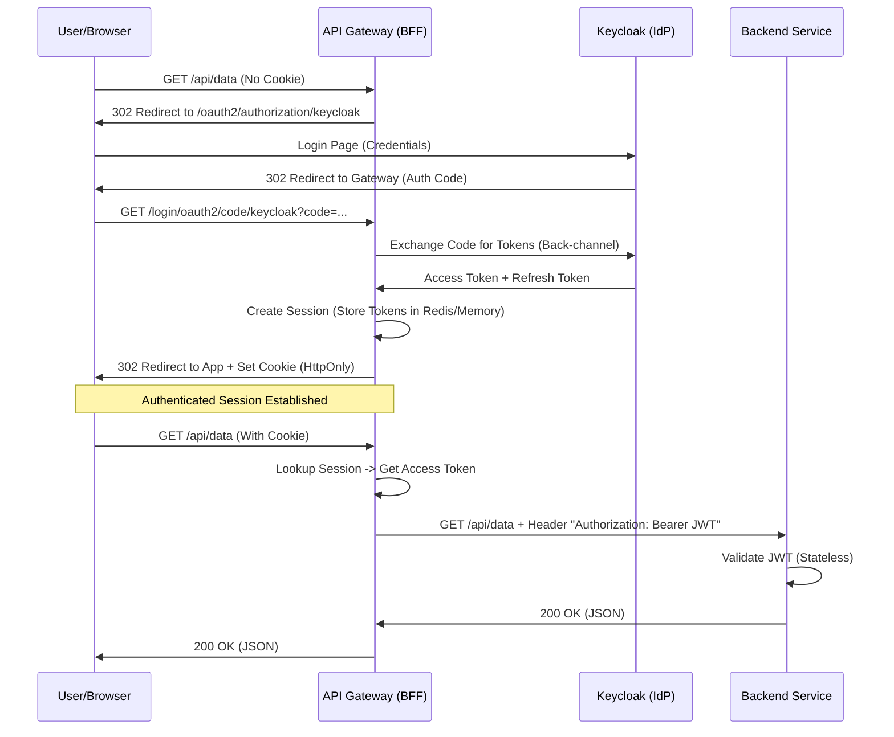

# Authentication & Identity: A Strategic Analysis for Modern Web Applications

## 1. Introduction

This document provides a comprehensive analysis of authentication standards and architectural patterns for securing our modern template application (React Frontend + Spring Boot Backend).

The evaluation is performed through the lens of our core project goals: **Security by Design** (OWASP compliance), **Future-Proofing** (Standard-compliance), and **User Experience** (Low friction).

## 2. Authentication Standards & Methods Analysis

We evaluated several modern and legacy authentication mechanisms to select the best fit for our ecosystem.

### 2.1. OAuth 2.0 & OpenID Connect (OIDC) - The Industry Standard
*   **Description**: A delegation protocol (OAuth2) combined with an identity layer (OIDC). It allows clients to verify the identity of the user based on the authentication performed by an Authorization Server.
*   **Pros**:
    *   **Federation**: Seamlessly integrates with Google, GitHub, Microsoft, etc.
    *   **Standardization**: Universally supported by libraries and gateways.
    *   **Decoupling**: Applications don't handle passwords. Identity is centralized.
    *   **Stateless APIs**: Access tokens (JWTs) carry authorization data, perfect for microservices.
*   **Cons**:
    *   **Complexity**: Requires understanding flows (Authorization Code, PKCE).
    *   **infrastructure**: Requires an Identity Provider (Keycloak, Auth0).
*   **Verdict**: **Recommended.** It is the de-facto standard for modern apps.

### 2.2. WebAuthn / Passkeys (FIDO2) - The Future
*   **Description**: Passwordless authentication using public-key cryptography. Users log in with TouchID, FaceID, or YubiKeys.
*   **Pros**:
    *   **Phishing Resistant**: Impossible to phish as there are no shared secrets.
    *   **UX**: Extremely fast and convenient for users.
*   **Cons**:
    *   **Device Dependency**: Requires user to have a compatible device (though sync is improving).
    *   **Recovery**: Account recovery is complex if the device is lost.
    *   **Implementation**: Complex server-side implementation compared to OIDC.
*   **Verdict**: **Strong Contender for "Method".** We should aim to support this *within* our OIDC provider (Keycloak supports WebAuthn), rather than building it from scratch.

### 2.3. SAML 2.0 - The Enterprise Legacy
*   **Description**: XML-based standard for exchanging authentication and authorization data.
*   **Pros**:
    *   **Enterprise Reach**: Still dominant in old-school corporate environments.
*   **Cons**:
    *   **XML**: Heavy, verbose, and harder to parse/secure than JSON.
    *   **Mobile/SPA Unfriendly**: Not designed for modern web/mobile apps.
*   **Verdict**: **Rejected.** Only relevant if integrating with legacy enterprise IdPs (which can be bridged via Keycloak anyway).

### 2.4. Magic Links / OTP - The "Simple" Passwordless
*   **Description**: User enters email -> receives a link/code -> clicks to login.
*   **Pros**:
    *   **No Passwords**: Users don't need to remember anything.
*   **Cons**:
    *   **Security**: Email is often not secure. Links can be intercepted.
    *   **Friction**: Requires context switching (App -> Email -> App).
*   **Verdict**: **Secondary Option.** Good as a backup or for low-security apps, but not primary.

## 3. Identity Provider Selection (Open Source)

Since our template application is **100% Open Source**, we evaluated the top self-hostable Identity Providers (IdPs) available in 2025.

| Feature | **Keycloak** | **Zitadel** | **Authentik** |
| :--- | :--- | :--- | :--- |
| **Primary Stack** | Java / Quarkus | Go | Python / Go |
| **Target Audience** | Enterprise & Gov | Cloud-Native / SaaS | Homelab / IT Ops |
| **Market Status** | The Standard ("800lb Gorilla") | Modern Challenger | Flexible Utility |
| **Pros** | • Massive Ecosystem • Spring Boot Integration • Complete Feature Set | • High Performance • Built-in Multi-tenancy • Audit Trail | • Flexible Pipelines • Great for Proxying |
| **Cons** | • Resource Heavy • Utilitarian UI | • Smaller Ecosystem | • Niche focus |
| **Verdict** | **SELECTED** | **Strong Alternative** | **Rejected** |

**Justification for Keycloak**: For a "Reference Architecture," we select the tool that most Java developers are expected to know. Its integration with Spring Security is seamless and widely documented.

## 4. System Architecture Options Analysis

Before selecting the specific implementation (Gateway BFF), we analyzed four architectural patterns for securing Single Page Applications (SPAs) connected to Microservices.

### 4.1. Option A: The "Public Client" Pattern (Stateless Frontend)
*   **How it works**: The React App uses an OIDC library (e.g., `oidc-client-ts`) to authenticate directly with Keycloak using the **Authorization Code Flow with PKCE**. The Access Token is stored in the browser (localStorage or Memory).
*   **Pros**:
    *   **Zero Backend State**: The backend API is purely stateless.
    *   **Simple Network**: Direct communication between Browser and IdP.
*   **Cons**:
    *   **High Security Risk (XSS)**: If an attacker injects a script (XSS) into the application, they can read `localStorage` and exfiltrate the Access Token. This gives them full access to the user's account until the token expires.
    *   **Token Lifecycle Complexity**: The frontend developer must implement complex logic to handle silent refreshes (iframe/refresh tokens), which is error-prone.
*   **Verdict**: **Rejected.** The security risk is unacceptable for a "secure by design" template.

### 4.2. Option B: The "Unified Backend" Pattern (Monolithic BFF)
*   **How it works**: The Spring Boot Backend serves the React App (static files) and handles the OAuth2 Login. It creates a server-side session and issues a `JSESSIONID` cookie to the browser.
*   **Pros**:
    *   **Secure**: Tokens are kept on the server.
    *   **Simple Deployment**: Only one container to deploy.
*   **Cons**:
    *   **Tight Coupling**: The backend logic is mixed with authentication logic and UI serving.
    *   **Scalability**: Scaling the API means scaling the session management.
    *   **Microservice Anti-Pattern**: If we add a second service (e.g., `Billing Service`), the browser cannot talk to it directly because the session is locked to the `Backend Service`.
*   **Verdict**: **Rejected.** Good for simple monoliths, but fails to provide a path to microservices.

### 4.3. Option C: The "Gateway BFF" Pattern (The Choice)
*   **How it works**: A dedicated, lightweight "Edge Service" (Spring Cloud Gateway) sits between the Browser and the Microservices.
    *   **Browser ↔ Gateway**: Authenticated via **HttpOnly, Secure Cookies**.
    *   **Gateway ↔ Services**: Authenticated via **JWT (Access Token)**.
*   **Pros**:
    *   **Best of Both Worlds**: The frontend is secure (Cookies), and the backend services are stateless (JWTs).
    *   **Separation of Concerns**: Authentication logic is isolated in the Gateway. Backend developers just focus on domain logic.
    *   **Microservice Ready**: New services can be added behind the Gateway without changing the authentication architecture.
*   **Cons**:
    *   **Infrastructure**: Requires deploying an extra container (The Gateway).
*   **Verdict**: **Selected.** It offers the highest security and flexibility for a modern cloud-native architecture.

### 4.4. Option D: Service Mesh / Sidecar Auth (Istio / Envoy)
*   **How it works**: Authentication is offloaded to a sidecar proxy (Envoy) running next to each service pod in Kubernetes.
*   **Pros**:
    *   **Infrastructure-Level Auth**: Authentication is handled by the platform, not the code.
*   **Cons**:
    *   **Extreme Complexity**: Requires a full Kubernetes cluster + Istio/Linkerd setup. Overkill for a template application.
    *   **Local Dev Experience**: Very difficult to replicate locally with Docker Compose.
*   **Verdict**: **Rejected.** Too complex for a developer-focused template.

## 5. System Architecture: The "Golden Path" Implementation

We have selected the **Gateway BFF (Backend for Frontend)** pattern. This architecture resolves the tension between "Stateless APIs" and "Secure Browsers".

### 5.1. The Token Relay Flow

### 5.2. Network Isolation & Security Boundaries
Security is enhanced by physical network separation in Docker/Kubernetes.

*   **Public Zone (The Internet)**:
    *   **Traffic**: User Browser ↔ API Gateway (Port 443/8080).
    *   **Data**: Encrypted Traffic, Opaque Session Cookies.
*   **Private Zone (The Cluster)**:
    *   **Traffic**: Gateway ↔ Backend (Port 8081), Gateway ↔ Keycloak (Port 9000).
    *   **Data**: Raw JWTs, User Data, Database Connections.
*   **Benefit**: Even if the Frontend is compromised via XSS, the attacker cannot steal the Access Token because it simply isn't there. They can hijack the session *on that machine*, but they cannot exfiltrate the credential to use elsewhere.

### 5.3. Roles & Responsibilities

| Component       | Role                        | Responsibility                                                                                                                    |
| :-------------- | :-------------------------- | :-------------------------------------------------------------------------------------------------------------------------------- |
| **Keycloak**    | **Identity Provider (IdP)** | Managing users, passwords, MFA, and issuing tokens. The "Source of Truth" for identity.                                           |
| **API Gateway** | **OAuth2 Client & PEP**     | **Policy Enforcement Point**. Handles Login/Logout, stores tokens securely, translates Cookies to Tokens. Defends the perimeter.  |
| **Backend API** | **Resource Server**         | **Business Logic**. Enforces fine-grained permissions (e.g., "User has `ROLE_ADMIN`?"). Does *not* handle login forms or cookies. |
| **React App**   | **Public UI**               | **Presentation**. Handles 401s by redirecting to Gateway. Focuses on UX, not Auth security.                                       |

## 7. References

### 7.1 Core Standards
*   **OpenID Connect Core 1.0**: [Official Specification](https://openid.net/specs/openid-connect-core-1_0.html) - The primary identity layer on top of OAuth 2.0.
*   **OAuth 2.0 for Browser-Based Apps**: [IETF Best Current Practice](https://datatracker.ietf.org/doc/html/draft-ietf-oauth-browser-based-apps) - The authoritative guide on why "Public Clients" are risky and why BFF is preferred.
*   **PKCE (Proof Key for Code Exchange)**: [RFC 7636](https://datatracker.ietf.org/doc/html/rfc7636) - The extension to OAuth 2.0 to secure Authorization Code flow for public clients.
*   **Web Authentication (WebAuthn)**: [W3C Recommendation](https://www.w3.org/TR/webauthn-2/) - The standard for passwordless authentication (FIDO2).
*   **The BFF Pattern (Backend for Frontend)**: [OAuth.net Definition](https://auth0.com/blog/the-backend-for-frontend-pattern-bff/) - Conceptual overview of the architectural pattern.

### 7.2 Spring documentations
*   **Spring Cloud Gateway**: [Official Documentation](https://docs.spring.io/spring-cloud-gateway/reference/) - How Spring CLoud gateway works
*   **Spring Security - OAuth 2.0 Resource Server**: [Reference Guide](https://docs.spring.io/spring-security/reference/servlet/oauth2/resource-server/index.html) - How to configure the Backend to validate JWTs.

### 7.3 Tools & Platforms
*   **Keycloak Documentation**: [Server Administration Guide](https://www.keycloak.org/documentation) - Official guide for configuring Realms, Clients, and Users.
*   **Zitadel**: [Docs](https://zitadel.com/docs) - Documentation for the cloud-native alternative.
    

### 7.4 Implementation Guides
*   **OAuth2 Backend for Frontend With Spring Cloud Gateway**:  [Baldung Implementation guide](https://www.baeldung.com/spring-cloud-gateway-bff-oauth2) - Step-by-step tutorial on implementing the BFF pattern with Spring Cloud Gateway.[Github Repo](https://github.com/eugenp/tutorials/tree/master/spring-security-modules/spring-security-oauth2-bff)
*   **Securing your web apps: Spring security OAuth 2.0 + BFF pattern**: [Independant blog post](https://productdock.com/securing-your-web-apps-spring-security-oauth-2-0-bff-pattern/) - Recent and vendor neutral guide on BFF with Spring Security. [Github Repo](https://github.com/GoodbyePlanet/spring-cg-bff?spm=a2ty_o01.29997173.0.0.737bc921wf3YWz)
*   **Keycloak and Spring Boot OAuth 2.0 and OpenID Connect (OIDC) Authentication**: [Mddeium blog post](https://medium.com/@nsalexamy/keycloak-and-spring-boot-oauth-2-0-and-openid-connect-oidc-authentication-304e7b511d02) - How to integrate Keycloak with Spring Boot applications.
