# API-First Governance

## Context

We follow a strict **API-First** methodology. This means the OpenAPI Specification (`openapi.yaml`) is the primary artifact of the development process, not a byproduct. It serves as the **Single Source of Truth** for the interface between the Frontend and the Backend.

## Motivation

*   **Parallel Development**: Frontend and Backend teams can work simultaneously once the contract is defined.
*   **Drift Prevention**: Generating code from the spec ensures that the implementation never diverges from the documentation.
*   **Developer Experience**: Provides type-safe clients (TypeScript) and server stubs (Java) automatically, reducing boilerplate.

## The Workflow

Code is a derivative of the specification. We do not generate the spec from code; we generate the code from the spec.

```mermaid
flowchart TD
    %% Nodes
    Spec["📄 openapi.yaml<br/>(Source of Truth)"]
    Lint["🔍 Spectral<br/>(Linting & Style)"]
    Diff["⚖️ OpenAPI Diff<br/>(Breaking Changes?)"]
    
    subgraph Backend [Backend Build]
        direction TB
        JavaGen["☕ OpenAPI Generator<br/>(Maven Plugin)"]
        Interfaces["📝 Java Interfaces<br/>(Target/Generated)"]
        Impl["🛠️ Controller Implementation<br/>(src/main/java)"]
    end

    subgraph Frontend [Frontend Build]
        direction TB
        TSGen["TS OpenAPI Generator<br/>(NPM Script)"]
        Client["📦 TypeScript Client<br/>(src/api/generated)"]
        Hooks["fz React Hooks<br/>(src/hooks)"]
    end

    %% Flow
    Spec --> Lint
    Spec --> Diff
    
    Lint -->|Pass| JavaGen
    Lint -->|Pass| TSGen
    
    JavaGen --> Interfaces
    Interfaces -.->|Implements| Impl
    
    TSGen --> Client
    Client -.->|Imports| Hooks

    %% Styling
    style Spec fill:#2e8555,stroke:#333,stroke-width:2px,color:#fff
    style Interfaces stroke-dasharray: 5 5
    style Client stroke-dasharray: 5 5
```

## Governance Rules

### 1. Specification Ownership
The `api/` directory is the owner of the contract. Changes to the API must be made in `api/specification/openapi.yaml` via a Pull Request.

### 2. No Manual Edits
*   **Backend**: Developers must **never** manually edit the `api` package in Java. They must implement the generated interfaces.
*   **Frontend**: Developers must **never** manually edit the `src/api/generated` files. They must regenerate them using `npm run api:generate`.

### 3. Linting Standards
The specification is automatically validated against our style guide (`api/rules/style.yaml`) using **Spectral**. This enforces:
*   **RESTful URLs**: Kebab-case paths (`/user-profiles`, not `/userProfiles`).
*   **Versioning**: All paths must start with `/v1/`.
*   **Error Handling**: All 4xx/5xx responses must return the RFC 7807 `ProblemDetail` structure.

### 4. Breaking Changes
We use **OpenAPI Diff** in CI/CD to detect breaking changes.
*   **Non-Breaking**: Adding a new endpoint, adding an optional field.
*   **Breaking**: Removing a field, changing a type, making an optional field required.
    *   *Policy*: Breaking changes require a version bump (v1 -> v2) or explicit approval from the System Architect.
