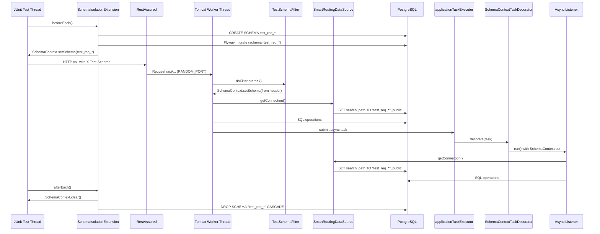
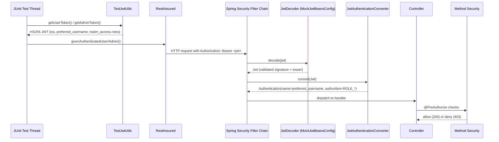
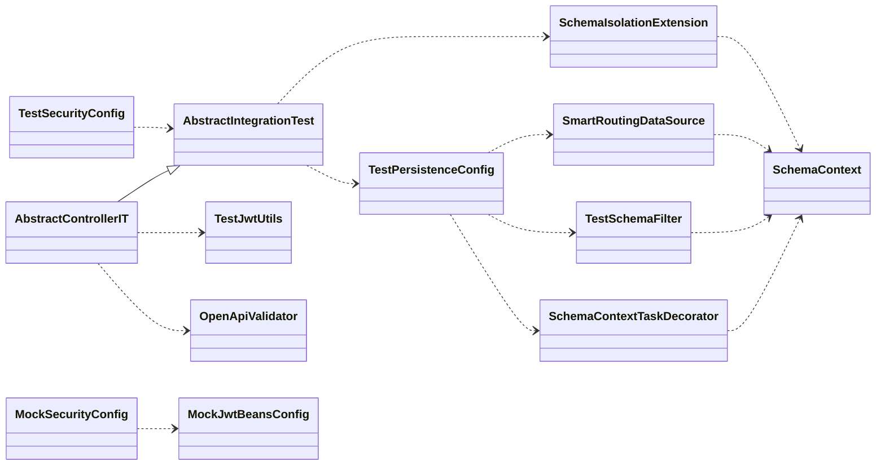
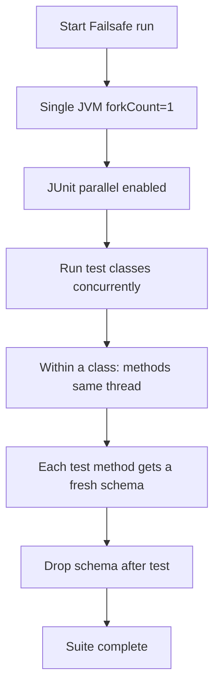

# Integration Testing

## Scope

This document describes how we run **backend integration tests** in this repository:

- real Spring Boot runtime (`@SpringBootTest`)
- real PostgreSQL via Testcontainers
- schema-per-test isolation (no manual truncation)
- support for async event processing (Spring Modulith)
- safe parallel execution

## Goals and non-goals

**Goals**

- High confidence: test the system as it runs (HTTP boundary + DB + migrations).
- Deterministic isolation: no shared state between tests.
- CI-friendly: single JVM, parallel test classes where possible.

**Non-goals**

- We do not aim to test Keycloak itself in the backend integration-test suite.
- We do not aim to run a separate database container per test.

## Test types and naming

- **Unit tests**: `*Test.java` (Surefire)
- **Integration tests**: `*IT.java` (Failsafe)

## Profiles

We use profiles to keep tests predictable:

- `test` profile:
  - default for unit tests
  - permissive security (most endpoints are `permitAll`) to keep non-security tests focused
- `integration` profile:
  - enables integration-test-only wiring (schema-per-test persistence + mock resource-server security)
  - typically used together with `test`: `@ActiveProfiles({"test", "integration"})`

## Security in integration tests (mock resource server)

Most integration tests run with the permissive `test` profile (security not being the focus).

For authentication/authorization-focused controller ITs we additionally enable the `integration` profile, which wires a **mock resource server**:

- JWTs are minted locally (HS256) via `TestJwtUtils`.
- The request carries `Authorization: Bearer <token>`.
- A test-only `JwtDecoder` validates signature + issuer.
- A test-only `JwtAuthenticationConverter` maps claims:
  - principal: `preferred_username`
  - roles: `realm_access.roles` → `ROLE_*`

This setup exercises the same *shape* of token/claims the backend expects, without requiring a Keycloak container.

## Database strategy: schema-per-test

### Why schema-per-test

- Adding a new table/constraint cannot be forgotten in cleanup logic.
- Isolation is strong even under parallel execution.
- Cleanup is deterministic: `DROP SCHEMA ... CASCADE`.

### How it works

At a high level:

1. A JUnit extension creates a unique schema for each test method.
2. Flyway migrates that schema.
3. Test code runs with that schema set in a ThreadLocal (`SchemaContext`).
4. The schema is dropped after the test.

Key implementation pieces (test-only):

- `SchemaIsolationExtension` (schema lifecycle + Flyway per schema)
- `SchemaContext` (ThreadLocal holder)
- `SmartRoutingDataSource` (applies `SET search_path` and resets on connection close)

## Thread boundary: JUnit → Tomcat

Controller integration tests use `@SpringBootTest(webEnvironment = RANDOM_PORT)` and RestAssured.
This means:

- test code runs on the **JUnit thread**
- the request is handled on a **Tomcat worker thread**

To route database calls to the correct schema, we propagate the schema via an HTTP header:

- Header name: `X-Test-Schema`
- Server-side: `TestSchemaFilter` reads the header and sets `SchemaContext` on the request thread

## Async boundary: request thread → async worker threads

Some integration tests trigger asynchronous work (e.g., Spring Modulith listeners).
ThreadLocals do not cross thread boundaries, so we propagate schema context via a `TaskDecorator`:

- `SchemaContextTaskDecorator` captures the schema when the task is submitted
- the `applicationTaskExecutor` is configured to use this decorator

## Parallel execution

We run integration tests in a single JVM and rely on **JUnit 5 parallel execution**.

- Methods within a class: sequential (`same_thread`)
- Test classes: may execute concurrently (`concurrent`)

Configuration lives in `backend/src/test/resources/junit-platform.properties`.

### Guardrails

- Avoid global mutable state in tests.
- Do not set global `RestAssured.requestSpecification` (static) because it can race under parallel class execution.
- Prefer shared base classes over per-test ad-hoc configuration.

## Base classes and conventions

### `AbstractIntegrationTest`

Use this for integration tests that need:

- PostgreSQL Testcontainers
- schema-per-test isolation
- (optionally) mock security

### `AbstractControllerIT`

Use this for controller tests that:

- call the API via HTTP (RestAssured)
- must send `X-Test-Schema` on each request
- optionally send `Authorization: Bearer ...` for auth-focused tests

## OpenAPI contract validation

For controller integration tests, validate requests/responses against the OpenAPI spec using the provided RestAssured filter:

- `OpenApiValidator.validationFilter()`

This helps catch contract drift (e.g., missing required fields, wrong response codes).

## Diagrams

### Sequence: request + async processing + schema isolation

### Sequence: mock security (HS256 JWT) and authorization

### Class diagram: test support components

### Flowchart: parallel class execution (single JVM)

## Troubleshooting

- **Wrong schema / missing tables**: verify the request carries `X-Test-Schema` and that `SchemaIsolationExtension` ran Flyway for the schema.
- **Flaky failures under suite runs**: check for shared mutable static state, and confirm connections reset `search_path` on close.
- **Async writes in `public`**: ensure the `integration` profile is active and `applicationTaskExecutor` uses the `SchemaContextTaskDecorator`.
