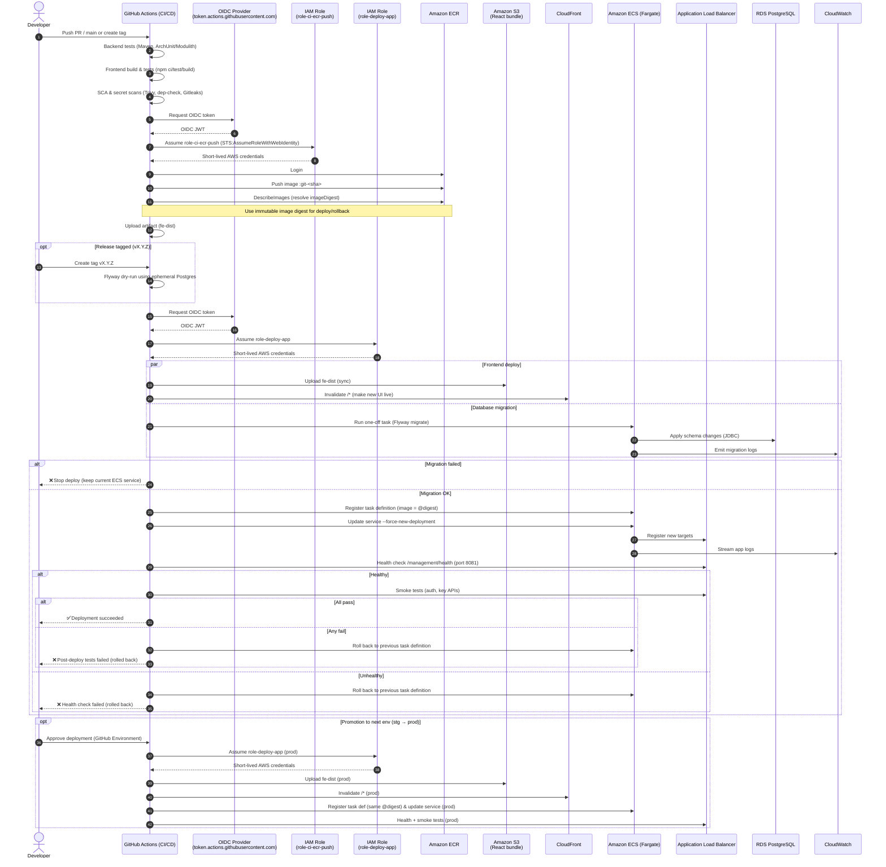

This guide documents how to deploy a full-stack application (Spring Boot backend + PostgreSQL + React frontend) 
on AWS using ECS Fargate, RDS, and CloudFront/S3.  
It's meant as a **reference architecture** and **learning resource**.

> ⚠️ This repository contains **no credentials**.  
> All AWS account IDs and names are placeholders.

# To Do's
[To Do's](docs/todos.md)

---
# Reference Resources & Templates
[Reference Resources & Templates](docs/references.md)

---

# Table of Contents
<!-- TOC -->
- [To Do's](#to-dos)
- [Reference Resources \& Templates](#reference-resources--templates)
- [Table of Contents](#table-of-contents)
- [Architecture](#architecture)
- [Continuous Integration CI](#continuous-integration-ci)
  - [Build \& Package](#build--package)
- [Continuous Deployment CD](#continuous-deployment-cd)
  - [Deployment](#deployment)
  - [Promotion, Monitoring \& Rollback](#promotion-monitoring--rollback)
- [AWS Components configuration](#aws-components-configuration)
  - [Phase 0 - Prereqs \& Naming](#phase-0---prereqs--naming)
  - [Phase 1 - Foundation (Networking \& Accounts)](#phase-1---foundation-networking--accounts)
  - [Phase 2 - Data (RDS PostgreSQL)](#phase-2---data-rds-postgresql)
  - [Phase 3 - Images (ECR) \& Build](#phase-3---images-ecr--build)
  - [Phase 4 - IAM for CI/CD \& Tasks](#phase-4---iam-for-cicd--tasks)
    - [GitHub → AWS (OIDC)](#github--aws-oidc)
    - [ECS Roles](#ecs-roles)
  - [Phase 5 - ECS (Cluster, Task Def, ALB, Service)](#phase-5---ecs-cluster-task-def-alb-service)
  - [Phase 6 - GitHub Actions (CI/CD)](#phase-6---github-actions-cicd)
    - [Build \& Push](#build--push)
    - [Deploy](#deploy)
  - [Phase 7 - Frontend (React on S3 + CloudFront)](#phase-7---frontend-react-on-s3--cloudfront)
  - [Phase 8 - Observability \& Ops](#phase-8---observability--ops)
  - [Phase 9 - Security Essentials](#phase-9---security-essentials)
  - [Phase 10 - Test \& Promote](#phase-10---test--promote)
  - [Creation Order Summary](#creation-order-summary)
- [AWS Cloud Resource Naming Conventions](#aws-cloud-resource-naming-conventions)
  - [1) Simple rules (use everywhere)](#1-simple-rules-use-everywhere)
  - [2) Canonical pattern](#2-canonical-pattern)
  - [3) Per-service naming templates](#3-per-service-naming-templates)
  - [4) Tagging strategy (mandatory-your best friend)](#4-tagging-strategy-mandatory-your-best-friend)
  - [5) Worked examples](#5-worked-examples)
    - [A) External client – ACME, Invoicer project, API service, prod in eu-west-1](#a-external-client--acme-invoicer-project-api-service-prod-in-eu-west-1)
    - [B) Your SaaS – “Ledger”, worker service, staging in eu-central-1](#b-your-saas--ledger-worker-service-staging-in-eu-central-1)
    - [C) Portfolio – “portfolio-site”, no client, dev in eu-west-1](#c-portfolio--portfolio-site-no-client-dev-in-eu-west-1)
    - [Image tags \& versions](#image-tags--versions)
    - [Guardrails \& pitfalls](#guardrails--pitfalls)
    - [Drop-in variables (IaC)](#drop-in-variables-iac)
- [AWS + Copilot Cheatsheet](#aws--copilot-cheatsheet)
  - [1. Project Structure](#1-project-structure)
  - [2. Backend Setup (Spring Boot + Docker + AWS Copilot)](#2-backend-setup-spring-boot--docker--aws-copilot)
    - [Build + Test Locally](#build--test-locally)
    - [Copilot App Initialization](#copilot-app-initialization)
    - [Create and Deploy Service](#create-and-deploy-service)
    - [Modify manifest (for internal/private API)](#modify-manifest-for-internalprivate-api)
  - [3. Frontend Setup (React + TypeScript + Vite)](#3-frontend-setup-react--typescript--vite)
    - [Create project](#create-project)
  - [4. Deploy Frontend (S3 + CloudFront)](#4-deploy-frontend-s3--cloudfront)
    - [Create S3 bucket](#create-s3-bucket)
    - [Create Origin Access Control (OAC)](#create-origin-access-control-oac)
    - [Create CloudFront Distribution](#create-cloudfront-distribution)
    - [S3 Bucket Policy](#s3-bucket-policy)
    - [Build and Upload](#build-and-upload)
    - [Invalidate CloudFront Cache](#invalidate-cloudfront-cache)
    - [Verify](#verify)
  - [5. Never Commit These](#5-never-commit-these)
    - [Sensitive / private files](#sensitive--private-files)
  - [Delete all AWS Ressources](#delete-all-aws-ressources)
    - [1. Delete the backend (ECS) via Copilot](#1-delete-the-backend-ecs-via-copilot)
      - [Verify deletion (optional sanity check)](#verify-deletion-optional-sanity-check)
    - [3. Delete the CloudFront distribution](#3-delete-the-cloudfront-distribution)
    - [4. Delete the frontend S3 bucket](#4-delete-the-frontend-s3-bucket)
    - [5. Remove Origin Access Control (OAC)](#5-remove-origin-access-control-oac)
    - [6. Optional: Clean leftover ECR repositories (if Copilot didn’t)](#6-optional-clean-leftover-ecr-repositories-if-copilot-didnt)
    - [7. Optional: Clean IAM roles (Copilot sometimes leaves environment roles)](#7-optional-clean-iam-roles-copilot-sometimes-leaves-environment-roles)
    - [8. Optional: Delete CloudWatch log groups](#8-optional-delete-cloudwatch-log-groups)
    - [9. Validate your AWS account is clean](#9-validate-your-aws-account-is-clean)
    - [10. Common Misses (and hidden costs)](#10-common-misses-and-hidden-costs)
- [Cheatsheet](#cheatsheet)
<!-- TOC -->

# Architecture
[Architecture](docs/architecture.md)

---

# Continuous Integration CI


## Build & Package

6. **Authenticate GitHub → AWS via OIDC**  
   GitHub Actions requests an OpenID Connect (OIDC) token from `token.actions.githubusercontent.com`.  
   AWS IAM verifies the token and issues short-lived credentials for the role:
   - `role-ci-ecr-push`

7. **Build backend container image**  
   Using **Jib** or **Paketo Buildpacks**, a Docker image of the Spring Boot app is created.  
   It includes all application code and dependencies.

8. **Push image to Amazon ECR**  
   The pipeline logs in to Amazon ECR and pushes the built image, tagged as:
   ```bash
   ghost-template-api:git-<sha>
   ```
   ECR returns an **immutable image digest** (e.g. `sha256:abcd...`).

9. **Store frontend artifact**  
   The compiled React bundle (`build/`) is uploaded as a GitHub Actions artifact, so it can be reused in deployment workflows.

10. **Optional: tag a release**  
    A human or automation creates a version tag (like `v1.2.3`) and generates release notes.  
    This locks the version that will be deployed.

11. **Optional: Flyway dry-run**  
    The pipeline runs a temporary PostgreSQL instance and executes `flyway:migrate` to verify that database migrations apply cleanly.  
    If any migration fails → deployment is blocked until fixed.

# Continuous Deployment CD

## Deployment

12. **Authenticate again with AWS (deployment role)**  
    The pipeline assumes a second AWS IAM role:  
    - `role-deploy-app`  
    This one has permission to update ECS services, RDS secrets, and CloudFront.

13. **Upload frontend bundle to S3**  
    The React `build/` folder is synced to the S3 bucket (e.g. `ghost-template-web-prod-euc2-1`).  
    This makes the static website files (HTML, JS, CSS) publicly readable via CloudFront.

14. **Invalidate CloudFront cache**  
    The pipeline issues a cache invalidation (usually for `/*`) so that users immediately see the new version.

15. **Run Flyway migrations (real DB)**  
    The backend migrations are applied to the **production RDS PostgreSQL** instance by running a **one-off ECS task**:
    ```bash
    java -jar app.jar --spring.flyway.enabled=true
    ```
    If migrations fail → stop deployment and keep the current ECS version active.

16. **Register new ECS task definition**  
    A new ECS task definition is created, referencing:
    - The latest image digest in ECR  
    - Environment variables (DB URL, credentials, etc.)  
    - Roles for task execution and secret retrieval  

17. **Force ECS service update**  
    ECS deploys new containers running the updated image.  
    It uses **rolling deployments** with health checks via the **Application Load Balancer (ALB)**.

18. **Health checks**  
    The pipeline monitors the new ECS tasks until:
    - ALB marks them as healthy  
    - `/management/health` endpoint responds with `200 OK` (on management port 8081)  

19. **Smoke tests**  
    Once the new containers are live, the pipeline runs quick checks:
    - Login endpoint  
    - Core API routes  
    - Database connectivity  
    If all pass → continue.  
    If any fail → automatically roll back to the previous ECS task definition.


## Promotion, Monitoring & Rollback

20. **Promotion**  
    After the first environment (e.g. `staging`) passes health & smoke tests, the same image digest is promoted to `prod` via manual GitHub approval.

21. **Monitoring**  
    CloudWatch collects:
    - ECS logs (application and system)  
    - ALB request counts, latency, and errors  
    - RDS metrics (connections, CPU, disk I/O)  
    Alarms alert on 5xx spikes or failed health checks.

22. **Rollback**  
    If an issue appears post-deploy:
    - The GitHub workflow can re-run the ECS update command using the **previous task definition revision**.
    - ECS instantly rolls traffic back to the stable containers.

23. **Cleanup / retention**  
    - ECR lifecycle policy deletes old images (e.g. keep last 30).  
    - CloudWatch logs older than 30 days are purged.  
    - RDS snapshots rotate automatically.  
    - Artifacts and cache files are cleaned to reduce costs.




---

# AWS Components configuration

## Phase 0 - Prereqs & Naming
- **Region:** `eu-central-2` (Zurich)
- **IAM Identity Center (SSO)** enabled with admin profile
- **CLI Profile:** `aws configure sso`
- **Naming convention:**
  - Org: `ghost`
  - Project: `template`
  - Service: `api`
  - Env: `prod`


## Phase 1 - Foundation (Networking & Accounts)
- **VPC:** `ghost-main-vpc` (CIDR: `10.0.0.0/16`)
- **Subnets:**
  - Public: `10.0.1.0/24`, `10.0.2.0/24`
  - Private: `10.0.11.0/24`, `10.0.12.0/24`
- **Internet Gateway** and **NAT Gateways**
- **Security Groups:**
  - `alb-sg`: Inbound `80/443` from `0.0.0.0/0`
  - `ecs-sg`: Inbound `8080` from `alb-sg`
  - `rds-sg`: Inbound `5432` from `ecs-sg`
- **Check ECS service-linked role:** `AWSServiceRoleForECS`


## Phase 2 - Data (RDS PostgreSQL)
- **Engine:** PostgreSQL (latest)
- **Instance class:** `db.t3.small` or `db.t4g.small`
- **Storage:** gp3 20–50 GB (autoscaling on)
- **VPC:** Zurich VPC
- **Subnets:** Private subnets
- **Public access:** No
- **Security group:** `rds-sg`
- **Master username:** `ghost_admin`
- **DB name:** `ghostdb`
- **Store credentials:** Secrets Manager
- **Backup:** Enabled (7–14 days)
- **Outputs:** RDS endpoint + Secret ARN


## Phase 3 - Images (ECR) & Build
- **ECR repo:** `ghost/template/api`
- **Push images:** Tags `git-<sha>` or `vX.Y.Z`
- **Lifecycle policy:** Keep last 30 images
- **Image scanning:** Enabled

## Phase 4 - IAM for CI/CD & Tasks
### GitHub → AWS (OIDC)
- **OIDC Provider:** `token.actions.githubusercontent.com`
- **Role `role-ci-ecr-push`:**
  - Trust: GitHub OIDC
  - Policy: ECR push minimal
- **Role `role-deploy-app`:**
  - Trust: GitHub OIDC
  - Policy: ECS update, ECR describe, IAM pass

### ECS Roles
- **Execution role:** `ecsTaskExecutionRole` (policy: `AmazonECSTaskExecutionRolePolicy`)
- **Task role:** `ghost-template-api-taskrole`
  - Allow `secretsmanager:GetSecretValue`


## Phase 5 - ECS (Cluster, Task Def, ALB, Service)
- **Cluster:** `ghost-main-ecs` (Zurich)
- **Task Definition:**
  - Family: `ghost-template-api`
  - CPU/Mem: `0.5 vCPU / 1–2 GB`
  - Container:
    - Port: 8080 (app), 8081 (management)
    - Health: `/management/health` (port 8081)
    - Env vars: `SPRING_DATASOURCE_URL`, `USERNAME`, `PASSWORD`
  - Execution Role: `ecsTaskExecutionRole`
  - Task Role: `ghost-template-api-taskrole`
- **ALB:**
  - Public subnets, `alb-sg`
  - Target group → port 8080
- **ECS Service:**
  - Launch type: Fargate
  - Subnets: Private
  - SG: `ecs-sg`
  - Target group: ALB TG


## Phase 6 - GitHub Actions (CI/CD)
### Build & Push
- **Assume:** `role-ci-ecr-push`
- **Steps:**
  - `docker build` and `docker push` to ECR

### Deploy
- **Assume:** `role-deploy-app`
- **Steps:**
  - Resolve image digest from ECR
  - Register new task definition
  - `aws ecs update-service` with `--force-new-deployment`


## Phase 7 - Frontend (React on S3 + CloudFront)
- **Build React:** `npm run build`
- **S3 bucket:** `ghost-template-web-prod-euc2-1`
- **CloudFront:**
  - Origin: S3
  - Cert: ACM (us-east-1)
  - Custom domain via Route 53
- **GitHub Actions:** `aws s3 sync build/ s3://bucket --delete`


## Phase 8 - Observability & Ops
- CloudWatch log retention 30d
- Alarms: ECS CPU/mem >80%, ALB 5xx, RDS connections
- ECR lifecycle + RDS snapshots
- Budgets and billing alerts


## Phase 9 - Security Essentials
- MFA on SSO & root
- Least privilege OIDC roles
- Secrets in Secrets Manager
- HTTPS via ACM + ALB listener 443


## Phase 10 - Test & Promote
- Test `/management/health` (port 8081) via internal network
- Run smoke tests
- Point domain to ALB or CloudFront
- Tag release (`v1.0.0`) and redeploy


## Creation Order Summary
1. VPC + Subnets + NAT + SGs  
2. RDS PostgreSQL  
3. ECR repo + image push  
4. IAM (OIDC + roles)  
5. ALB  
6. ECS Cluster + Task Def + Service  
7. GitHub CI/CD pipeline  
8. React S3 + CloudFront  
9. Monitoring + Security


# AWS Cloud Resource Naming Conventions
A consistent naming convention for cloud resources is crucial for managing infrastructure effectively. It aids in identification,

## 1) Simple rules (use everywhere)
- lowercase, hyphens only (a-z0-9-).
- Keep names short but specific; prefer segments over long words.
- Order segments from broad → specific.

Standard segments:
- `{org}` – your company/handle (e.g., zenbyte)
- `{client}` – external client id (optional for personal work)
- `{proj}` – product/project key (e.g., invoicer)
- `{svc}` – microservice or component (e.g., api, worker)
- `{env}` – dev|stg|prod (or sandbox, demo when needed)
- `{region}` – short code eu-west-1 → euw1, us-east-1 → use1, etc.
- `{tier}` – data|edge|net|ops (optional grouping)
- `{seq}` – numeric suffix if uniqueness is needed

Recommended short region map:
- eu-west-1 = `euw1`
- eu-central-1 = `euc1`
- us-east-1 = `use1`
- us-west-2 = `usw2`

## 2) Canonical pattern

General pattern (resource names):
`{org}`[-`{client}`]/`{proj}`/`{svc}`-`{env}`-`{region}` for ECR-style repos (with slashes)
`{org}`-`{opt_client}`-`{proj}`-`{svc}`-`{env}`-`{region}` for everything else

Omit `{client}` for your own SaaS/portfolio.

If a service is whole-app, you can drop `{svc}` and use `{proj}`.

## 3) Per-service naming templates

| Category                    | Resource                                | Naming Convention / Example                                                                                       |
| --------------------------- | --------------------------------------- | ----------------------------------------------------------------------------------------------------------------- |
| **Compute**                 | **ECR repo**                            | `{org}`[-`{client}`]/`{proj}`/`{svc}`-`{env}`                                                                     |
|                             | **Tags (image)**                        | :v`{semver}`, :git-`{shortsha}`, :`{env}`                                                                         |
|                             | **App Runner service**                  | `{org}`-`{opt_client}`-`{proj}`-`{svc}`-`{env}`-`{region}`                                                        |
| **ECS**                     | **Cluster**                             | `{org}`-`{opt_client}`-`{proj}`-`{env}`-`{region}`-ecs                                                            |
|                             | **Service**                             | `{org}`-`{opt_client}`-`{proj}`-`{svc}`-`{env}`-`{region}`-svc                                                    |
|                             | **Task def (family)**                   | `{org}`-`{proj}`-`{svc}`                                                                                          |
|                             | **Lambda function**                     | `{org}`-`{opt_client}`-`{proj}`-`{svc}`-`{env}` (keep ≤ 64 chars)                                                 |
| **Networking & Edge**       | **VPC**                                 | `{org}`-`{opt_client}`-`{proj}`-`{env}`-`{region}`-vpc                                                            |
|                             | **Subnets**                             | `{org}`-`{proj}`-`{env}`-`{region}`-`{tier}`-`{az}` e.g., `zenbyte-invoicer-dev-euw1-app-a`                       |
|                             | **Security Group**                      | `{org}`-`{proj}`-`{svc}`-`{env}`-sg                                                                               |
|                             | **ALB/NLB**                             | `{org}`-`{proj}`-`{env}`-`{region}`-alb                                                                           |
|                             | **Target group**                        | `{org}`-`{proj}`-`{svc}`-`{env}`-tg                                                                               |
|                             | **Route 53 records**                    | `{svc}`.`{env}`.`{proj}`.`{domain}` e.g., `api.dev.invoicer.example.com`                                          |
|                             | **CloudFront distro**                   | `{org}`-`{proj}`-`{env}`-cdn                                                                                      |
| **Data & Storage**          | **S3 buckets**                          | `{org}`-`{opt_client}`-`{proj}`-`{tier}`-`{env}`-`{region}`-`{seq}` e.g., `zenbyte-invoicer-artifacts-dev-euw1-1` |
|                             | **RDS instance/cluster**                | `{org}`-`{proj}`-`{env}`-`{region}`-db                                                                            |
|                             | **DynamoDB table**                      | `{org}`-`{proj}`-`{svc}`-`{env}`                                                                                  |
|                             | **ElastiCache**                         | `{org}`-`{proj}`-`{env}`-`{region}`-cache                                                                         |
| **Messaging & Integration** | **SQS queue**                           | `{org}`-`{proj}`-`{svc}`-`{env}`-q                                                                                |
|                             | **SNS topic**                           | `{org}`-`{proj}`-`{svc}`-`{env}`-topic                                                                            |
|                             | **EventBridge bus/rule**                | `{org}`-`{proj}`-`{env}`-bus, `{org}`-`{proj}`-`{svc}`-`{env}`-rule                                               |
| **Config, Secrets, Keys**   | **SSM Parameter prefix**                | /`{org}`/`{opt_client}`/`{proj}`/`{env}`/`{svc}`/... e.g., `/zenbyte/invoicer/prod/api/SPRING_DATASOURCE_URL`     |
|                             | **Secrets Manager name**                | `{org}`/`{opt_client}`/`{proj}`/`{env}`/`{svc}`/db                                                                |
|                             | **KMS key alias**                       | `alias/{org}-{proj}-{env}`                                                                                        |
| **Observability**           | **CloudWatch log group**                | `/aws/{runtime}/{org}/{proj}/{svc}/{env}` e.g., `/aws/ecs/zenbyte/invoicer/api/prod`                              |
|                             | **X-Ray group**                         | `{org}`-`{proj}`-`{env}`-xray                                                                                     |
| **CI/CD & Artifacts**       | **CodeBuild/CodePipeline/Artifacts S3** |                                                                                                                   |
|                             | **Project**                             | `{org}`-`{proj}`-`{env}`-build                                                                                    |
|                             | **Pipeline**                            | `{org}`-`{proj}`-`{env}`-pipe                                                                                     |
|                             | **Artifacts bucket**                    | `{org}`-`{proj}`-artifacts-`{region}`                                                                             |
|                             | **GitHub Actions env names**            | `{proj}`-`{env}`                                                                                                  |
| **IAM (≤ 64 chars)**        | **Roles**                               | `role-{org}-{proj}-{svc}-{env}-{purpose}` e.g., `role-zenbyte-invoicer-api-prod-task`                             |
|                             | **Policies**                            | `pol-{org}-{proj}-{svc}-{purpose}`                                                                                |
|                             | **Instance profiles**                   | `ip-{org}-{proj}-{svc}-{env}`                                                                                     |


## 4) Tagging strategy (mandatory-your best friend)

Apply these AWS Tags to every resource (via IaC)
Also set AWS Budgets per tag (Project, Client, Environment) for cost visibility.

| Key         | Example          | Notes                          |
| ----------- | ---------------- | ------------------------------ |
| Owner       | yourname         | Person/team accountable        |
| Org         | zenbyte          | Your org/brand                 |
| Client      | acme or internal | External client or internal    |
| Project     | invoicer         | Product/app key                |
| Service     | api              | Microservice/component         |
| Environment | dev              | stg                            |
| Region      | eu-west-1        | Full AWS region                |
| CostCenter  | CONSULTING       | Optional but great for billing |
| Compliance  | none             | gdpr                           |
| DataClass   | public           | internal                       |


## 5) Worked examples
### A) External client – ACME, Invoicer project, API service, prod in eu-west-1
- **ECR repo**: zenbyte-acme/invoicer/api-prod
- **ECS cluster**: zenbyte-acme-invoicer-prod-euw1-ecs
- **ECS service**: zenbyte-acme-invoicer-api-prod-euw1-svc
- **Task family**: zenbyte-invoicer-api
- **ALB**: zenbyte-acme-invoicer-prod-euw1-alb
- **RDS**: zenbyte-invoicer-prod-euw1-db
- **S3 (artifacts)**: zenbyte-invoicer-artifacts-euw1-1
- **Parameter path**: /zenbyte/acme/invoicer/prod/api/SPRING_DATASOURCE_URL
- **IAM task role**: role-zenbyte-invoicer-api-prod-task
- **Route 53**: api.prod.invoicer.acme.com

### B) Your SaaS – “Ledger”, worker service, staging in eu-central-1
- **ECR**: zenbyte/ledger/worker-stg
- **App Runner svc**: zenbyte-ledger-worker-stg-euc1
- **S3 (uploads)**: zenbyte-ledger-uploads-stg-euc1-1
- **DynamoDB table**: zenbyte-ledger-worker-stg
- **Log group**: /aws/apprunner/zenbyte/ledger/worker/stg
- **KMS alias**: alias/zenbyte-ledger-stg
- **Route 53**: worker.stg.ledger.example.com

### C) Portfolio – “portfolio-site”, no client, dev in eu-west-1
- **ECR**: zenbyte/portfolio-site/web-dev
- **CloudFront**: zenbyte-portfolio-site-dev-cdn
- **S3 (static site)**: zenbyte-portfolio-site-web-dev-euw1-1

### Image tags & versions
Use immutable tags in deploys:
- `:v1.4.3` (semver, from release)
- `:git-ab12cd3` (from commit)
Optional rolling: :prod points to current prod but never deploy by mutable tag alone.

### Guardrails & pitfalls
S3 names must be globally unique → include region or a short random suffix.
Lambda name ≤ 64 chars → keep `{org}`, `{proj}`, `{svc}` short.
Don’t put secrets in names (even DB names).
If you use multi-account, add `{acct}` segment (e.g., prd, nonprd) to names or tags.

### Drop-in variables (IaC)
```hcl
# Terraform locals
locals {
  org     = "zenbyte"
  client  = "acme"        # or "internal"
  proj    = "invoicer"
  svc     = "api"
  env     = "prod"        # dev|stg|prod
  region  = "eu-west-1"
  rshort  = "euw1"
}

# Compose names
locals {
  base_dash = "${local.org}-${local.client}-${local.proj}-${local.env}-${local.rshort}"
  svc_dash  = "${local.org}-${local.client}-${local.proj}-${local.svc}-${local.env}-${local.rshort}"
  ecr_repo  = "${local.org}-${local.client}/${local.proj}/${local.svc}-${local.env}"
}

# Standard tags
locals {
  tags = {
    Owner       = "yourname"
    Org         = local.org
    Client      = local.client
    Project     = local.proj
    Service     = local.svc
    Environment = local.env
    Region      = local.region
    CostCenter  = "CONSULTING"
  }
}
``` 


# AWS + Copilot Cheatsheet

## 1. Project Structure
template-app/
├── backend/
│   ├── src/
│   ├── pom.xml
│   └── Dockerfile
├── frontend/
│   ├── src/
│   ├── vite.config.ts
│   ├── package.json
│   ├── .env.development
│   ├── .env.production
│   ├── dist/                 ← built static files
│   ├── cloudfront.json       ← CloudFront configuration
│   └── ...
└── copilot/
└── (auto-generated by copilot CLI)


## 2. Backend Setup (Spring Boot + Docker + AWS Copilot)

### Build + Test Locally
``` bash
export AWS_PROFILE=<your-profile>
export AWS_REGION=eu-central-1

aws sso logout
unset AWS_ACCESS_KEY_ID AWS_SECRET_ACCESS_KEY AWS_SESSION_TOKEN
aws sts get-caller-identity

cd backend
DOCKER_BUILDKIT=1 docker build -t spring-demo:local .
docker run -p 8080:8080 spring-demo:local
``` 

### Copilot App Initialization
``` bash
copilot app init spring-react-demo
copilot env init --name test --profile <YOUR_AWS_SSO_PROFILE> --default-config
``` 

### Create and Deploy Service
``` bash
copilot svc init \
  --name api \
  --app spring-react-demo \
  --svc-type "Load Balanced Web Service" \
  --dockerfile ./backend/Dockerfile \
  --port 8080

copilot svc deploy --name api --env test
``` 
The first deploy builds the image → pushes to ECR → creates ECS + ALB.
You’ll get an ALB public URL like
http://spring-Publi-xxxx.eu-central-1.elb.amazonaws.com.


### Modify manifest (for internal/private API)
Edit copilot/api/manifest.yml:
``` yaml
http:
  public: false
  path: '/'
  healthcheck:
    path: '/management/health'
    port: 8081
``` 

Redeploy
``` bash
copilot svc deploy --name api --env test --force
```

## 3. Frontend Setup (React + TypeScript + Vite)
### Create project
``` bash
npm create vite@latest frontend -- --template react-ts
cd frontend
npm install
``` 

vite.config.ts
``` typescript
import { defineConfig } from 'vite'
import react from '@vitejs/plugin-react-swc'

// https://vite.dev/config/
export default defineConfig(({ mode }) => ({
    plugins: [react()],
    server: {
        proxy: mode === 'development'
            ? { '/api': 'http://localhost:8080' } // local backend
            : undefined
    },
    build: { outDir: 'dist' },
    base: '/',
    define: {
        __API_URL__: JSON.stringify(process.env.VITE_API_URL || '/api')
    }
}))
``` 

.env
.env.development => VITE_API_URL=http://localhost:8080
.env.production => VITE_API_URL=/api


## 4. Deploy Frontend (S3 + CloudFront)

### Create S3 bucket
``` bash 
aws s3 mb s3://<BUCKET NAME>
``` 

### Create Origin Access Control (OAC)
``` bash 
aws cloudfront create-origin-access-control \
  --origin-access-control-config '{
    "Name": "spring-react-oac",
    "OriginAccessControlOriginType": "s3",
    "SigningBehavior": "always",
    "SigningProtocol": "sigv4",
    "Description": "Access control for S3 frontend"
  }'
``` 
Save the returned Id → call it OAC_ID.

### Create CloudFront Distribution
``` json 
{
  "CallerReference": "spring-react-frontend-001",
  "Comment": "CloudFront for React SPA (+ /api/* to Spring ALB)",
  "Enabled": true,
  "DefaultRootObject": "index.html",

  "Origins": {
    "Quantity": 2,
    "Items": [
      {
        "Id": "S3Origin",
        "DomainName": "<DOMAIN NAME OF YOUR S3 BUCKET>.s3.<REGION>.amazonaws.com",
        "OriginAccessControlId": "<OAC_ID>",
        "S3OriginConfig": { "OriginAccessIdentity": "" }
      },
      {
        "Id": "ApiOrigin",
        "DomainName": "<DOMAIN NAME OF YOUR SPRING API ALB>",
        "CustomOriginConfig": {
          "OriginProtocolPolicy": "http-only",
          "HTTPPort": 80,
          "HTTPSPort": 443,
          "OriginSslProtocols": {
            "Quantity": 1,
            "Items": ["TLSv1.2"]
          }
        }
      }
    ]
  },

  "DefaultCacheBehavior": {
    "TargetOriginId": "S3Origin",
    "ViewerProtocolPolicy": "redirect-to-https",
    "Compress": true,
    "AllowedMethods": {
      "Quantity": 2,
      "Items": ["GET","HEAD"],
      "CachedMethods": {
        "Quantity": 2,
        "Items": ["GET","HEAD"]
      }
    },
    "ForwardedValues": {
      "QueryString": false,
      "Cookies": { "Forward": "none" }
    },
    "MinTTL": 0,
    "DefaultTTL": 300,
    "MaxTTL": 86400
  },

  "CacheBehaviors": {
    "Quantity": 1,
    "Items": [
      {
        "PathPattern": "/api/*",
        "TargetOriginId": "ApiOrigin",
        "ViewerProtocolPolicy": "redirect-to-https",
        "Compress": true,
        "AllowedMethods": {
          "Quantity": 7,
          "Items": ["GET","HEAD","OPTIONS","PUT","POST","PATCH","DELETE"],
          "CachedMethods": {
            "Quantity": 2,
            "Items": ["GET","HEAD"]
          }
        },
        "ForwardedValues": {
          "QueryString": true,
          "Cookies": { "Forward": "all" },
          "Headers": {
            "Quantity": 2,
            "Items": ["Authorization","Content-Type"]
          }
        },
        "MinTTL": 0,
        "DefaultTTL": 0,
        "MaxTTL": 0
      }
    ]
  },

  "CustomErrorResponses": {
    "Quantity": 2,
    "Items": [
      { "ErrorCode": 403, "ResponsePagePath": "/index.html", "ResponseCode": "200", "ErrorCachingMinTTL": 0 },
      { "ErrorCode": 404, "ResponsePagePath": "/index.html", "ResponseCode": "200", "ErrorCachingMinTTL": 0 }
    ]
  },

  "ViewerCertificate": { "CloudFrontDefaultCertificate": true }
}

``` 

Deploy
``` bash
aws cloudfront create-distribution --distribution-config file://cloudfront.json
```

### S3 Bucket Policy
``` bash
aws s3api put-bucket-policy --bucket <YOUR BUCKET NAME> --policy "{
  \"Version\":\"2012-10-17\",
  \"Statement\":[
    {
      \"Sid\":\"AllowCloudFrontAccess\",
      \"Effect\":\"Allow\",
      \"Principal\":{\"Service\":\"cloudfront.amazonaws.com\"},
      \"Action\":\"s3:GetObject\",
      \"Resource\":\"arn:aws:s3:::<BUCKET NAME>/*\"
    }>/*\",
      \"Condition\":{
        \"StringEquals\":{
          \"AWS:SourceArn\":\"arn:aws:cloudfront::<ACCOUNT_ID>:distribution/<DIST_ID>\"
        }
      }
    }
  ]
}"
```

### Build and Upload
``` bash
cd frontend
npm run build
aws s3 sync ./dist s3://<BUCKET NAME> --delete
```

Optional cache header
``` bash
aws s3 cp ./dist s3://<BUCKET NAME>--recursive --exclude index.html --cache-control "public,max-age=31536000,immutable"
aws s3 cp ./dist/index.html s3://<BUCKET NAME> /index.html --cache-control "no-cache"
```


### Invalidate CloudFront Cache
``` bash
aws cloudfront create-invalidation \
  --distribution-id <DIST_ID> \
  --paths "/*"
```

### Verify
``` bash
curl -I https://<CLOUDFRONT_DOMAIN>/
curl -s https://<CLOUDFRONT_DOMAIN>/api/hello
```


## 5. Never Commit These

### Sensitive / private files
AWS Account ID
ECR repository URIs
CloudFront Distribution IDs
Load Balancer DNS names
IAM role ARNs
SSO URLs

**/.env
**/.env.*
**/cloudfront.json
copilot/.workspace
copilot/**/manifest.yml  # optional, if it contains secrets
*.pem
*.key
*.crt


## Delete all AWS Ressources
### 1. Delete the backend (ECS) via Copilot
``` bash
cd /path/to/template-app
copilot svc delete --name api
```
It will:
- delete the ECS service (Fargate tasks, ALB listener, target groups)
- clean up related CloudFormation stack (spring-react-demo-test-api)
- ask confirmation before deleting ECR images

Then remove the environment:
``` bash
copilot env delete --name test
```

Finally, remove the application wrapper:
``` bash
copilot app delete
```

This step deletes:
- ECS clusters
- ALBs
- ECR repositories
- related IAM roles and policies
- VPCs created for the environment


#### Verify deletion (optional sanity check)
``` bash
aws cloudformation list-stacks --query "StackSummaries[?StackName.contains(@, 'spring-react-demo')].StackStatus"
```

### 3. Delete the CloudFront distribution
You must disable it first — CloudFront doesn’t allow direct deletion of active distributions.
``` bash
aws cloudfront list-distributions \
  --query "DistributionList.Items[].{Id:Id,DomainName:DomainName,Comment:Comment}" \
  --output table
  
  DistributionId    DomainName         Comment
---------------  -----------------  -------------------------------
 E2123456789XYZ   d11111111111111.cloudfront.net 
  
DIST_ID=<YOUR_CLOUDFRONT_DISTRIBUTION_ID>

aws cloudfront get-distribution-config --id "$DIST_ID" > cf.json
ETAG=$(jq -r '.ETag' cf.json)

jq '.DistributionConfig.Enabled=false' cf.json > cf-disabled.json

aws cloudfront update-distribution --id "$DIST_ID" --if-match "$ETAG" --distribution-config file://cf-disabled.json

aws cloudfront get-distribution --id "$DIST_ID" --query 'Distribution.{Status:Status,Enabled:DistributionConfig.Enabled}' --output table
```
Status must be "Deployed" and Enabled must be false

Wait 10–15 minutes for the distribution to fully disable, then delete:
``` bash
aws cloudfront delete-distribution --id "$DIST_ID" --if-match "$ETAG"
```

You can verify deletion progress in AWS Console → CloudFront → Distributions.

### 4. Delete the frontend S3 bucket
Check bucket name from your CloudFront origins or config:
``` bash
aws s3 ls | grep spring-react-demo
```
Then remove:
``` bash
aws s3 rm s3://spring-react-demo-frontend-<REGION> --recursive
aws s3api delete-bucket --bucket spring-react-demo-frontend-<REGION>
```

### 5. Remove Origin Access Control (OAC)
``` bash
aws cloudfront list-origin-access-controls --query "OriginAccessControlList.Items[].{Id:Id,Name:Name}"
OAC_ID=
aws cloudfront list-distributions \
  --query "DistributionList.Items[?Origins.Items[?OriginAccessControlId=='$OAC_ID']].[Id,DomainName]" \
  --output table
ETAG=$(aws cloudfront get-origin-access-control-config \
  --id "$OAC_ID" \
  --query 'ETag' --output text)
aws cloudfront delete-origin-access-control \
  --id "$OAC_ID" \
  --if-match "$ETAG"
```

### 6. Optional: Clean leftover ECR repositories (if Copilot didn’t)
``` bash
aws ecr describe-repositories --query 'repositories[].repositoryName'
aws ecr delete-repository --repository-name spring-react-demo/api --force   
```

### 7. Optional: Clean IAM roles (Copilot sometimes leaves environment roles)
``` bash
aws iam list-roles --query "Roles[?contains(RoleName, 'copilot')].RoleName"
aws iam delete-role --role-name <ROLE_NAME>
```

### 8. Optional: Delete CloudWatch log groups
``` bash
aws logs describe-log-groups --query "logGroups[?contains(logGroupName, 'spring-react-demo')].logGroupName"
aws logs delete-log-group --log-group-name /copilot/spring-react-demo/api
```

### 9. Validate your AWS account is clean
``` bash
aws cloudformation list-stacks --query "StackSummaries[?StackStatus!='DELETE_COMPLETE']"
aws ecr describe-repositories --query "repositories[].repositoryName"
aws ecs list-clusters
aws cloudfront list-distributions
aws s3 ls
```

### 10. Common Misses (and hidden costs)
| Resource                       | Typical Monthly Cost         | Delete Command                       |
| ------------------------------ | ---------------------------- | ------------------------------------ |
| CloudFront distribution        | ~$0.02–$0.10/day if active   | Step 3                               |
| S3 bucket                      | ~$0.023/GB                   | Step 4                               |
| ECR repository                 | ~$0.10/month + image storage | Step 6                               |
| CloudWatch logs                | ~$0.03/GB/mo                 | Step 8                               |
| ALB (if Copilot fails cleanup) | ~$0.025/hour                 | Delete via console or CloudFormation |


# Cheatsheet
docker compose up -d --build
docker compose down -v --rmi local --remove-orphans